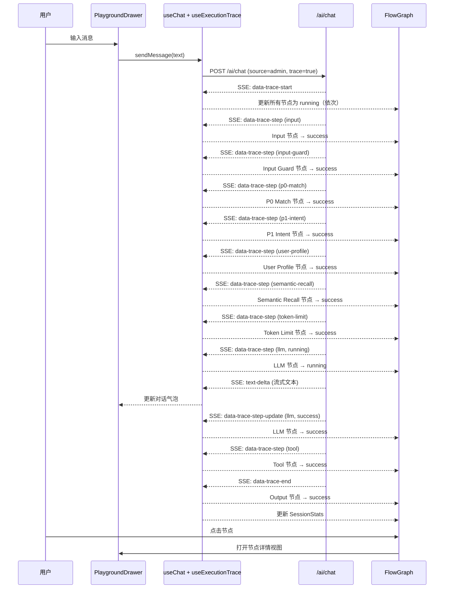

# 设计文档：Admin AI Playground 重构

## Overview

本次重构将 AI Playground 从当前的"半成品全屏画布"改造为 Mastra 风格的专业调试面板。核心设计决策：

1. **全屏 Flow Graph 为主体** — 所有管线节点预渲染，trace 数据驱动状态流转
2. **Drawer 承载所有交互** — 对话、配置、节点详情三合一
3. **灰度优先视觉** — 克制用色，良好间距，长时间调试不疲劳
4. **严格对齐后端 API** — 前端展示字段与 `wrapWithTrace` 发送的数据一一对应

### 技术栈

- 前端：React 19 + `@xyflow/react` (ReactFlow) + `@ai-sdk/react` (useChat) + shadcn/ui
- 后端：Elysia + Vercel AI SDK (`createUIMessageStream`)
- 状态管理：React hooks（`useExecutionTrace` 重构）
- API 调用：Eden Treaty + `unwrap`

### 重构范围

| 层 | 变更 |
|---|------|
| 前端 | 删除 ~20 个死文件，重写 playground-layout、flow-builder、unified-drawer，新增分层布局算法 |
| 后端 | 增强 `wrapWithTrace` 函数，补充 6 个字段 |
| 类型 | 精简 trace.ts/flow.ts，更新 ModelParams |

## Architecture

### 组件架构

```
PlaygroundLayout (全屏容器)
├── Header (透明浮层，pointer-events-none)
├── FlowGraph (ReactFlow 画布，占满屏幕)
│   ├── Pipeline Nodes (预渲染的管线节点)
│   │   ├── InputNode
│   │   ├── ProcessorNode (Input Guard)
│   │   ├── P0MatchNode
│   │   ├── P1IntentNode
│   │   ├── ProcessorNode (User Profile)
│   │   ├── ProcessorNode (Semantic Recall)
│   │   ├── ProcessorNode (Token Limit)
│   │   ├── LLMNode
│   │   ├── ToolNode (动态数量)
│   │   └── OutputNode
│   └── Edges (连线，状态驱动样式)
├── RoundSelector (轮次选择器浮层)
├── SessionStatsBar (底部统计浮层)
└── PlaygroundDrawer (右侧抽屉)
    ├── ChatView (对话视图)
    │   ├── MessageList (消息列表)
    │   ├── ToolCards (Tool 结果卡片)
    │   └── MessageInput (输入框)
    ├── SettingsView (配置视图)
    │   ├── MockSettings (身份 + 位置)
    │   ├── ModelSelector (模型选择)
    │   └── TraceToggle (Trace 开关)
    └── NodeDetailView (节点详情视图)
        └── 按节点类型渲染对应详情
```

### 数据流



## Components and Interfaces

### 1. PlaygroundLayout（重写）

主容器组件，编排所有子组件。

```typescript
// apps/admin/src/features/ai-ops/components/playground/playground-layout.tsx
interface PlaygroundLayoutState {
  drawerOpen: boolean
  drawerView: 'chat' | 'settings' | 'node-detail'
  selectedNodeId: string | null
  selectedRound: number // 当前查看的轮次索引
  mockSettings: MockSettings
  traceEnabled: boolean
}
```

### 2. FlowGraph（重写 flow-builder + flow-graph）

核心变化：从"根据 trace 动态构建节点"改为"预渲染所有节点 + trace 驱动状态更新"。

```typescript
// 新的 flow-builder：生成静态管线 + 根据 trace 更新状态
interface StaticPipelineConfig {
  layers: PipelineLayer[]
}

interface PipelineLayer {
  y: number           // 层的 Y 坐标
  nodes: PipelineNodeConfig[]
}

interface PipelineNodeConfig {
  id: string          // 如 'input-guard', 'p0-match'
  type: FlowNodeType
  label: string
  // 用于匹配 trace step 的标识
  traceStepMatcher: (step: TraceStep) => boolean
}

// 预渲染函数：生成初始的 pending 状态节点
function buildStaticPipeline(): FlowGraphData

// 状态更新函数：根据 trace 数据更新节点状态
function applyTraceToGraph(
  graph: FlowGraphData,
  trace: ExecutionTrace
): FlowGraphData
```

### 3. PlaygroundDrawer（重写 unified-drawer）

三合一 Drawer，替代当前的 UnifiedDrawer。

```typescript
interface PlaygroundDrawerProps {
  open: boolean
  onOpenChange: (open: boolean) => void
  view: 'chat' | 'settings' | 'node-detail'
  onViewChange: (view: 'chat' | 'settings' | 'node-detail') => void
  // Chat view
  messages: UIMessage[]
  onSendMessage: (text: string) => void
  onClear: () => void
  onStop: () => void
  isLoading: boolean
  // Settings view
  mockSettings: MockSettings
  onMockSettingsChange: (settings: MockSettings) => void
  modelParams: ModelParams
  onModelParamsChange: (params: ModelParams) => void
  traceEnabled: boolean
  onTraceEnabledChange: (enabled: boolean) => void
  // Node detail view
  selectedNode: FlowNode | null
  systemPrompt: string | null  // 从 trace-start 获取
  traceOutput: TraceOutput | null  // 从 trace-end 获取
}
```

### 4. Pipeline Node 组件（重构现有 nodes/）

统一的节点卡片组件，根据状态渲染不同样式。

```typescript
interface PipelineNodeProps {
  data: {
    type: FlowNodeType
    status: 'pending' | 'running' | 'success' | 'error' | 'skipped'
    label: string
    subtitle?: string  // 关键指标，如 "12ms" 或 "1,234 tokens"
  }
}
```

节点样式映射：
- `pending`: `bg-card border-dashed border-muted text-muted-foreground`
- `running`: `bg-card border-primary animate-pulse-subtle`
- `success`: `bg-card border-foreground/30`
- `error`: `bg-card border-destructive`
- `skipped`: `bg-card/50 border-dashed border-muted text-muted-foreground/50`

### 5. SessionStatsBar（新组件）

画布底部浮层统计栏。

```typescript
interface SessionStatsBarProps {
  model: string
  rounds: number
  totalTokens: number
  totalDuration: number  // ms
  estimatedCost: number  // USD
}
```

### 6. RoundSelector（新组件）

轮次选择器浮层。

```typescript
interface RoundSelectorProps {
  rounds: number
  selectedRound: number
  onRoundChange: (round: number) => void
}
```

### 7. useExecutionTrace Hook（重构）

核心变化：
- `ModelParams.model` 从 `'deepseek'` 改为 `'qwen-flash' | 'qwen-plus' | 'qwen-max'`
- 新增 `systemPrompt` 状态（从 trace-start 事件保存）
- 新增 `getTraceByRound(index)` 方法

```typescript
interface UseExecutionTraceReturn {
  traces: ExecutionTrace[]
  modelParams: ModelParams
  setModelParams: (params: ModelParams) => void
  systemPrompt: string | null
  handleTraceStart: (...) => void
  handleTraceStep: (step: TraceStep) => void
  updateTraceStep: (stepId: string, updates: Partial<TraceStep>) => void
  handleTraceEnd: (...) => void
  clearTrace: () => void
  isStreaming: boolean
  sessionStats: SessionStats
}
```

## Data Models

### 更新后的 ModelParams

```typescript
// types/trace.ts
interface ModelParams {
  model: 'qwen-flash' | 'qwen-plus' | 'qwen-max'
  temperature: number  // 0-2
  maxTokens: number    // 256-8192
}

const DEFAULT_MODEL_PARAMS: ModelParams = {
  model: 'qwen-flash',
  temperature: 0,
  maxTokens: 2048,
}

// Qwen3 定价 (USD per token)
const QWEN_PRICE: Record<string, { input: number; output: number }> = {
  'qwen-flash': { input: 0.0 / 1_000_000, output: 0.0 / 1_000_000 },  // 免费
  'qwen-plus': { input: 0.8 / 1_000_000, output: 2.0 / 1_000_000 },
  'qwen-max': { input: 2.0 / 1_000_000, output: 6.0 / 1_000_000 },
}
```

### 更新后的 MockSettings

```typescript
// 保持现有结构，无需变更
interface MockSettings {
  userType: 'anonymous' | 'logged_in' | 'with_phone'
  location: string  // 'guanyinqiao' | 'jiefangbei' | 'nanping' | 'shapingba'
}
```

### 精简后的 TraceStep 类型

移除后端不发送的类型（`MemoryContext`、`RAGSearchResult`），保留实际使用的类型。

```typescript
// types/trace.ts - 精简版
type StepType = 'input' | 'prompt' | 'llm' | 'tool' | 'output'
type ExtendedStepType = StepType | 'processor' | 'p0-match' | 'p1-intent'

interface TraceStep {
  id: string
  type: StepType | ExtendedStepType
  name: string
  startedAt: string
  completedAt?: string
  status: 'pending' | 'running' | 'success' | 'error'
  duration?: number
  data: Record<string, unknown>  // 简化为通用类型，按 type 在组件中解析
  error?: string
}
```

### 分层布局配置

```typescript
// flow/utils/layout.ts
interface LayerConfig {
  id: string
  y: number
  nodes: Array<{
    nodeId: string
    type: FlowNodeType
    label: string
    traceType: string  // 匹配 trace step 的 type
    processorType?: string  // 匹配 processor 的 processorType
  }>
}

const PIPELINE_LAYERS: LayerConfig[] = [
  { id: 'L1', y: 0, nodes: [
    { nodeId: 'input', type: 'input', label: '用户输入', traceType: 'input' },
  ]},
  { id: 'L2', y: 1, nodes: [
    { nodeId: 'input-guard', type: 'processor', label: 'Input Guard', traceType: 'processor', processorType: 'input-guard' },
    { nodeId: 'p0-match', type: 'p0-match', label: 'P0 匹配', traceType: 'p0-match' },
  ]},
  { id: 'L3', y: 2, nodes: [
    { nodeId: 'p1-intent', type: 'p1-intent', label: 'P1 意图', traceType: 'p1-intent' },
  ]},
  { id: 'L4', y: 3, nodes: [
    { nodeId: 'user-profile', type: 'processor', label: 'User Profile', traceType: 'processor', processorType: 'user-profile' },
    { nodeId: 'semantic-recall', type: 'processor', label: 'Semantic Recall', traceType: 'processor', processorType: 'semantic-recall' },
    { nodeId: 'token-limit', type: 'processor', label: 'Token Limit', traceType: 'processor', processorType: 'token-limit' },
  ]},
  { id: 'L5', y: 4, nodes: [
    { nodeId: 'llm', type: 'llm', label: 'LLM 推理', traceType: 'llm' },
  ]},
  { id: 'L6', y: 5, nodes: [
    // Tool 节点动态生成，初始显示一个占位
    { nodeId: 'tool-placeholder', type: 'tool', label: 'Tool 调用', traceType: 'tool' },
  ]},
  { id: 'L7', y: 6, nodes: [
    { nodeId: 'output', type: 'output', label: '输出', traceType: 'output' },
  ]},
]
```

### 后端增强的 Trace 数据结构

```typescript
// 后端 wrapWithTrace 增强后的数据结构

// Input 步骤增强
{ type: 'input', data: { text: string, source: string, userId: string | null } }

// Input Guard 步骤增强
{ type: 'processor', data: { processorType: 'input-guard', output: { blocked: boolean, sanitized: string, triggeredRules: string[] }, config: { maxLength: number } } }

// LLM 步骤增强
{ type: 'llm', data: { model: 'qwen-flash' | 'qwen-plus' | 'qwen-max', inputTokens: number, outputTokens: number, totalTokens: number } }

// Semantic Recall 步骤增强
{ type: 'processor', data: { processorType: 'semantic-recall', output: { query: string, resultCount: number, topScore: number }, config: { enabled: boolean } } }

// Tool 步骤增强
{ type: 'tool', data: { toolName: string, toolDisplayName: string, input: object, output: object, widgetType?: string } }

// Output 步骤（新增）
{ type: 'output', data: { text: string, toolCallCount: number } }
```


## Correctness Properties

*A property is a characteristic or behavior that should hold true across all valid executions of a system — essentially, a formal statement about what the system should do. Properties serve as the bridge between human-readable specifications and machine-verifiable correctness guarantees.*

### Property 1: Trace-to-node status mapping

*For any* ExecutionTrace and any TraceStep within it, when `applyTraceToGraph` processes the step, the corresponding Pipeline_Node's status in the output FlowGraphData should match the step's status field (pending→pending, running→running, success→success, error→error).

**Validates: Requirements 3.1, 3.2**

### Property 2: Edge style derivation from node status

*For any* FlowGraphData with connected nodes, the edge between a source node and its target node should have a style that corresponds to the source node's status (pending→dashed gray, running→animated, success→solid dark, error→solid red).

**Validates: Requirements 3.3**

### Property 3: P0 match skip logic

*For any* ExecutionTrace where the P0 Match step has `data.matched === true`, when `applyTraceToGraph` processes this trace, all nodes between P0 Match and Output (P1 Intent, User Profile, Semantic Recall, Token Limit, LLM, Tool) should have status `skipped`.

**Validates: Requirements 3.4**

### Property 4: Cost calculation correctness

*For any* model name in `{'qwen-flash', 'qwen-plus', 'qwen-max'}` and any non-negative inputTokens and outputTokens, the calculated cost should equal `inputTokens * QWEN_PRICE[model].input + outputTokens * QWEN_PRICE[model].output`.

**Validates: Requirements 6.4, 9.3**

### Property 5: Session stats accumulation

*For any* list of ExecutionTraces, the `calculateSessionStats` function should return totalTokens equal to the sum of all LLM steps' totalTokens across all traces, and totalRounds equal to the number of traces.

**Validates: Requirements 9.2**

### Property 6: Layout layer assignment

*For any* output of `buildStaticPipeline`, each node should be assigned to the correct layer according to PIPELINE_LAYERS config: Input in L1, Input Guard and P0 Match in L2, P1 Intent in L3, User Profile/Semantic Recall/Token Limit in L4, LLM in L5, Tool in L6, Output in L7. Nodes in the same layer should have the same Y coordinate.

**Validates: Requirements 2.3**

## Error Handling

### 前端错误处理

| 场景 | 处理方式 |
|------|---------|
| SSE 连接断开 | `useChat` 的 `onError` 回调触发，调用 `handleTraceEnd(status: 'error')`，LLM 节点标记为 error |
| Trace 步骤缺失 | `applyTraceToGraph` 对未匹配到 trace step 的节点保持 pending 状态 |
| JSON 解析失败（节点详情） | JSON 查看器组件 catch 错误，显示原始文本 |
| API 调用失败（welcome） | useQuery 的 error 状态，显示默认欢迎文案 |
| 模型参数无效 | 前端表单限制 temperature 0-2、maxTokens 256-8192 |

### 后端错误处理

| 场景 | 处理方式 |
|------|---------|
| Processor 执行失败 | 对应 trace step 的 status 设为 'error'，error 字段包含错误信息 |
| LLM 调用超时 | `data-trace-end` 的 status 设为 'error' |
| Tool 执行失败 | Tool step 的 status 设为 'error'，output 包含错误信息 |

## Testing Strategy

### 单元测试

- `buildStaticPipeline()`: 验证返回正确数量和类型的节点
- `applyTraceToGraph()`: 验证各种 trace 场景下的节点状态映射
- `calculateSessionStats()`: 验证多轮 trace 的统计累加
- `calculateCost()`: 验证各模型的费用计算

### Property-Based Testing

使用 `fast-check` 库，每个 property test 运行至少 100 次迭代。

- **Feature: admin-ai-playground-refactor, Property 1: Trace-to-node status mapping** — 生成随机 TraceStep，验证 applyTraceToGraph 的状态映射
- **Feature: admin-ai-playground-refactor, Property 2: Edge style derivation** — 生成随机节点状态组合，验证边样式推导
- **Feature: admin-ai-playground-refactor, Property 3: P0 match skip logic** — 生成 P0 matched=true 的随机 trace，验证后续节点被 skip
- **Feature: admin-ai-playground-refactor, Property 4: Cost calculation** — 生成随机模型名和 token 数，验证费用计算公式
- **Feature: admin-ai-playground-refactor, Property 5: Session stats accumulation** — 生成随机 trace 列表，验证统计累加
- **Feature: admin-ai-playground-refactor, Property 6: Layout layer assignment** — 验证 buildStaticPipeline 的层分配
