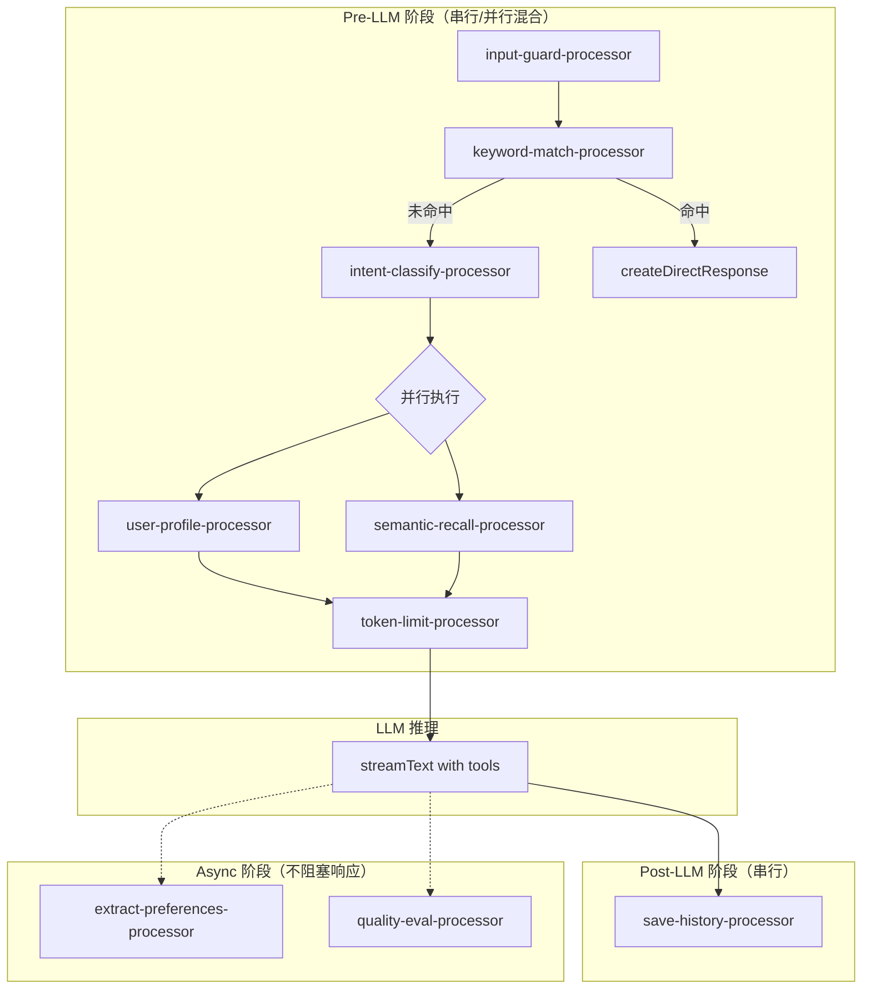
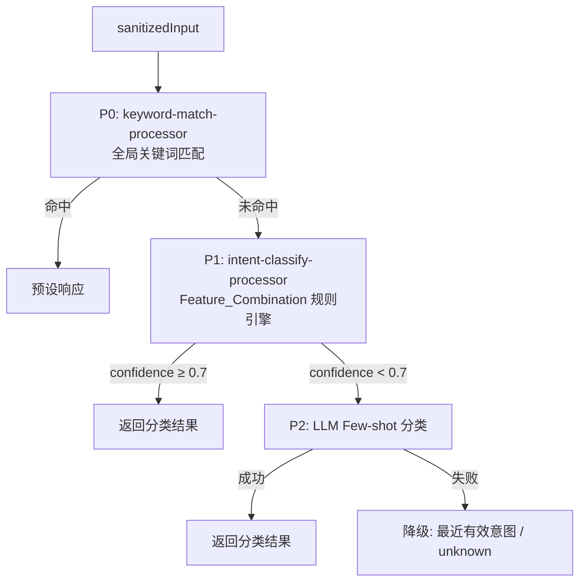

# 设计文档：AI 核心系统增强

## 概述

本设计对聚场 AI 系统的五个核心子系统进行全面增强：处理器架构、意图分类、记忆系统、Playground 调试和语义命名。核心目标是将当前 `handleChatStream`（原 `streamChat`）中约 500 行的内联处理逻辑重构为标准化的 Processor 管线，同时提升意图分类精度、记忆时效性和调试可观测性。

### 设计原则

- **纯函数优先**：所有 Processor 必须是纯函数，禁止 class，符合 `ProcessorFn` 签名
- **Schema 派生**：所有 TypeBox Schema 从 `@juchang/db` 派生，禁止手动重复定义
- **单向数据流**：`context.metadata` 是处理器间唯一的数据传递通道，禁止闭包变量
- **渐进式重构**：保持 API 接口不变，内部逐步迁移到新架构
- **可扩展性**：关键组件预留扩展钩子，支持配置化和插件式注册

## 架构

### 整体处理管线



### 三阶段执行模型

| 阶段 | 处理器 | 执行策略 | 失败行为 |
|------|--------|---------|---------|
| Pre-LLM | input-guard → keyword-match → intent-classify → [user-profile ∥ semantic-recall] → token-limit | 串行 + 条件并行 | 任一失败 → 停止 + `createDirectResponse` |
| Post-LLM | save-history | 串行 | 失败 → 记录日志，不影响响应 |
| Async | extract-preferences, quality-eval | 异步并行 | 失败 → 记录日志，静默忽略 |

### 意图分类三层漏斗



## 组件与接口

### 1. ProcessorContext 增强

当前 `ProcessorContext` 的 `metadata` 字段为 `Record<string, unknown>`，需要增强为结构化类型以支持处理器间的类型安全数据传递。

```typescript
// processors/types.ts

/** 处理器间共享的结构化元数据 */
export interface ProcessorMetadata {
  /** keyword-match-processor 输出 */
  keywordMatch?: {
    matched: boolean;
    keywordId?: string;
    keyword?: string;
    matchType?: string;
    priority?: number;
    responseType?: string;
  };
  /** intent-classify-processor 输出 */
  intentClassify?: {
    intent: IntentType;
    confidence: number;
    method: 'p0' | 'p1' | 'p2';
    matchedPattern?: string;
    p1Features?: string[];
    p2FewShotUsed?: boolean;
    cachedResult?: boolean;
    /** P1 代码异常时降级到 P2 的标记 */
    degraded?: boolean;
  };
  /** user-profile-processor 输出 */
  userProfile?: {
    hasProfile: boolean;
    preferencesCount: number;
    topPreferences?: string[];
  };
  /** semantic-recall-processor 输出 */
  semanticRecall?: {
    resultsCount: number;
    avgSimilarity: number;
    rerankApplied: boolean;
    sources: ('conversations' | 'activities')[];
  };
  /** 对话历史摘要 */
  conversationSummary?: {
    recentIntents: IntentType[];
    turnCount: number;
  };
  /** 处理器间自定义共享状态 */
  [key: string]: unknown;
}

export interface ProcessorContext {
  userId: string | null;
  messages: Message[];
  /** 原始用户输入（未经净化，用于 trace 记录和数据库保存） */
  rawUserInput: string;
  /** 净化后的用户输入（经过 input-guard 处理，用于意图分类、语义召回等） */
  userInput: string;
  systemPrompt: string;
  userProfile?: string;
  semanticContext?: string;
  /** 结构化元数据，替代原 p0MatchKeyword 等散落字段 */
  metadata: ProcessorMetadata;
}
```

### 2. runProcessors 增强

```typescript
// processors/index.ts

/** 处理器配置项 */
export interface ProcessorConfig {
  processor: ProcessorWithMeta;
  /** 条件执行：返回 true 才执行 */
  condition?: (context: ProcessorContext) => boolean;
  /** 所属并行组，同组处理器并行执行 */
  parallelGroup?: string;
}

/** 增强版编排器 */
export async function runProcessors(
  configs: ProcessorConfig[],
  initialContext: ProcessorContext
): Promise<{
  context: ProcessorContext;
  logs: ProcessorLogEntry[];
  success: boolean;
  /** 被跳过的处理器名称 */
  skipped: string[];
}>;
```

编排逻辑：
1. 按顺序遍历 `configs`，遇到相同 `parallelGroup` 的连续处理器收集为一组
2. 串行处理器直接执行；并行组使用 `Promise.all` 并行执行
3. 并行组的 context 合并策略：
   - `systemPrompt`：按处理器在 `configs` 中的声明顺序拼接注入段落（如 `basePrompt + userProfileSection + semanticRecallSection`）
   - `metadata`：浅合并各处理器的命名空间（各处理器写入不同的 key，不会冲突）
   - 其他字段（`messages`、`userInput`）：取最后一个处理器的值（并行组内通常不修改这些字段）
4. `condition` 返回 `false` 时跳过该处理器，记录到 `skipped` 数组

**扩展钩子：Processor 插件式注册**

处理器管线配置通过工厂函数构建，支持动态注册新 Processor，无需修改 `handleChatStream` 核心逻辑。

```typescript
// processors/pipeline.ts

/** 处理器管线注册表 */
const processorRegistry = new Map<string, ProcessorConfig>();

/** 注册处理器 */
export function registerProcessor(name: string, config: ProcessorConfig): void {
  processorRegistry.set(name, config);
}

/** 构建 Pre-LLM 管线配置 */
export function buildPreLLMPipeline(): ProcessorConfig[] {
  // 内置处理器 + 已注册的自定义处理器
  const builtIn: ProcessorConfig[] = [
    { processor: intentClassifyProcessor, condition: (ctx) => !ctx.metadata.keywordMatch?.matched },
    { processor: userProfileProcessor, parallelGroup: 'inject' },
    { processor: semanticRecallProcessor, parallelGroup: 'inject' },
    { processor: tokenLimitProcessor },
  ];
  // 自定义处理器插入到 tokenLimitProcessor 之前
  const custom = Array.from(processorRegistry.values());
  return [...builtIn.slice(0, -1), ...custom, builtIn[builtIn.length - 1]];
}
```

**Processor 命名统一规范**

所有 Processor 纯函数统一使用 `xxxProcessor` 后缀：

```typescript
// processors/index.ts 导出
export { inputGuardProcessor } from './input-guard';
export { keywordMatchProcessor } from './keyword-match';
export { intentClassifyProcessor } from './intent-classify';
export { userProfileProcessor } from './user-profile';
export { semanticRecallProcessor } from './semantic-recall';
export { tokenLimitProcessor } from './token-limit';
export { saveHistoryProcessor } from './save-history';
export { extractPreferencesProcessor } from './extract-preferences';
```

旧版包装函数（`injectUserProfile`、`injectSemanticRecall`、`sanitizeAndGuard` 等）在处理器架构重构完成后删除。

### 3. keyword-match-processor（新增）

将当前 `handleChatStream` 中内联的 P0 关键词匹配逻辑提取为标准 Processor。

```typescript
// processors/keyword-match.ts

export async function keywordMatchProcessor(
  context: ProcessorContext
): Promise<ProcessorResult>;

keywordMatchProcessor.processorName = 'keyword-match-processor';
```

行为：
- 调用 `matchKeyword(context.userInput)` 进行全局关键词匹配
- 命中时：将匹配数据写入 `context.metadata.keywordMatch`，返回 `success: true`
- 未命中时：正常传递 context 到下一个处理器

**关键设计决策：keyword-match 作为独立预检查**

`keyword-match-processor` 不放入 `runProcessors` 管线，而是作为独立预检查步骤在管线之前执行。原因是 P0 命中后需要提前返回 `createDirectResponse`，这属于流程控制而非 context 变换。

```typescript
// handleChatStream 伪代码
const keywordResult = await keywordMatchProcessor(initialContext);
processorLogs.push(/* keywordResult log */);

if (keywordResult.context.metadata.keywordMatch?.matched) {
  return createDirectResponse(/* 预设响应 */);
}

// P0 未命中，继续执行 runProcessors 管线
const { context, logs } = await runProcessors(preLLMConfigs, keywordResult.context);
```

### 4. intent-classify-processor（新增）

将当前内联的意图分类逻辑提取为标准 Processor，并增强为三层漏斗。

```typescript
// processors/intent-classify.ts

export async function intentClassifyProcessor(
  context: ProcessorContext
): Promise<ProcessorResult>;

intentClassifyProcessor.processorName = 'intent-classify-processor';
```

行为：
- **仅处理 P1 和 P2 层**，P0 由 `keyword-match-processor` 独立处理，命中时不进入本处理器
- P1 层使用 Feature_Combination 策略（见下文数据模型）
- P1 置信度 < 0.7 时升级到 P2 层 LLM Few-shot 分类
- P1 代码异常时：记录错误日志，降级到 P2，但在 `metadata.intentClassify` 中标记 `degraded: true`
- 将分类结果写入 `context.metadata.intentClassify`
- 记录分类方法、匹配模式、置信度和耗时到 `toolCallRecords`

**条件执行配置**：
```typescript
// 在 handleChatStream 中的处理器配置
{
  processor: intentClassifyProcessor,
  // P0 未命中时才执行意图分类
  condition: (ctx) => !ctx.metadata.keywordMatch?.matched,
}
```

### 5. Feature_Combination 规则引擎

```typescript
// intent/feature-combination.ts

/** 特征信号 */
export interface FeatureSignal {
  /** 关键词匹配 */
  keywords: string[];
  /** 句式结构模式 */
  syntaxPattern?: RegExp;
  /** 上下文信号（如最近意图） */
  contextSignal?: (history: Array<{ role: string; content: string }>) => boolean;
}

/** 特征组合规则 */
export interface FeatureCombinationRule {
  intent: IntentType;
  /** 特征信号列表 */
  signals: FeatureSignal[];
  /** 基础置信度 */
  baseConfidence: number;
  /** 每命中一个额外信号增加的置信度 */
  signalBoost: number;
  /** 最大置信度 */
  maxConfidence: number;
}

/** 基于特征组合的意图分类 */
export function classifyByFeatureCombination(
  input: string,
  conversationHistory: Array<{ role: string; content: string }>
): ClassifyResult;
```

**置信度计算公式**：
```
confidence = min(baseConfidence + hitCount × signalBoost, maxConfidence)
```
- `hitCount`：命中的特征信号数量（signals 中任意命中即计数）
- 例如：`base=0.5, boost=0.15, max=0.95`
  - 命中 1 个信号 → 0.65
  - 命中 2 个信号 → 0.80
  - 命中 3 个及以上 → 0.95（封顶）

**扩展钩子：规则配置化加载**

`FeatureCombinationRule` 数组支持从 JSON 配置文件加载，而非硬编码在代码中。初始版本使用内置默认规则，后续可扩展为从数据库或配置服务加载。

```typescript
// intent/feature-combination.ts

/** 默认内置规则（代码中定义） */
export const DEFAULT_FEATURE_RULES: FeatureCombinationRule[] = [/* ... */];

/** 加载规则：优先使用外部配置，降级到默认规则 */
export function loadFeatureRules(
  externalRules?: FeatureCombinationRule[]
): FeatureCombinationRule[] {
  return externalRules ?? DEFAULT_FEATURE_RULES;
}
```

示例规则：
- "帮我组" + 活动类型词（火锅/桌游/运动）→ `create` 置信度 0.95
- 单独的"想" → `explore` 置信度 0.6（低于阈值，升级到 P2）
- "想" + 活动类型词 → `explore` 置信度 0.8

### 6. P2 LLM Few-shot 分类器

```typescript
// intent/llm-classifier.ts

/** Few-shot 样例 */
export interface FewShotExample {
  input: string;
  intent: IntentType;
  explanation: string;
}

/** 编辑距离缓存（全局单例，跨会话共享，内存存储） */
const globalEditDistanceCache: EditDistanceCache = {
  entries: new Map(),
  ttlMs: 5 * 60 * 1000, // 5 分钟
};

interface EditDistanceCache {
  entries: Map<string, { intent: IntentType; confidence: number; timestamp: number }>;
  ttlMs: number; // 5 分钟
}

/** LLM Few-shot 意图分类 */
export async function classifyByLLMFewShot(
  input: string,
  conversationHistory: Array<{ role: string; content: string }>,
  cache?: EditDistanceCache // 默认使用 globalEditDistanceCache
): Promise<ClassifyResult>;

/** 计算编辑距离 */
export function editDistance(a: string, b: string): number;
```

行为：
- 维护 5-8 个标注样例覆盖主要意图
- 分类前先检查缓存：对所有缓存 key 计算编辑距离，距离 < 3 且未过期则复用
- 分类后将结果写入缓存（key = input, TTL = 5 分钟）
- 降级策略：P1 和 P2 均无法确定时，取对话历史中最近的有效意图

**扩展钩子：Few-shot 样例可编辑**

Few-shot 样例支持从数据库 `ai_eval_samples` 表加载，Admin 后台可编辑。初始版本使用内置默认样例，后续通过 Admin API 管理。

```typescript
// intent/llm-classifier.ts

/** 默认内置 Few-shot 样例 */
export const DEFAULT_FEW_SHOT_EXAMPLES: FewShotExample[] = [/* ... */];

/** 加载 Few-shot 样例：优先从数据库加载，降级到默认样例 */
export async function loadFewShotExamples(): Promise<FewShotExample[]> {
  try {
    const dbExamples = await db.query.aiEvalSamples.findMany({
      where: eq(aiEvalSamples.type, 'few-shot'),
      limit: 8,
    });
    return dbExamples.length > 0
      ? dbExamples.map(toFewShotExample)
      : DEFAULT_FEW_SHOT_EXAMPLES;
  } catch {
    return DEFAULT_FEW_SHOT_EXAMPLES;
  }
}
```

### 7. semantic-recall-processor 增强

```typescript
// processors/semantic-recall.ts（增强）
```

变更：
- 搜索范围扩展：同时搜索 `conversation_messages` 表和 `activities` 表
- 相似度阈值从 0.7 降低至 0.5
- 合并结果后使用 `qwen3-rerank`（通过 `models/router.ts` 的 `rerank()` 函数）进行重排序
- 返回 top-K 结果（K=5）
- 为每条消息计算 Importance_Score 并优先返回高分消息

### 8. 记忆系统增强

#### 8.1 EnhancedPreference 扩展

```typescript
// memory/working.ts（增强）

export interface EnhancedPreference {
  category: PreferenceCategory;
  value: string;
  sentiment: PreferenceSentiment;
  confidence: number;
  updatedAt: Date;
  /** 新增：提及次数 */
  mentionCount: number;
}
```

#### 8.2 时间衰减函数

```typescript
// memory/temporal-decay.ts（新增）

/**
 * 计算偏好的时间衰减权重
 * - 0-7 天：1.0
 * - 7-30 天：线性衰减至 0.3
 * - 30-90 天：线性衰减至 0.1
 * - >90 天：0
 */
export function calculateTemporalDecay(updatedAt: Date, now?: Date): number;

/**
 * 计算偏好的综合分数 = confidence × temporalDecay
 */
export function calculatePreferenceScore(
  preference: EnhancedPreference,
  now?: Date
): number;
```

#### 8.3 偏好冲突处理

当用户表达矛盾偏好时（如已有"喜欢火锅"后说"最近不想吃火锅"）：
1. 新偏好覆盖旧偏好的 `sentiment` 字段
2. 旧偏好的 `confidence` 降低 50%
3. 新偏好的 `mentionCount` 设为 1

在 `mergeEnhancedPreferences` 函数中实现冲突检测：通过 `category + value` 匹配，当 `sentiment` 不同时触发冲突处理。

#### 8.4 偏好清理策略

当偏好数量超过 30 条时，执行合并清理：
- 移除条件：`confidence < 0.2` 且 `updatedAt` 超过 30 天
- 在 `saveEnhancedUserProfile` 时触发

#### 8.5 偏好提取前置检查

```typescript
// memory/preference-signal.ts（新增）

/** 偏好信号关键词 */
const PREFERENCE_SIGNAL_KEYWORDS = [
  '喜欢', '不喜欢', '讨厌', '爱', '想吃', '不吃',
  '想玩', '不想', '偏好', '习惯', '常去', '最爱',
];

/**
 * 检测对话中是否包含偏好信号
 * 仅当检测到信号时才调用 LLM 提取
 */
export function hasPreferenceSignal(
  messages: Array<{ role: string; content: string }>
): boolean;
```

#### 8.6 Importance_Score 计算

```typescript
// memory/importance.ts（新增）

export interface ImportanceFactors {
  hasPreferenceExpression: boolean;  // 包含偏好表达
  hasToolCallResult: boolean;        // 包含工具调用结果
  hasConfirmation: boolean;          // 包含确认/否定
  hasLocationMention: boolean;       // 包含地点提及
}

/**
 * 计算消息的重要性分数 (0-1)
 * 
 * 计算公式：
 * score = 0.3 + (hasPreferenceExpression ? 0.175 : 0)
 *             + (hasToolCallResult ? 0.175 : 0)
 *             + (hasConfirmation ? 0.175 : 0)
 *             + (hasLocationMention ? 0.175 : 0)
 * 
 * 基础分 0.3，每个 factor +0.175，上限 1.0
 */
export function calculateImportanceScore(
  content: string,
  factors: ImportanceFactors
): number;
```

### 9. resolveToolsForIntent（合并）

将 `tools/index.ts` 的 `getToolsByIntent` 和 `tools/registry.ts` 的 `getToolsForIntent` 合并为单一入口：

```typescript
// tools/registry.ts（重构）

/**
 * 统一的工具解析入口
 * 合并原 getToolsByIntent (index.ts) 和 getToolsForIntent (registry.ts)
 */
export function resolveToolsForIntent(
  userId: string | null,
  intent: IntentType,
  options: {
    hasDraftContext?: boolean;
    location?: { lat: number; lng: number } | null;
  }
): Record<string, unknown>;
```

同时将 `intent/router.ts` 的 `getToolsForIntent` 和 `tools/registry.ts` 的 `getToolNamesForIntent` 合并为单一函数 `getToolNamesByIntent`，放在 `tools/registry.ts` 中，`intent/router.ts` 中的原函数删除或转发。

### 10. AI 参数配置模块

#### 10.1 数据库表设计

```sql
-- packages/db/src/schema/ai-configs.ts
CREATE TABLE ai_configs (
  id UUID PRIMARY KEY DEFAULT gen_random_uuid(),
  config_key VARCHAR(100) NOT NULL UNIQUE,  -- 如 'intent.feature_rules', 'intent.few_shot_examples'
  config_value JSONB NOT NULL,              -- 配置值
  category VARCHAR(50) NOT NULL,            -- 分类：'intent' | 'memory' | 'model' | 'processor'
  description TEXT,                         -- 配置项描述
  version INTEGER NOT NULL DEFAULT 1,       -- 版本号，每次更新自增
  updated_at TIMESTAMP WITH TIME ZONE NOT NULL DEFAULT NOW(),
  updated_by VARCHAR(100),                  -- 更新人
  created_at TIMESTAMP WITH TIME ZONE NOT NULL DEFAULT NOW()
);
```

```typescript
// packages/db/src/schema/ai-configs.ts
import { pgTable, uuid, varchar, jsonb, integer, timestamp, text } from 'drizzle-orm/pg-core';

export const aiConfigs = pgTable('ai_configs', {
  id: uuid('id').primaryKey().defaultRandom(),
  configKey: varchar('config_key', { length: 100 }).notNull().unique(),
  configValue: jsonb('config_value').notNull(),
  category: varchar('category', { length: 50 }).notNull(),
  description: text('description'),
  version: integer('version').notNull().default(1),
  updatedAt: timestamp('updated_at', { withTimezone: true }).notNull().defaultNow(),
  updatedBy: varchar('updated_by', { length: 100 }),
  createdAt: timestamp('created_at', { withTimezone: true }).notNull().defaultNow(),
});
```

#### 10.2 预定义配置键

| config_key | category | 说明 | 默认值来源 |
|-----------|----------|------|-----------|
| `intent.feature_rules` | intent | Feature_Combination 规则数组 | `DEFAULT_FEATURE_RULES` |
| `intent.few_shot_examples` | intent | Few-shot 标注样例数组 | `DEFAULT_FEW_SHOT_EXAMPLES` |
| `intent.confidence_threshold` | intent | P1→P2 升级阈值 | `0.7` |
| `intent.edit_distance_ttl_ms` | intent | 编辑距离缓存 TTL | `300000` |
| `memory.temporal_decay_days` | memory | 时间衰减分段天数 [7, 30, 90] | `[7, 30, 90]` |
| `memory.max_preferences` | memory | 偏好最大数量 | `30` |
| `memory.cleanup_confidence_threshold` | memory | 清理置信度阈值 | `0.2` |
| `memory.similarity_threshold` | memory | 语义召回相似度阈值 | `0.5` |
| `model.intent_model_map` | model | 意图→模型映射 | 内置映射 |
| `model.fallback_config` | model | 降级策略配置 | `DEFAULT_FALLBACK_CONFIG` |
| `processor.pipeline_config` | processor | 处理器管线配置（顺序、启用状态、并行组） | 内置管线 |

#### 10.3 API 端点

```typescript
// apps/api/src/modules/ai/config/config.controller.ts

// 获取所有配置（按类别分组）
GET /ai/configs
  → { intent: [...], memory: [...], model: [...], processor: [...] }

// 获取单个配置
GET /ai/configs/:configKey
  → { configKey, configValue, version, updatedAt }

// 更新配置（自动递增版本号）
PUT /ai/configs/:configKey
  body: { configValue: unknown }
  → { configKey, configValue, version, updatedAt }

// 获取配置变更历史
GET /ai/configs/:configKey/history
  → Array<{ version, configValue, updatedAt, updatedBy }>

// 回滚到指定版本
POST /ai/configs/:configKey/rollback
  body: { targetVersion: number }
  → { configKey, configValue, version, updatedAt }
```

#### 10.4 配置加载服务

```typescript
// apps/api/src/modules/ai/config/config.service.ts

/** 内存缓存，TTL 30 秒 */
interface ConfigCache {
  data: Map<string, { value: unknown; expireAt: number }>;
  ttlMs: number; // 30000
}

/**
 * 获取配置值（带缓存）
 * 优先从内存缓存读取，过期后从数据库加载
 * 加载失败时降级到代码默认值
 */
export async function getConfigValue<T>(
  configKey: string,
  defaultValue: T
): Promise<T>;

/**
 * 更新配置值（写入数据库 + 刷新缓存）
 */
export async function setConfigValue(
  configKey: string,
  configValue: unknown,
  updatedBy?: string
): Promise<{ version: number }>;

/**
 * 获取配置变更历史
 * 通过查询同一 configKey 的所有版本记录实现
 */
export async function getConfigHistory(
  configKey: string
): Promise<Array<{ version: number; configValue: unknown; updatedAt: Date; updatedBy: string | null }>>;
```

#### 10.5 与现有模块的集成

各模块通过 `getConfigValue` 加载配置，替代硬编码默认值：

```typescript
// intent/feature-combination.ts
const rules = await getConfigValue('intent.feature_rules', DEFAULT_FEATURE_RULES);

// intent/llm-classifier.ts
const examples = await getConfigValue('intent.few_shot_examples', DEFAULT_FEW_SHOT_EXAMPLES);
const threshold = await getConfigValue('intent.confidence_threshold', 0.7);

// models/router.ts
const fallbackConfig = await getConfigValue('model.fallback_config', DEFAULT_FALLBACK_CONFIG);

// processors/pipeline.ts
const pipelineConfig = await getConfigValue('processor.pipeline_config', DEFAULT_PIPELINE_CONFIG);
```

#### 10.6 配置变更历史

为支持回滚，`ai_configs` 表使用版本号机制：
- 每次 `PUT` 更新时，先将当前记录复制到 `ai_config_history` 表，再更新主表并递增 `version`
- 回滚时从 `ai_config_history` 表读取目标版本的 `configValue`，写入主表

```sql
CREATE TABLE ai_config_history (
  id UUID PRIMARY KEY DEFAULT gen_random_uuid(),
  config_key VARCHAR(100) NOT NULL,
  config_value JSONB NOT NULL,
  version INTEGER NOT NULL,
  updated_at TIMESTAMP WITH TIME ZONE NOT NULL,
  updated_by VARCHAR(100),
  created_at TIMESTAMP WITH TIME ZONE NOT NULL DEFAULT NOW()
);
```

### 11. Playground 增强组件

#### 11.1 瀑布图组件

```typescript
// apps/admin/src/features/ai-ops/components/playground/waterfall-view.tsx

interface WaterfallViewProps {
  processorLogs: ProcessorLogEntry[];
  onProcessorClick: (processorName: string) => void;
}
```

展示每个处理器的名称、执行时间条形图、输入摘要和输出摘要。点击节点打开详情面板。

#### 11.2 Tool Calls 时间线

```typescript
// apps/admin/src/features/ai-ops/components/playground/tool-calls-timeline.tsx

interface ToolCallsTimelineProps {
  toolCalls: Array<{
    toolName: string;
    toolCallId: string;
    args: unknown;
    result?: unknown;
    executionTimeMs: number;
    timestamp: string;
  }>;
  onToolCallClick?: (toolCallId: string) => void;
}
```

以时间线形式展示每个 Tool 的名称、输入参数、返回结果和执行耗时。点击可展开完整的输入输出 JSON。

#### 11.3 System Prompt Diff 查看器

```typescript
// apps/admin/src/features/ai-ops/components/playground/system-prompt-diff.tsx

interface SystemPromptDiffProps {
  basePrompt: string;      // 未注入任何 Processor 数据的原始模板
  finalPrompt: string;     // 最终组装的完整系统提示词
  injectionSources: Array<{
    source: string;        // 'user-profile' | 'semantic-recall' | 'working-memory'
    content: string;
    startIndex: number;
    endIndex: number;
  }>;
}
```

#### 11.4 意图分类 A/B 对比

```typescript
// apps/admin/src/features/ai-ops/components/playground/intent-ab-compare.tsx

interface IntentABCompareProps {
  input: string;
  p0Result?: { matched: boolean; keyword?: string };
  p1Result?: { intent: IntentType; confidence: number; features: string[] };
  p2Result?: { intent: IntentType; confidence: number };
}
```

#### 11.5 用户画像模拟

```typescript
// apps/admin/src/features/ai-ops/components/playground/profile-simulator.tsx

interface ProfileSimulatorProps {
  currentProfile: EnhancedUserProfile | null;
  onSimulate: (profile: EnhancedUserProfile) => void;
}
```

支持手动编辑偏好列表、置信度、时间衰减权重，以模拟画像重新执行请求。

#### 11.6 会话回放

```typescript
// apps/admin/src/features/ai-ops/components/playground/session-replay.tsx

interface SessionReplayProps {
  conversations: ConversationThread[];
  onSelectConversation: (id: string) => void;
  onReplayMessage: (messageId: string) => void;
}
```

#### 11.7 Memory Inspector

```typescript
// apps/admin/src/features/ai-ops/components/playground/memory-inspector.tsx

interface MemoryInspectorProps {
  userId: string;
  profile: EnhancedUserProfile | null;
}
```

展示 Working Memory 内容，包括每个偏好的类别、情感、置信度、mentionCount 和最后更新时间。

#### 11.8 Session Stats Bar 增强

在现有 `session-stats-bar.tsx` 中增加预估成本字段：

```typescript
interface SessionStats {
  // ... 现有字段
  /** 预估成本（元） */
  estimatedCost?: number;
}
```

成本计算基于模型定价和 Token 用量：
- qwen-flash: 输入 ¥0.0005/千token, 输出 ¥0.002/千token
- qwen-plus: 输入 ¥0.002/千token, 输出 ¥0.006/千token
- qwen-max: 输入 ¥0.02/千token, 输出 ¥0.06/千token

## 数据模型

### ProcessorMetadata（新增结构化类型）

见上文「组件与接口」第 1 节。

### EnhancedPreference（扩展）

| 字段 | 类型 | 说明 | 变更 |
|------|------|------|------|
| category | PreferenceCategory | 偏好类别 | 不变 |
| value | string | 偏好内容 | 不变 |
| sentiment | PreferenceSentiment | 情感标签 | 不变 |
| confidence | number | 置信度 0-1 | 不变 |
| updatedAt | Date | 最后更新时间 | 不变 |
| mentionCount | number | 提及次数，初始值 1 | **新增** |

### ClassifyResult（扩展）

| 字段 | 类型 | 说明 | 变更 |
|------|------|------|------|
| intent | IntentType | 意图类型 | 不变 |
| confidence | number | 置信度 0-1 | 不变 |
| method | ClassifyMethod | 分类方法 | **扩展为 'p0' \| 'p1' \| 'p2'** |
| matchedPattern | string? | 匹配的模式 | 不变 |
| p1Features | string[]? | P1 层命中的特征信号 | **新增** |

### FeatureCombinationRule

| 字段 | 类型 | 说明 |
|------|------|------|
| intent | IntentType | 目标意图 |
| signals | FeatureSignal[] | 特征信号列表 |
| baseConfidence | number | 基础置信度 |
| signalBoost | number | 每个额外信号的置信度增量 |
| maxConfidence | number | 最大置信度上限 |

### FewShotExample

| 字段 | 类型 | 说明 |
|------|------|------|
| input | string | 用户输入样例 |
| intent | IntentType | 正确意图 |
| explanation | string | 分类理由 |

### EditDistanceCache

| 字段 | 类型 | 说明 |
|------|------|------|
| entries | Map<string, CacheEntry> | 缓存条目 |
| ttlMs | number | 过期时间（5 分钟） |

### ImportanceFactors

| 字段 | 类型 | 说明 |
|------|------|------|
| hasPreferenceExpression | boolean | 包含偏好表达 |
| hasToolCallResult | boolean | 包含工具调用结果 |
| hasConfirmation | boolean | 包含确认/否定 |
| hasLocationMention | boolean | 包含地点提及 |


## 正确性属性

*正确性属性是系统在所有合法执行路径上都应保持的特征或行为——本质上是对"系统应该做什么"的形式化陈述。属性是人类可读规格与机器可验证正确性保证之间的桥梁。*

### Property 1: 条件跳过

*For any* 处理器配置列表和 ProcessorContext，如果某个处理器的 `condition` 函数对当前 context 返回 `false`，则该处理器不应被执行，且其名称应出现在返回结果的 `skipped` 数组中。

**Validates: Requirements 1.3**

### Property 2: 日志完整性

*For any* 处理器配置列表和 ProcessorContext，`runProcessors` 执行后返回的 `logs` 数组中每条记录都应包含 `processorName`、`executionTime`（≥ 0）、`success`（boolean）和 `timestamp`（非空字符串），且 `logs.length + skipped.length` 应等于配置列表的总长度。

**Validates: Requirements 1.5**

### Property 3: Pre-LLM 失败即停

*For any* 长度 ≥ 2 的处理器链，如果第 N 个处理器返回 `success: false`，则 `logs` 数组长度应等于 N（即后续处理器未执行），且 `runProcessors` 返回 `success: false`。

**Validates: Requirements 1.7**

### Property 4: Post-LLM 失败不阻塞

*For any* post-LLM 处理器链，如果第 N 个处理器返回 `success: false`，后续处理器仍应被执行，`logs` 数组长度应等于处理器链总长度。

**Validates: Requirements 1.8**

### Property 5: Feature_Combination 置信度单调性

*For any* 用户输入和 Feature_Combination 规则集，命中的特征信号数量越多，返回的置信度应越高（或相等），且不超过规则定义的 `maxConfidence`。

**Validates: Requirements 2.1**

### Property 6: 三层漏斗级联

*For any* 用户输入，如果 P0 层（keyword-match）命中，则 P1 和 P2 层不应被触发；如果 P1 层返回置信度 ≥ 0.7，则 P2 层不应被触发；仅当 P1 层置信度 < 0.7 时 P2 层才被触发。

**Validates: Requirements 2.2, 2.8**

### Property 7: 上下文窗口限制

*For any* 长度为 N 的对话历史（N ≥ 0），传递给意图分类器的上下文消息数量应等于 `min(N, 6)`（最近 3 轮 = 6 条消息）。

**Validates: Requirements 2.3**

### Property 8: 编辑距离缓存命中

*For any* 两个输入字符串 A 和 B，如果 `editDistance(A, B) < 3` 且 A 的分类结果已在缓存中且未过期（TTL 5 分钟内），则对 B 的分类应直接返回缓存结果而不调用 LLM。

**Validates: Requirements 2.4**

### Property 9: 降级到最近有效意图

*For any* 对话历史，当 P1 和 P2 均返回 `unknown` 时，分类结果应等于对话历史中最近一条非 `unknown` 意图；如果历史中无有效意图，则返回 `unknown`。

**Validates: Requirements 2.5**

### Property 10: 分类元数据完整性

*For any* 意图分类结果，输出的 `toolCallRecords` 条目应包含分类方法（'p0'|'p1'|'p2'）、置信度（0-1）和耗时（≥ 0），且当方法为 'p1' 时应包含 `matchedPattern`。

**Validates: Requirements 2.7**

### Property 11: 时间衰减分段线性

*For any* 时间差 `d`（天），`calculateTemporalDecay` 应满足：
- `d ∈ [0, 7]` → 返回 1.0
- `d ∈ (7, 30]` → 返回 `1.0 - (d - 7) × 0.7 / 23`（线性从 1.0 到 0.3）
- `d ∈ (30, 90]` → 返回 `0.3 - (d - 30) × 0.2 / 60`（线性从 0.3 到 0.1）
- `d > 90` → 返回 0

**Validates: Requirements 3.1**

### Property 12: 矛盾偏好冲突处理

*For any* 偏好列表中存在 `(category=C, value=V, sentiment=like, confidence=X)` 的偏好，当合并一个 `(category=C, value=V, sentiment=dislike)` 的新偏好时，结果中该偏好的 `sentiment` 应为 `dislike`，且旧偏好的 `confidence` 应变为 `X × 0.5`。

**Validates: Requirements 3.2**

### Property 13: mentionCount 累加

*For any* 偏好，新创建时 `mentionCount` 应为 1；每次被再次提及后 `mentionCount` 应 +1，`confidence` 应 +0.1（上限 1.0）。

**Validates: Requirements 3.3, 3.7**

### Property 14: 偏好清理

*For any* 偏好列表（长度 > 30），执行清理后不应包含任何 `confidence < 0.2` 且 `updatedAt` 距今超过 30 天的偏好。

**Validates: Requirements 3.4**

### Property 15: 画像 Prompt 构建

*For any* 偏好列表，`buildProfilePrompt` 输出中的偏好应按 `confidence × temporalDecay` 综合分数降序排列，且不应包含综合分数为 0 的偏好。

**Validates: Requirements 3.6, 3.11**

### Property 16: 偏好信号前置检查

*For any* 不包含偏好信号关键词（"喜欢"、"不吃"等）的对话历史，`hasPreferenceSignal` 应返回 `false`，从而不触发 LLM 偏好提取。

**Validates: Requirements 3.8**

### Property 17: Importance_Score 计算

*For any* 消息内容和 ImportanceFactors，`calculateImportanceScore` 返回值应在 [0, 1] 范围内，且当所有 factors 为 true 时分数应高于所有 factors 为 false 时的分数。

**Validates: Requirements 3.9**

### Property 18: 预估成本计算

*For any* token 用量（inputTokens, outputTokens）和模型 ID，预估成本应等于 `inputTokens × inputPrice / 1000 + outputTokens × outputPrice / 1000`，其中价格由模型定价表决定。

**Validates: Requirements 4.7**

### Property 19: resolveToolsForIntent 等价性

*For any* 意图类型和上下文参数，`resolveToolsForIntent` 返回的工具集应与原 `getToolsByIntent`（index.ts）在相同参数下返回的工具集一致（键名集合相等）。

**Validates: Requirements 5.5**

## 错误处理

### Pre-LLM 阶段

| 处理器 | 失败场景 | 处理策略 |
|--------|---------|---------|
| input-guard-processor | 输入被拦截 | 返回 `createDirectResponse`，附带建议响应文本 |
| keyword-match-processor | 关键词服务不可用 | 记录错误，视为未命中，继续后续处理器 |
| intent-classify-processor | P1 规则引擎代码异常 | 记录错误日志，降级到 P2 LLM 分类，标记 `metadata.intentClassify.degraded: true` |
| intent-classify-processor | P1 正常执行但置信度 < 0.7 | 正常升级到 P2（非降级，不标记 degraded） |
| intent-classify-processor | P2 LLM 调用失败 | 降级到对话历史最近有效意图，最终兜底 `unknown` |
| user-profile-processor | 用户画像读取失败 | 跳过画像注入，使用空画像继续 |
| semantic-recall-processor | 向量搜索或 rerank 失败 | 跳过语义召回，使用空上下文继续 |
| token-limit-processor | 截断异常 | 使用原始 prompt 继续（可能超 token 限制） |

### Post-LLM 阶段

| 处理器 | 失败场景 | 处理策略 |
|--------|---------|---------|
| save-history-processor | 数据库写入失败 | 记录错误日志，不影响用户响应 |

### Async 阶段

| 处理器 | 失败场景 | 处理策略 |
|--------|---------|---------|
| extract-preferences-processor | LLM 提取失败 | 降级到关键词提取，再失败则静默忽略 |
| quality-eval-processor | 评估失败 | 静默忽略，记录错误日志 |

### 编辑距离缓存

- 缓存条目过期（TTL 5 分钟）后自动清除
- 缓存 Map 大小超过 1000 条时执行 LRU 淘汰
- 缓存读写异常不影响分类流程，降级到直接调用 LLM

### 记忆系统

- 偏好合并冲突时以新偏好为准，旧偏好降级但不删除
- Working Memory JSON 解析失败时返回空画像，不阻塞请求
- 时间衰减计算中 `updatedAt` 为 null 时视为 0 权重

## 测试策略

### 属性测试（Property-Based Testing）

使用 `fast-check` 库进行属性测试，每个属性至少运行 100 次迭代。

**测试文件组织**：
- `processors/__tests__/run-processors.property.test.ts` — Property 1-4
- `intent/__tests__/feature-combination.property.test.ts` — Property 5-6
- `intent/__tests__/classifier.property.test.ts` — Property 7-10
- `memory/__tests__/temporal-decay.property.test.ts` — Property 11
- `memory/__tests__/preferences.property.test.ts` — Property 12-16
- `memory/__tests__/importance.property.test.ts` — Property 17
- `tools/__tests__/registry.property.test.ts` — Property 19

**标注格式**：
```typescript
// Feature: ai-core-enhancement, Property 11: 时间衰减分段线性
test.prop('calculateTemporalDecay 满足分段线性约束', [fc.float(...)], (days) => {
  // ...
});
```

### 单元测试

单元测试聚焦于具体示例和边界条件：
- 编辑距离函数的已知输入输出对
- 贪婪正则修复后的具体 case（"想" 不匹配 explore）
- 偏好清理的边界条件（恰好 30 条、恰好 30 天）
- 成本计算的具体模型定价验证
- Few-shot 样例的格式正确性

### Playground 组件测试

Playground 增强的 UI 组件通过手动验证，不纳入自动化属性测试范围。重点验证：
- 瀑布图渲染正确性
- System Prompt diff 高亮准确性
- A/B 对比数据展示完整性
