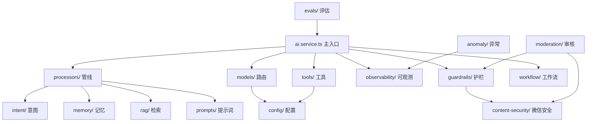

# 设计文档：AI 模块全面优化

## 概述

本设计覆盖聚场 AI 系统 12 个模块的优化，按优先级分为三个阶段：
- **Phase 1（P0 稳定性）**：Tracer 并发修复、Workflow 持久化、Tools 超时保护
- **Phase 2（P1 架构优化）**：Model Router 熔断、Guardrails 动态化、Observability 指标、ai.service.ts 重构、Agent 清理
- **Phase 3（P2 功能增强）**：RAG 优化、Evals 扩展、Prompts 版本化、Anomaly 扩展、Moderation 增强

所有模块遵循项目规范：Processor 纯函数、Schema 从 DB 派生、TypeBox 替代 Zod、统一通过 `getConfigValue` 读取动态配置。

## 架构

### 模块依赖关系



### 改动范围

| 层级 | 改动文件 | 类型 |
|------|---------|------|
| DB Schema | `packages/db/src/schema/workflow-states.ts` | 新建 |
| DB Schema | `packages/db/src/schema/ai-eval-runs.ts` | 新建 |
| Observability | `apps/api/src/modules/ai/observability/tracer.ts` | 重写 |
| Observability | `apps/api/src/modules/ai/observability/quality-metrics.ts` | 修改 |
| Observability | `apps/api/src/modules/ai/observability/metrics.ts` | 修改 |
| Model Router | `apps/api/src/modules/ai/models/router.ts` | 修改 |
| RAG | `apps/api/src/modules/ai/rag/search.ts` | 修改 |
| Tools | `apps/api/src/modules/ai/tools/registry.ts` | 修改 |
| Tools | `apps/api/src/modules/ai/tools/executor.ts` | 修改 |
| Guardrails | `apps/api/src/modules/ai/guardrails/input-guard.ts` | 修改 |
| Guardrails | `apps/api/src/modules/ai/guardrails/output-guard.ts` | 修改 |
| Evals | `apps/api/src/modules/ai/evals/runner.ts` | 修改 |
| Evals | `apps/api/src/modules/ai/evals/scorers.ts` | 修改 |
| Workflow | `apps/api/src/modules/ai/workflow/workflow.ts` | 重写 |
| Prompts | `apps/api/src/modules/ai/prompts/index.ts` | 修改 |
| Anomaly | `apps/api/src/modules/ai/anomaly/detector.ts` | 修改 |
| Moderation | `apps/api/src/modules/ai/moderation/moderation.service.ts` | 修改 |
| Processors | `apps/api/src/modules/ai/processors/record-metrics.ts` | 新建 |
| Processors | `apps/api/src/modules/ai/processors/persist-request.ts` | 新建 |
| Processors | `apps/api/src/modules/ai/processors/evaluate-quality.ts` | 新建 |
| Processors | `apps/api/src/modules/ai/processors/output-guard.ts` | 新建 |
| Main | `apps/api/src/modules/ai/ai.service.ts` | 修改 |
| Agent | `apps/api/src/modules/ai/agent/` | 删除 |

## 组件与接口

### 1. Tracer 重写（需求 1）

用 `AsyncLocalStorage` 替换全局变量，实现请求级上下文隔离。

```typescript
// apps/api/src/modules/ai/observability/tracer.ts
import { AsyncLocalStorage } from 'async_hooks';

interface TraceContext {
  traceId: string;
  currentSpanId: string | null;
}

const traceStorage = new AsyncLocalStorage<TraceContext>();

// 带上限的 Store
const MAX_STORE_SIZE = 10000;
const spanStore = new Map<string, Span>();
const traceStore = new Map<string, AIRequestTrace>();

// 淘汰最早条目
function evictIfNeeded(store: Map<string, any>, maxSize: number): void {
  if (store.size <= maxSize) return;
  const firstKey = store.keys().next().value;
  if (firstKey) store.delete(firstKey);
}

// 创建 Trace（在 AsyncLocalStorage 中运行）
export function runWithTrace<T>(fn: () => T): T {
  const traceId = generateId();
  return traceStorage.run({ traceId, currentSpanId: null }, fn);
}

// 获取当前上下文（从 AsyncLocalStorage 读取）
export function getCurrentTraceId(): string | null {
  return traceStorage.getStore()?.traceId ?? null;
}

// startSpan / endSpan 通过 traceStorage.getStore() 读写
// 定时清理：模块加载时启动 setInterval
const CLEANUP_INTERVAL = 5 * 60 * 1000; // 5 分钟
setInterval(() => cleanupOldTraces(), CLEANUP_INTERVAL);
```

### 2. Quality Score 多维化（需求 2）

```typescript
// apps/api/src/modules/ai/observability/quality-metrics.ts
export function calculateQualityScore(data: ConversationMetricsData): number {
  const intentScore = data.intentConfidence ?? 0.5;
  
  const toolsCalled = data.toolsCalled?.length ?? 0;
  const toolsSucceeded = data.toolsSucceeded ?? 0;
  const toolScore = toolsCalled > 0 ? toolsSucceeded / toolsCalled : 1;
  
  // 延迟合理性：< 3s 满分，3-10s 线性衰减，> 10s 为 0
  const latency = data.latencyMs ?? 3000;
  const latencyScore = latency <= 3000 ? 1 : latency >= 10000 ? 0 : (10000 - latency) / 7000;
  
  // 输出长度合理性：10-2000 字符满分，过短或过长扣分
  const len = data.outputLength ?? 0;
  const lengthScore = len >= 10 && len <= 2000 ? 1 : len < 10 ? 0.3 : 0.7;
  
  return Math.round((0.3 * intentScore + 0.3 * toolScore + 0.2 * latencyScore + 0.2 * lengthScore) * 100) / 100;
}
```

Metrics 模块的 `getTokenUsageStats` / `getToolCallStats` 改为从数据库聚合查询：

```typescript
// apps/api/src/modules/ai/observability/metrics.ts
export async function getTokenUsageStats(startDate: Date, endDate: Date): Promise<DailyTokenUsage[]> {
  const result = await db.execute(sql`
    SELECT DATE(created_at) as date,
           COUNT(*) as total_requests,
           SUM(input_tokens) as input_tokens,
           SUM(output_tokens) as output_tokens
    FROM ai_requests
    WHERE created_at >= ${toTimestamp(startDate)} AND created_at <= ${toTimestamp(endDate)}
    GROUP BY DATE(created_at)
    ORDER BY date DESC
  `);
  return result.map(mapToDailyTokenUsage);
}
```

### 3. Model Router 熔断（需求 3）

```typescript
// apps/api/src/modules/ai/models/router.ts

interface ProviderHealth {
  consecutiveFailures: number;
  lastFailureTime: number;
  isHealthy: boolean;
}

const providerHealth: Record<string, ProviderHealth> = {};
const FAILURE_THRESHOLD = 5;
const COOLDOWN_MS = 60_000;
const MAX_RETRY_DELAY = 30_000;

function isProviderHealthy(name: string): boolean {
  const health = providerHealth[name];
  if (!health || health.isHealthy) return true;
  // 冷却期结束，自动恢复
  if (Date.now() - health.lastFailureTime > COOLDOWN_MS) {
    health.isHealthy = true;
    health.consecutiveFailures = 0;
    return true;
  }
  return false;
}

function recordFailure(name: string): void {
  if (!providerHealth[name]) {
    providerHealth[name] = { consecutiveFailures: 0, lastFailureTime: 0, isHealthy: true };
  }
  const health = providerHealth[name];
  health.consecutiveFailures++;
  health.lastFailureTime = Date.now();
  if (health.consecutiveFailures >= FAILURE_THRESHOLD) {
    health.isHealthy = false;
  }
}

// checkAllProvidersHealth 修复：检查 qwen 和 deepseek
export async function checkAllProvidersHealth() {
  const results = await Promise.all([
    checkProviderHealth('qwen'),
    checkProviderHealth('deepseek'),
  ]);
  return { qwen: results[0], deepseek: results[1] };
}

// withRetry 增加最大延迟上限
const delay = Math.min(retryDelay * Math.pow(2, attempt) * (0.5 + Math.random() * 0.5), MAX_RETRY_DELAY);

// getModelByIntent 支持动态配置
export async function getModelByIntent(intent: string): Promise<LanguageModel> {
  const intentMap = await getConfigValue('model.intent_map', {
    chat: 'qwen-flash', reasoning: 'qwen-plus', agent: 'qwen-max', vision: 'qwen3-vl-plus'
  });
  const modelId = intentMap[intent] || 'qwen-flash';
  return getChatModel(modelId);
}
```

### 4. RAG 搜索优化（需求 4）

```typescript
// apps/api/src/modules/ai/rag/search.ts

// 批量索引：合并 Embedding 调用
export async function indexActivities(activityList: Activity[], options?) {
  for (let i = 0; i < activityList.length; i += batchSize) {
    const batch = activityList.slice(i, i + batchSize);
    // 批量生成 Embedding（一次 API 调用）
    const texts = batch.map(a => `${a.title} ${a.type} ${a.locationName} ${a.description || ''}`);
    const embeddings = await getEmbeddings(texts); // 批量 API
    // 批量更新数据库
    for (let j = 0; j < batch.length; j++) {
      await db.update(activities).set({ embedding: embeddings[j] }).where(eq(activities.id, batch[j].id));
    }
  }
}

// Rerank/MaxSim 可配置开关
const ragConfig = await getConfigValue('rag.search_options', { useRerank: true, useMaxSim: true });

// 活动状态变更时清除索引（在 activities.service.ts 中调用）
export async function onActivityStatusChange(activityId: string, newStatus: string) {
  if (newStatus === 'completed' || newStatus === 'cancelled') {
    await deleteIndex(activityId);
  }
}

// generateMatchReason 增强模板
export function generateMatchReason(query: string, activity: Activity, score: number, distance?: number) {
  const parts: string[] = [];
  if (distance && distance < 1000) parts.push(`距你仅 ${Math.round(distance)}m`);
  else if (distance) parts.push(`距你 ${(distance / 1000).toFixed(1)}km`);
  if (activity.type) parts.push(`${activity.type}类活动`);
  if (score >= 0.8) parts.push('和你的需求高度匹配');
  else if (score >= 0.6) parts.push('比较符合你的需求');
  return `推荐「${activity.title}」：${parts.join('，')}`;
}
```

### 5. Tools 超时与指标（需求 5）

```typescript
// apps/api/src/modules/ai/tools/executor.ts

const TOOL_TIMEOUTS: Record<string, number> = {
  // 查询类 5s
  exploreNearby: 5000, getActivityDetail: 5000, getMyActivities: 5000,
  getMyIntents: 5000, getDraft: 5000,
  // 写入类 10s
  createActivityDraft: 10000, publishActivity: 10000, joinActivity: 10000,
  refineDraft: 10000, cancelActivity: 10000,
  createPartnerIntent: 10000, cancelIntent: 10000, confirmMatch: 10000,
  askPreference: 5000,
};

export function withTimeout<T>(promise: Promise<T>, ms: number, toolName: string): Promise<T> {
  return Promise.race([
    promise,
    new Promise<never>((_, reject) =>
      setTimeout(() => reject(new Error(`Tool "${toolName}" timed out after ${ms}ms`)), ms)
    ),
  ]);
}

// 工具执行包装器：超时 + 指标记录
export async function executeToolWithMetrics(
  toolName: string, executeFn: () => Promise<unknown>, requestId?: string
): Promise<unknown> {
  const timeout = TOOL_TIMEOUTS[toolName] ?? 5000;
  const startTime = Date.now();
  let success = true;
  try {
    return await withTimeout(executeFn(), timeout, toolName);
  } catch (error) {
    success = false;
    throw error;
  } finally {
    const durationMs = Date.now() - startTime;
    // 异步写入 ai_tool_calls 表
    db.insert(aiToolCalls).values({
      requestId: requestId || null, toolName, durationMs, success,
    }).catch(() => {});
  }
}
```

Tools 映射动态化 + 废弃函数清理：

```typescript
// apps/api/src/modules/ai/tools/registry.ts

// 从配置读取映射（带默认值回退）
async function getIntentToolMap(): Promise<Record<string, string[]>> {
  return getConfigValue('tools.intent_map', INTENT_TOOL_MAP);
}

// 移除废弃函数：getToolNamesForIntent, getToolsForIntent, getAllTools
// 所有调用方迁移到 getToolNamesByIntent / resolveToolsForIntent
```

### 6. Guardrails 动态敏感词 + Output Guard（需求 6）

```typescript
// apps/api/src/modules/ai/guardrails/input-guard.ts

let cachedSensitiveWords: string[] | null = null;
let cacheExpiry = 0;
const CACHE_TTL = 5 * 60 * 1000; // 5 分钟

async function getDynamicSensitiveWords(): Promise<string[]> {
  if (cachedSensitiveWords && Date.now() < cacheExpiry) return cachedSensitiveWords;
  const rows = await db.select({ word: aiSensitiveWords.word })
    .from(aiSensitiveWords)
    .where(eq(aiSensitiveWords.isActive, true));
  cachedSensitiveWords = rows.map(r => r.word);
  cacheExpiry = Date.now() + CACHE_TTL;
  return cachedSensitiveWords;
}

// checkInput 中合并硬编码 + 动态敏感词
const allSensitiveWords = [...SENSITIVE_WORDS, ...await getDynamicSensitiveWords(), ...(cfg.customSensitiveWords || [])];
```

Output Guard 作为 Post-LLM Processor：

```typescript
// apps/api/src/modules/ai/processors/output-guard.ts
export async function outputGuardProcessor(context: ProcessorContext): Promise<ProcessorResult> {
  const startTime = Date.now();
  const lastMessage = context.messages[context.messages.length - 1];
  if (lastMessage?.role !== 'assistant') {
    return { success: true, context, executionTime: Date.now() - startTime };
  }
  const content = typeof lastMessage.content === 'string' ? lastMessage.content : '';
  const sanitized = sanitizeOutput(content);
  const result = checkOutput(content);
  return {
    success: true, // Output guard 不阻断响应，只清理
    context: { ...context, metadata: { ...context.metadata, outputGuard: { sanitized: content !== sanitized, riskLevel: result.riskLevel } } },
    executionTime: Date.now() - startTime,
    data: { riskLevel: result.riskLevel, triggeredRules: result.triggeredRules },
  };
}
outputGuardProcessor.processorName = 'output-guard-processor';
```

### 7. Evals 扩展（需求 7）

新建 `ai_eval_runs` 表存储评估运行结果（复用已有的 `ai_eval_samples` 表名但需新建）：

```typescript
// packages/db/src/schema/ai-eval-runs.ts
export const aiEvalRuns = pgTable("ai_eval_runs", {
  id: uuid("id").primaryKey().defaultRandom(),
  runId: varchar("run_id", { length: 100 }).notNull(),
  datasetName: varchar("dataset_name", { length: 100 }).notNull(),
  sampleId: varchar("sample_id", { length: 100 }).notNull(),
  input: text("input").notNull(),
  expectedIntent: varchar("expected_intent", { length: 50 }),
  actualIntent: varchar("actual_intent", { length: 50 }),
  actualOutput: text("actual_output"),
  scores: jsonb("scores"), // { intentMatch: 0.9, toolMatch: 1.0, ... }
  totalScore: real("total_score"),
  passed: boolean("passed").default(false),
  durationMs: integer("duration_ms"),
  error: text("error"),
  createdAt: timestamp("created_at").defaultNow().notNull(),
});
```

评估数据集扩展到 32 个样本，评分器增加中文质量检测。

### 8. Workflow 持久化（需求 8）

```typescript
// packages/db/src/schema/workflow-states.ts
export const workflowStates = pgTable("workflow_states", {
  id: uuid("id").primaryKey().defaultRandom(),
  userId: uuid("user_id").notNull().references(() => users.id),
  type: varchar("type", { length: 50 }).notNull(), // 'draft' | 'match' | 'preference'
  status: varchar("status", { length: 20 }).notNull().default('pending'),
  currentStep: integer("current_step").notNull().default(0),
  data: jsonb("data").notNull(),
  createdAt: timestamp("created_at").defaultNow().notNull(),
  updatedAt: timestamp("updated_at").defaultNow().notNull(),
  expiresAt: timestamp("expires_at").notNull(),
}, (t) => [
  index("workflow_states_user_status_idx").on(t.userId, t.status),
  index("workflow_states_expires_idx").on(t.expiresAt),
]);
```

workflow.ts 改为直接读写数据库：

```typescript
// apps/api/src/modules/ai/workflow/workflow.ts
export async function createWorkflow<TData>(definition, userId): Promise<WorkflowState<TData>> {
  const state = { id: randomUUID(), type: definition.type, status: 'pending', ... };
  await db.insert(workflowStates).values(state);
  return state;
}

export async function getWorkflow<TData>(workflowId: string): Promise<WorkflowState<TData> | null> {
  const row = await db.query.workflowStates.findFirst({ where: eq(workflowStates.id, workflowId) });
  if (!row) return null;
  if (row.expiresAt && new Date() > row.expiresAt) {
    await db.update(workflowStates).set({ status: 'expired', updatedAt: new Date() }).where(eq(workflowStates.id, workflowId));
    return { ...row, status: 'expired' };
  }
  return row as WorkflowState<TData>;
}

// 定时清理
const CLEANUP_INTERVAL = 5 * 60 * 1000;
setInterval(async () => {
  await db.delete(workflowStates).where(sql`expires_at < NOW()`);
}, CLEANUP_INTERVAL);
```

### 9. Prompts 版本化（需求 9）

```typescript
// apps/api/src/modules/ai/prompts/index.ts
import { buildXmlSystemPrompt as buildV38 } from './xiaoju-v38';
import { buildXmlSystemPrompt as buildV39 } from './xiaoju-v39';

const PROMPT_REGISTRY: Record<string, (ctx: PromptContext) => string> = {
  v38: buildV38,
  v39: buildV39,
};

export async function getSystemPrompt(ctx: PromptContext): Promise<string> {
  const version = await getConfigValue('prompts.active_version', 'v39');
  const builder = PROMPT_REGISTRY[version];
  if (!builder) {
    console.warn(`[Prompts] Unknown version "${version}", falling back to v39`);
    return PROMPT_REGISTRY.v39(ctx);
  }
  return builder(ctx);
}

export function registerPromptVersion(version: string, builder: (ctx: PromptContext) => string): void {
  PROMPT_REGISTRY[version] = builder;
}
```

### 10. Agent 模块清理（需求 10）

1. 扫描所有 `from './agent'` 和 `from '../agent'` 引用
2. 将必要的类型定义迁移到 `processors/types.ts`
3. 将 `classifyIntent` / `classifyIntentFast` 确认已迁移到 `intent/` 模块
4. 删除 `apps/api/src/modules/ai/agent/` 整个目录
5. 更新 `apps/api/src/modules/ai/index.ts` 移除 agent 导出

### 11. Anomaly 扩展（需求 11）

```typescript
// apps/api/src/modules/ai/anomaly/detector.ts

// 新增 AI 异常检测规则
export async function detectHighTokenUsage(): Promise<AnomalyUser[]> {
  const thresholds = await getConfigValue('anomaly.thresholds', { dailyTokenLimit: 100000, duplicateInputLimit: 10 });
  const since = new Date(Date.now() - 24 * 60 * 60 * 1000);
  const result = await db.execute(sql`
    SELECT user_id, SUM(input_tokens + output_tokens) as total_tokens, u.nickname
    FROM ai_requests ar LEFT JOIN users u ON ar.user_id = u.id
    WHERE ar.created_at >= ${toTimestamp(since)} AND ar.user_id IS NOT NULL
    GROUP BY ar.user_id, u.nickname
    HAVING SUM(input_tokens + output_tokens) > ${thresholds.dailyTokenLimit}
  `);
  // 持久化到 ai_security_events
  for (const row of result) {
    await db.insert(aiSecurityEvents).values({
      userId: row.user_id, eventType: 'anomaly_high_token',
      severity: 'medium', metadata: { totalTokens: row.total_tokens },
    });
  }
  return result.map(mapToAnomalyUser);
}

export async function detectDuplicateRequests(): Promise<AnomalyUser[]> {
  // 基于 ai_requests.input 字段，1h 内相同输入超过阈值
  // 使用 created_at 索引避免全表扫描
}
```

### 12. Moderation 增强（需求 12）

```typescript
// apps/api/src/modules/ai/moderation/moderation.service.ts

// 批量分析
export async function analyzeActivities(activityIds: string[]): Promise<ModerationResult[]> {
  const activityList = await db.query.activities.findMany({
    where: inArray(activities.id, activityIds),
  });
  return Promise.all(activityList.map(a => analyzeActivityContent(a)));
}

// 微信二次确认
async function analyzeActivityContent(activity: Activity): Promise<ModerationResult> {
  const { score, reasons } = calculateRiskScore(activity.title, activity.description);
  const riskLevel = getRiskLevel(score);
  let wechatConfirmed = false;
  
  if (riskLevel !== 'low') {
    // 调用 content-security 模块的 msgSecCheck
    const { msgSecCheck } = await import('../../content-security');
    const wechatResult = await msgSecCheck(
      `${activity.title} ${activity.description || ''}`,
      activity.creatorId, 1
    );
    wechatConfirmed = true;
    if (!wechatResult.pass) {
      score = Math.max(score, 80); // 微信判定不通过，提升风险分
    }
  }
  
  // 持久化到 ai_security_events
  await db.insert(aiSecurityEvents).values({
    eventType: 'moderation_result',
    metadata: { activityId: activity.id, riskScore: score, reasons, wechatConfirmed },
  });
  
  return { activityId: activity.id, riskScore: score, riskLevel, reasons, suggestedAction: getSuggestedAction(riskLevel) };
}

// 风险规则动态配置
const riskRules = await getConfigValue('moderation.risk_rules', RISK_RULES);
```

### 13. ai.service.ts 重构（需求 13）

将 onFinish 中的 6 个职责拆分为 3 个 Post-LLM Processor：

```typescript
// apps/api/src/modules/ai/processors/record-metrics.ts
export async function recordMetricsProcessor(context: ProcessorContext): Promise<ProcessorResult> {
  const startTime = Date.now();
  const { metricsData } = context.metadata;
  if (!metricsData) return { success: true, context, executionTime: 0 };
  
  countAIRequest(metricsData.modelId, 'success');
  recordAILatency(metricsData.modelId, metricsData.duration);
  recordMetricsTokenUsage(metricsData.modelId, metricsData.inputTokens, metricsData.outputTokens);
  recordTokenUsageWithLog(context.userId, metricsData.usage, metricsData.toolCalls, metricsData.options);
  
  return { success: true, context, executionTime: Date.now() - startTime };
}
recordMetricsProcessor.processorName = 'record-metrics-processor';

// apps/api/src/modules/ai/processors/persist-request.ts
export async function persistRequestProcessor(context: ProcessorContext): Promise<ProcessorResult> {
  const startTime = Date.now();
  const { persistData } = context.metadata;
  if (!persistData) return { success: true, context, executionTime: 0 };
  
  await db.insert(aiRequests).values(persistData);
  return { success: true, context, executionTime: Date.now() - startTime };
}
persistRequestProcessor.processorName = 'persist-request-processor';

// apps/api/src/modules/ai/processors/evaluate-quality.ts
export async function evaluateQualityProcessor(context: ProcessorContext): Promise<ProcessorResult> {
  const startTime = Date.now();
  const { qualityData } = context.metadata;
  if (!qualityData) return { success: true, context, executionTime: 0 };
  
  const evalResult = await evaluateResponseQuality(qualityData);
  await recordConversationMetrics(qualityData.metricsData);
  
  return { success: true, context, executionTime: Date.now() - startTime, data: { score: evalResult.score } };
}
evaluateQualityProcessor.processorName = 'evaluate-quality-processor';
```

辅助函数迁移：`getUserNickname` → `users.service.ts`，`reverseGeocode` → `utils/geo.ts`，`listConversations` 等 → 已在 `ai.service.ts` 但应拆分到 `conversations.service.ts`。

createTracedStreamResponse 改为从 `ProcessorContext.metadata` 读取数据：

```typescript
function createTracedStreamResponse(result, ctx) {
  const { metadata } = ctx.preLLMContext;
  return {
    inputGuard: metadata.inputGuard,
    keywordMatch: metadata.keywordMatch,
    intentClassify: metadata.intentClassify,
    userProfile: metadata.userProfile,
    semanticRecall: metadata.semanticRecall,
    tokenLimit: metadata.tokenLimit,
    // 不再需要 findLogDuration / findLogData
  };
}
```
