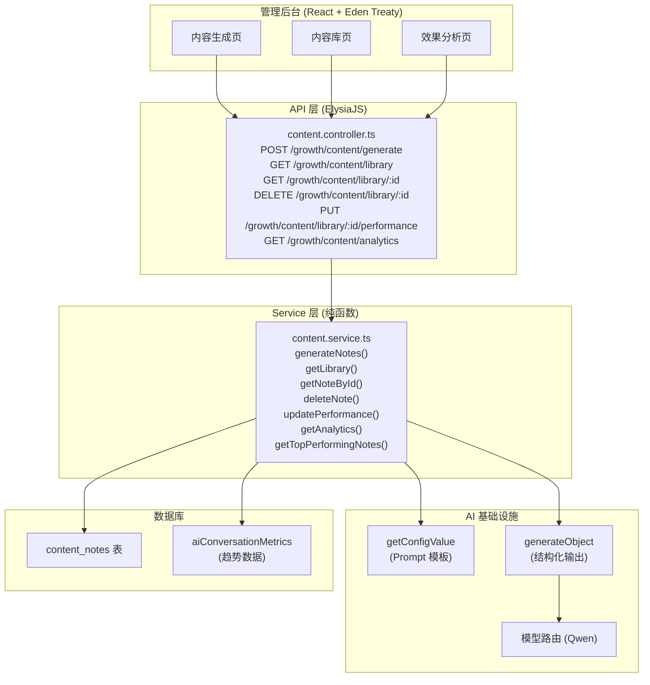
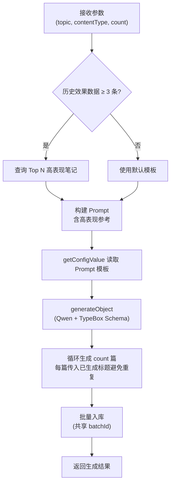

# 设计文档：自媒体内容运营中心

## 概述

自媒体内容运营中心在现有 growth 模块基础上扩展，新增 AI 驱动的小红书笔记批量生成、内容库管理、效果数据回填与分析、以及基于历史数据的 AI 优化闭环。

核心设计决策：
- **升级而非新建**：在 `apps/api/src/modules/growth/` 下新增文件，复用现有 controller 前缀 `/growth`
- **新增 DB 表**：`content_notes` 表存储笔记内容和效果数据，遵循 `@juchang/db` 单一数据源原则
- **AI 生成**：使用 `generateObject` + Qwen 模型 + TypeBox Schema，通过 `getConfigValue` 管理 Prompt 模板
- **Admin 前端**：在 `apps/admin/src/features/content-ops/` 下新建功能模块，使用 Eden Treaty 调用 API

## 架构



## 组件与接口

### 1. 数据库层：`packages/db/src/schema/content-notes.ts`

新增 `content_notes` 表，存储笔记内容和效果数据于同一张表中。

```typescript
import { pgTable, pgEnum, uuid, varchar, text, integer, timestamp, jsonb, index } from "drizzle-orm/pg-core";
import { createInsertSchema, createSelectSchema } from "drizzle-typebox";

export const contentTypeEnum = pgEnum("content_type", [
  "activity_recruit",   // 活动招募
  "buddy_story",        // 搭子故事
  "local_guide",        // 本地攻略
  "product_seed",       // 产品种草
]);

export const contentNotes = pgTable("content_notes", {
  id: uuid("id").primaryKey().defaultRandom(),

  // --- 生成参数 ---
  topic: varchar("topic", { length: 200 }).notNull(),
  contentType: contentTypeEnum("content_type").notNull(),
  batchId: uuid("batch_id").notNull(),  // 同一次批量生成共享

  // --- 笔记内容 ---
  title: varchar("title", { length: 60 }).notNull(),
  body: text("body").notNull(),
  hashtags: jsonb("hashtags").$type<string[]>().notNull(),
  coverImageHint: text("cover_image_hint"),

  // --- 效果数据（运营回填） ---
  views: integer("views"),
  likes: integer("likes"),
  collects: integer("collects"),
  comments: integer("comments"),
  newFollowers: integer("new_followers"),

  // --- 时间戳 ---
  createdAt: timestamp("created_at").defaultNow().notNull(),
  updatedAt: timestamp("updated_at").defaultNow().notNull(),
}, (t) => [
  index("content_notes_batch_idx").on(t.batchId),
  index("content_notes_type_idx").on(t.contentType),
  index("content_notes_created_at_idx").on(t.createdAt),
]);

export const insertContentNoteSchema = createInsertSchema(contentNotes);
export const selectContentNoteSchema = createSelectSchema(contentNotes);
export type ContentNote = typeof contentNotes.$inferSelect;
export type NewContentNote = typeof contentNotes.$inferInsert;
```

### 2. API 层：`apps/api/src/modules/growth/content.controller.ts`

新增独立 controller 文件，挂载到现有 growth 前缀下。

```typescript
// 端点设计
POST   /growth/content/generate           // 生成笔记
GET    /growth/content/library            // 内容库列表（分页、筛选、搜索）
GET    /growth/content/library/:id        // 笔记详情
DELETE /growth/content/library/:id        // 删除笔记
PUT    /growth/content/library/:id/performance  // 回填效果数据
GET    /growth/content/analytics          // 效果分析统计
```

### 3. Service 层：`apps/api/src/modules/growth/content.service.ts`

所有业务逻辑为纯函数，无 class。

```typescript
// 核心函数签名
async function generateNotes(params: {
  topic: string;
  contentType: ContentType;
  count: number;
  trendKeywords?: string[];
}): Promise<ContentNote[]>

async function getLibrary(params: {
  page: number;
  limit: number;
  contentType?: ContentType;
  keyword?: string;
}): Promise<{ data: ContentNote[]; total: number }>

async function getNoteById(id: string): Promise<ContentNote | null>

async function deleteNote(id: string): Promise<boolean>

async function updatePerformance(id: string, data: {
  views?: number;
  likes?: number;
  collects?: number;
  comments?: number;
  newFollowers?: number;
}): Promise<ContentNote>

async function getAnalytics(): Promise<{
  byType: Array<{ contentType: string; avgViews: number; avgLikes: number; avgCollects: number; count: number }>;
  topNotes: ContentNote[];
  totalNotes: number;
  totalWithPerformance: number;
}>

async function getTopPerformingNotes(limit: number): Promise<ContentNote[]>
```

### 4. Model 层：`apps/api/src/modules/growth/content.model.ts`

TypeBox Schema 定义，响应 Schema 从 DB 派生。

```typescript
import { selectContentNoteSchema, insertContentNoteSchema } from '@juchang/db';
import { t } from 'elysia';

// 请求 Schema（手动定义，非 DB 字段）
const GenerateRequest = t.Object({
  topic: t.String({ minLength: 1, maxLength: 200 }),
  contentType: t.Union([
    t.Literal('activity_recruit'),
    t.Literal('buddy_story'),
    t.Literal('local_guide'),
    t.Literal('product_seed'),
  ]),
  count: t.Integer({ minimum: 1, maximum: 5, default: 1 }),
  trendKeywords: t.Optional(t.Array(t.String())),
});

// 效果数据回填 Schema（手动定义，部分字段更新）
const PerformanceUpdateRequest = t.Object({
  views: t.Optional(t.Integer({ minimum: 0 })),
  likes: t.Optional(t.Integer({ minimum: 0 })),
  collects: t.Optional(t.Integer({ minimum: 0 })),
  comments: t.Optional(t.Integer({ minimum: 0 })),
  newFollowers: t.Optional(t.Integer({ minimum: 0 })),
});

// 响应 Schema 从 DB 派生
const ContentNoteResponse = selectContentNoteSchema;

// 列表响应
const LibraryResponse = t.Object({
  data: t.Array(selectContentNoteSchema),
  total: t.Integer(),
});

// 分析响应（Admin 特有类型，手动定义）
const AnalyticsResponse = t.Object({
  byType: t.Array(t.Object({
    contentType: t.String(),
    avgViews: t.Number(),
    avgLikes: t.Number(),
    avgCollects: t.Number(),
    count: t.Integer(),
  })),
  topNotes: t.Array(selectContentNoteSchema),
  totalNotes: t.Integer(),
  totalWithPerformance: t.Integer(),
});
```

### 5. AI 生成逻辑

`generateNotes` 函数的核心流程：



AI 生成使用 `generateObject` 确保结构化输出：

```typescript
const NoteOutputSchema = t.Object({
  title: t.String({ description: '小红书标题，不超过20字，含emoji' }),
  body: t.String({ description: '正文300-800字，分段结构，含emoji排版' }),
  hashtags: t.Array(t.String(), { description: '5-10个话题标签' }),
  coverImageHint: t.String({ description: '封面图片描述提示' }),
});
```

Prompt 模板通过 `getConfigValue('growth.content_prompt', defaultPrompt)` 管理，支持热更新。

### 6. Admin 前端：`apps/admin/src/features/content-ops/`

```
content-ops/
├── index.tsx                    # 导出
├── data/
│   └── schema.ts                # 前端类型定义
├── hooks/
│   └── use-content.ts           # Eden Treaty hooks
├── components/
│   ├── content-generate.tsx     # 生成页面（主题输入 + 热词推荐 + 生成结果）
│   ├── content-library.tsx      # 内容库列表（筛选、搜索、分页）
│   ├── content-detail.tsx       # 笔记详情（含复制按钮）
│   ├── content-analytics.tsx    # 效果分析页
│   └── performance-form.tsx     # 效果数据回填表单
```

Admin 路由：
- `/growth/content` → 内容生成页
- `/growth/library` → 内容库
- `/growth/analytics` → 效果分析

## 数据模型

### content_notes 表

| 字段 | 类型 | 说明 |
|------|------|------|
| id | uuid | 主键 |
| topic | varchar(200) | 生成主题 |
| contentType | enum | 内容类型 (activity_recruit/buddy_story/local_guide/product_seed) |
| batchId | uuid | 批次 ID，同一次生成共享 |
| title | varchar(60) | 小红书标题 |
| body | text | 正文内容 |
| hashtags | jsonb (string[]) | 话题标签数组 |
| coverImageHint | text | 封面图片描述提示 |
| views | integer (nullable) | 浏览量（运营回填） |
| likes | integer (nullable) | 点赞数（运营回填） |
| collects | integer (nullable) | 收藏数（运营回填） |
| comments | integer (nullable) | 评论数（运营回填） |
| newFollowers | integer (nullable) | 涨粉数（运营回填） |
| createdAt | timestamp | 创建时间 |
| updatedAt | timestamp | 更新时间 |

索引：`batchId`、`contentType`、`createdAt`

### Prompt 模板配置键

| configKey | 说明 |
|-----------|------|
| `growth.content_prompt` | 小红书笔记生成主 Prompt 模板 |
| `growth.content_prompt.system` | System Prompt（品牌调性、平台规则） |


## 正确性属性

*正确性属性是系统在所有合法执行路径上都应保持为真的特征或行为——本质上是对系统应做什么的形式化陈述。属性是人类可读规格与机器可验证正确性保证之间的桥梁。*

### Property 1: 生成笔记结构完整性

*For any* 合法的主题和内容类型输入，生成的笔记应满足：标题非空且不超过 20 个字符、正文长度在 300-800 字之间、话题标签数量在 5-10 个之间、封面图片描述提示非空。

**Validates: Requirements 1.1, 1.2, 1.3, 1.4**

### Property 2: 笔记持久化往返一致性

*For any* 成功生成的笔记，将其持久化到数据库后，通过 ID 查询返回的记录应与原始生成结果在 topic、contentType、title、body、hashtags 字段上完全一致。

**Validates: Requirements 1.7**

### Property 3: 批量生成数量与批次一致性

*For any* 合法的生成数量 N（1-5），批量生成应返回恰好 N 条笔记，且所有笔记共享同一个 batchId。

**Validates: Requirements 2.1, 2.3**

### Property 4: 批量生成标题唯一性

*For any* 批量生成的一组笔记（N ≥ 2），组内所有笔记的标题应两两不同。

**Validates: Requirements 2.2**

### Property 5: 内容库筛选正确性

*For any* 内容类型筛选条件或关键词搜索条件，返回的所有记录应满足：若指定了内容类型，则每条记录的 contentType 与筛选值一致；若指定了关键词，则每条记录的 topic 或 body 包含该关键词。

**Validates: Requirements 3.2, 3.3**

### Property 6: 内容库时间排序

*For any* 内容库查询结果列表，记录应按 createdAt 降序排列，即列表中前一条记录的 createdAt 大于等于后一条记录的 createdAt。

**Validates: Requirements 3.1**

### Property 7: 删除后不可查

*For any* 已存在的笔记记录，执行删除操作后，通过该 ID 查询应返回空结果。

**Validates: Requirements 3.5**

### Property 8: 效果数据回填往返一致性

*For any* 笔记记录和合法的效果数据（views、likes、collects、comments、newFollowers 均为非负整数），回填后查询该笔记应返回与提交值一致的效果数据字段。

**Validates: Requirements 4.2, 4.3**

### Property 9: 效果分析聚合正确性

*For any* 一组已回填效果数据的笔记记录，按内容类型聚合的平均浏览量应等于该类型所有记录浏览量之和除以记录数。

**Validates: Requirements 5.1**

### Property 10: 效果排行榜排序正确性

*For any* 至少 5 条已回填效果数据的笔记记录集合，排行榜应按综合互动指标（views + likes*2 + collects*3 + comments*2）降序排列。

**Validates: Requirements 5.3**

### Property 11: 未认证访问拒绝

*For any* 内容运营 API 端点，未携带有效认证 Token 的请求应返回 401 状态码。

**Validates: Requirements 10.7**

## 错误处理

| 场景 | 处理方式 |
|------|----------|
| LLM 调用失败 | 返回 `{ code: 500, msg: '内容生成失败: {错误原因}' }`，不保存记录到数据库 |
| LLM 返回格式不符合 Schema | `generateObject` 自动重试，最终失败返回 500 |
| 笔记 ID 不存在 | 返回 `{ code: 404, msg: '笔记不存在' }` |
| 未认证访问 | 返回 `{ code: 401, msg: '未授权' }` |
| 生成数量超出范围 | ElysiaJS TypeBox 校验自动拒绝，返回 422 |
| getConfigValue 失败 | 降级使用代码内默认 Prompt 模板 |
| 数据库写入失败 | 返回 `{ code: 500, msg: '保存失败' }` |

## 测试策略

### 双轨测试方法

- **单元测试**：验证具体示例、边界条件和错误场景
- **属性测试**：验证所有输入上的通用属性

### 属性测试配置

- 使用 `fast-check` 作为属性测试库
- 每个属性测试至少运行 100 次迭代
- 每个测试用注释标注对应的设计属性编号
- 标注格式：**Feature: content-operations, Property {number}: {property_text}**

### 单元测试重点

- LLM 调用失败时不保存记录（需求 1.8）
- 历史数据不足时使用默认模板（需求 6.3）
- getConfigValue 读取 Prompt 模板（需求 8.1）
- 各 API 端点的基本 CRUD 功能

### 属性测试重点

- Property 1-11 对应的所有正确性属性
- 重点关注数据持久化往返一致性（Property 2, 8）
- 重点关注查询筛选正确性（Property 5, 6）
