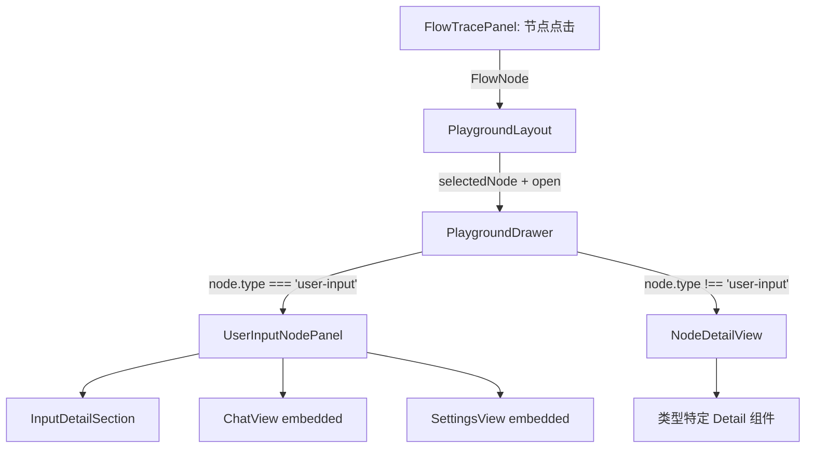

# Design Document: Playground Node Detail Redesign

## Overview

重新设计 AI Playground 右侧 Drawer 面板，从三 Tab 结构（对话/配置/节点）改为基于节点类型的动态内容渲染。核心变化：

1. 移除 `DrawerView` 类型和 Tab 切换 UI，Drawer 变为纯节点详情面板
2. "用户输入"节点特殊处理：平铺展示对话区 + 配置区 + 输入详情
3. 其他节点：仅展示该节点的 Trace 数据和类型特定属性
4. 所有节点标题统一中文化（流程图标签 + Drawer 标题）
5. 每种节点类型的详情卡片内容更丰富，增加视觉层次

## Architecture

### 组件层次变化

```
Before:
PlaygroundLayout
├── FlowTracePanel
├── PlaygroundDrawer (三 Tab: chat / settings / node-detail)
│   ├── ChatView
│   ├── SettingsView
│   └── NodeDetailView (扁平 key-value)

After:
PlaygroundLayout
├── FlowTracePanel
├── PlaygroundDrawer (纯节点详情面板，无 Tab)
│   ├── DrawerHeader (中文标题 + 状态 Badge + 耗时)
│   ├── [用户输入节点] → UserInputNodePanel
│   │   ├── InputDetailSection
│   │   ├── ChatView (embedded)
│   │   └── SettingsView (embedded)
│   └── [其他节点] → NodeDetailView
│       ├── InputGuardDetail
│       ├── KeywordMatchDetail
│       ├── IntentClassifyDetail
│       ├── UserProfileDetail
│       ├── SemanticRecallDetail
│       ├── TokenLimitDetail
│       ├── LLMDetail
│       ├── ToolDetail
│       └── FinalOutputDetail
```

### 数据流



### 状态管理简化

```typescript
// Before: 3 个状态
const [drawerOpen, setDrawerOpen] = useState(true)
const [drawerView, setDrawerView] = useState<DrawerView>('chat')
const [selectedNode, setSelectedNode] = useState<FlowNode | null>(null)

// After: 2 个状态
const [drawerOpen, setDrawerOpen] = useState(true)
const [selectedNode, setSelectedNode] = useState<FlowNode | null>(null)
```

## Components and Interfaces

### 1. PlaygroundDrawer (重构)

移除 `DrawerView` 类型和 Tab 切换，简化 Props：

```typescript
// 删除 DrawerView 类型
// 删除 view / onViewChange props

interface PlaygroundDrawerProps {
  open: boolean
  onOpenChange: (open: boolean) => void
  selectedNode: FlowNode | null
  // Chat props (传递给 UserInputNodePanel)
  messages: UIMessage[]
  onSendMessage: (text: string) => void
  onClear: () => void
  onStop: () => void
  isLoading: boolean
  error?: Error | null
  // Settings props (传递给 UserInputNodePanel)
  mockSettings: MockSettings
  onMockSettingsChange: (settings: MockSettings) => void
  modelParams: ModelParams
  onModelParamsChange: (params: ModelParams) => void
  traceEnabled: boolean
  onTraceEnabledChange: (enabled: boolean) => void
  // Node detail props
  systemPrompt: string | null
  traceOutput: TraceOutput | null
}
```

渲染逻辑：
- 顶部：`DrawerHeader` 显示中文标题 + 状态 Badge + 耗时
- 内容：根据 `selectedNode.data.type` 分支
  - `'user-input'` → `UserInputNodePanel`
  - 其他 → `NodeDetailView`

### 2. DrawerHeader (新组件)

统一的 Drawer 头部，替代原来的 Tab 切换区域：

```typescript
interface DrawerHeaderProps {
  node: FlowNode
}
```

展示：中文节点标题（从 `NODE_CHINESE_LABELS` 映射获取）+ 状态 Badge + 耗时

### 3. UserInputNodePanel (新组件)

用户输入节点的专属面板，平铺三个区域：

```typescript
interface UserInputNodePanelProps {
  node: FlowNode  // type === 'user-input'
  // Chat props
  messages: UIMessage[]
  onSendMessage: (text: string) => void
  onClear: () => void
  onStop: () => void
  isLoading: boolean
  error?: Error | null
  // Settings props
  mockSettings: MockSettings
  onMockSettingsChange: (settings: MockSettings) => void
  modelParams: ModelParams
  onModelParamsChange: (params: ModelParams) => void
  traceEnabled: boolean
  onTraceEnabledChange: (enabled: boolean) => void
}
```

### 4. NodeDetailView (重构)

移除 `NodeHeader`（已提升到 `DrawerHeader`），仅负责根据节点类型路由到对应 Detail 组件。

### 5. 节点标题中文映射

在 `flow.ts` 中新增统一映射，供流程图标签和 Drawer 标题共用：

```typescript
export const NODE_CHINESE_LABELS: Record<string, string> = {
  'user-input': '用户输入',
  'input-guard': '输入安全检查',
  'keyword-match': '关键词快捷匹配',
  'intent-classify': '意图识别',
  'user-profile': '用户画像',
  'semantic-recall': '语义记忆召回',
  'token-limit': '上下文窗口',
  'llm': '模型推理',
  'tool': '工具调用',
  'final-output': '最终响应',
}
```

同时更新 `PIPELINE_LAYERS` 和 `PROCESSOR_DISPLAY_NAMES` 引用此映射。

### 6. 各节点 Detail 组件增强

每个 Detail 组件根据需求增加更丰富的展示内容：

| 组件 | 增强内容 |
|------|---------|
| InputGuardDetail | 保持现有：拦截状态 Badge + 触发规则列表 + 净化文本 |
| KeywordMatchDetail (原 P0MatchDetail) | 保持现有：命中状态 + 关键词 + 匹配类型 + 响应类型 |
| IntentClassifyDetail (原 P1IntentDetail) | 新增：置信度 progress bar（替代纯数字） |
| UserProfileDetail | 新增：top preference tags 展示 |
| SemanticRecallDetail | 新增：rerank 状态 + 数据源展示 |
| TokenLimitDetail | 新增：原始/截断长度对比条 |
| LLMDetail | 新增：生成速度 + 费用展示 |
| ToolDetail | 新增：评估结果展示（分数 + issues） |
| FinalOutputDetail (原 OutputDetail) | 新增：总费用 + 调用次数统计 |

## Data Models

### 节点类型与中文标签映射

无需新增数据模型。所有数据类型已在 `flow.ts` 中定义（`FlowNodeData` 联合类型及其子类型）。新增的是一个常量映射 `NODE_CHINESE_LABELS`。

### Drawer 状态模型变化

```typescript
// 删除
export type DrawerView = 'chat' | 'settings' | 'node-detail'

// PlaygroundLayout 状态简化为：
{
  drawerOpen: boolean
  selectedNode: FlowNode | null
}
```

### 现有数据类型复用

所有节点 Detail 组件使用的数据均来自现有类型：
- `InputNodeData`: text, charCount, source, userId
- `ProcessorNodeData` + output/config: blocked, triggeredRules, sanitized, preferencesCount, locationsCount, resultCount, topScore, truncated, originalLength, finalLength
- `P0MatchNodeData`: matched, keyword, matchType, responseType
- `P1IntentNodeData`: intent, method, confidence
- `LLMNodeData`: model, inputTokens, outputTokens, totalTokens, cost, systemPrompt
- `ToolNodeData`: toolName, widgetType, input, output, evaluation
- `OutputNodeData`: totalDuration, totalTokens, totalCost, toolCallCount


## Correctness Properties

*A property is a characteristic or behavior that should hold true across all valid executions of a system — essentially, a formal statement about what the system should do. Properties serve as the bridge between human-readable specifications and machine-verifiable correctness guarantees.*

### Property 1: Chinese label completeness

*For any* node entry in `PIPELINE_LAYERS` and any processor type in `PROCESSOR_DISPLAY_NAMES`, the label value SHALL be a Chinese string matching the specified mapping in `NODE_CHINESE_LABELS`.

**Validates: Requirements 2.1, 2.2**

### Property 2: Drawer header renders node metadata

*For any* `FlowNode` with a valid `FlowNodeData`, when rendered in the Drawer header, the output SHALL contain the Chinese label from `NODE_CHINESE_LABELS`, a status Badge with the correct status text, and the formatted duration when available.

**Validates: Requirements 1.2, 2.3**

### Property 3: User-input node exclusivity

*For any* node with `type !== 'user-input'`, the Drawer content SHALL NOT render `ChatView` or `SettingsView` components. Conversely, for `type === 'user-input'`, the Drawer SHALL render both.

**Validates: Requirements 1.3, 1.4**

### Property 4: User-input detail content

*For any* `InputNodeData`, the rendered detail SHALL contain the input text, character count, and source Badge when source is present, and userId when userId is present.

**Validates: Requirements 4.1, 4.2**

### Property 5: Input-guard detail content

*For any* input-guard processor node data, the rendered detail SHALL contain a block status Badge ("通过" when not blocked, "拦截" when blocked) and all triggered rule names when present.

**Validates: Requirements 5.1, 5.2**

### Property 6: Keyword-match detail content

*For any* `P0MatchNodeData`, the rendered detail SHALL contain a hit/miss status Badge reflecting the `matched` boolean value.

**Validates: Requirements 6.1**

### Property 7: Intent-classify detail content

*For any* `P1IntentNodeData`, the rendered detail SHALL contain the intent type Badge, classification method label, and a confidence progress bar with percentage when confidence data is available.

**Validates: Requirements 7.1, 7.2, 7.3**

### Property 8: Token-limit detail content

*For any* token-limit processor node data, the rendered detail SHALL contain the truncation status Badge, a visual length comparison when truncation data is available, and the token limit value.

**Validates: Requirements 10.1, 10.2, 10.3**

### Property 9: Tool detail content

*For any* `ToolNodeData`, the rendered detail SHALL contain the tool name, widget type when present, and collapsible sections for input parameters and output result with JSON formatting.

**Validates: Requirements 12.1, 12.2**

### Property 10: Final-output detail content

*For any* `OutputNodeData` with associated `TraceOutput`, the rendered detail SHALL contain the full AI reply text when available, and display total duration, total tokens, estimated cost, and tool call count.

**Validates: Requirements 13.1, 13.3**

## Error Handling

### 无选中节点

当 `selectedNode` 为 `null` 时，Drawer 显示空状态提示"点击画布中的节点查看详情"（保持现有行为）。

### 节点数据缺失

各 Detail 组件对可选字段使用条件渲染，缺失字段不显示对应行，不报错。例如：
- LLM 节点无 cost 数据时不显示费用行
- Tool 节点无 evaluation 数据时不显示评估区块
- 用户输入节点无 userId 时不显示用户 ID 行

### 未知节点类型

`NodeContent` 路由组件对未匹配的节点类型显示"暂无详情"兜底文案（保持现有行为）。

### Drawer 关闭后状态保持

关闭 Drawer 时保留 `selectedNode` 状态，重新打开时显示上次查看的节点，避免状态丢失。

## Testing Strategy

### 单元测试

- 验证 `NODE_CHINESE_LABELS` 映射覆盖所有节点类型
- 验证 `PIPELINE_LAYERS` 中所有 label 与 `NODE_CHINESE_LABELS` 一致
- 验证 `PROCESSOR_DISPLAY_NAMES` 中所有 label 与 `NODE_CHINESE_LABELS` 一致
- 验证各 Detail 组件在数据缺失时不抛错

### Property-Based Testing

使用 `fast-check` 库，最少 100 次迭代。

- **Feature: playground-node-detail-redesign, Property 1**: 生成随机节点类型，验证 label 映射完整性
- **Feature: playground-node-detail-redesign, Property 2**: 生成随机 FlowNodeData，验证 header 渲染包含中文标题 + 状态 + 耗时
- **Feature: playground-node-detail-redesign, Property 3**: 生成随机非 user-input 节点，验证不渲染 ChatView/SettingsView
- **Feature: playground-node-detail-redesign, Property 4**: 生成随机 InputNodeData，验证渲染包含 text + charCount + 条件字段
- **Feature: playground-node-detail-redesign, Property 5**: 生成随机 input-guard 数据，验证 block status Badge 正确
- **Feature: playground-node-detail-redesign, Property 6**: 生成随机 P0MatchNodeData，验证 hit/miss Badge 正确
- **Feature: playground-node-detail-redesign, Property 7**: 生成随机 P1IntentNodeData，验证 intent + method + confidence 渲染
- **Feature: playground-node-detail-redesign, Property 8**: 生成随机 token-limit 数据，验证 truncation + length comparison + limit 渲染
- **Feature: playground-node-detail-redesign, Property 9**: 生成随机 ToolNodeData，验证 tool name + collapsible JSON sections
- **Feature: playground-node-detail-redesign, Property 10**: 生成随机 OutputNodeData + TraceOutput，验证 reply + stats 渲染
