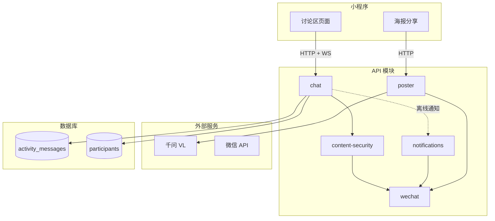
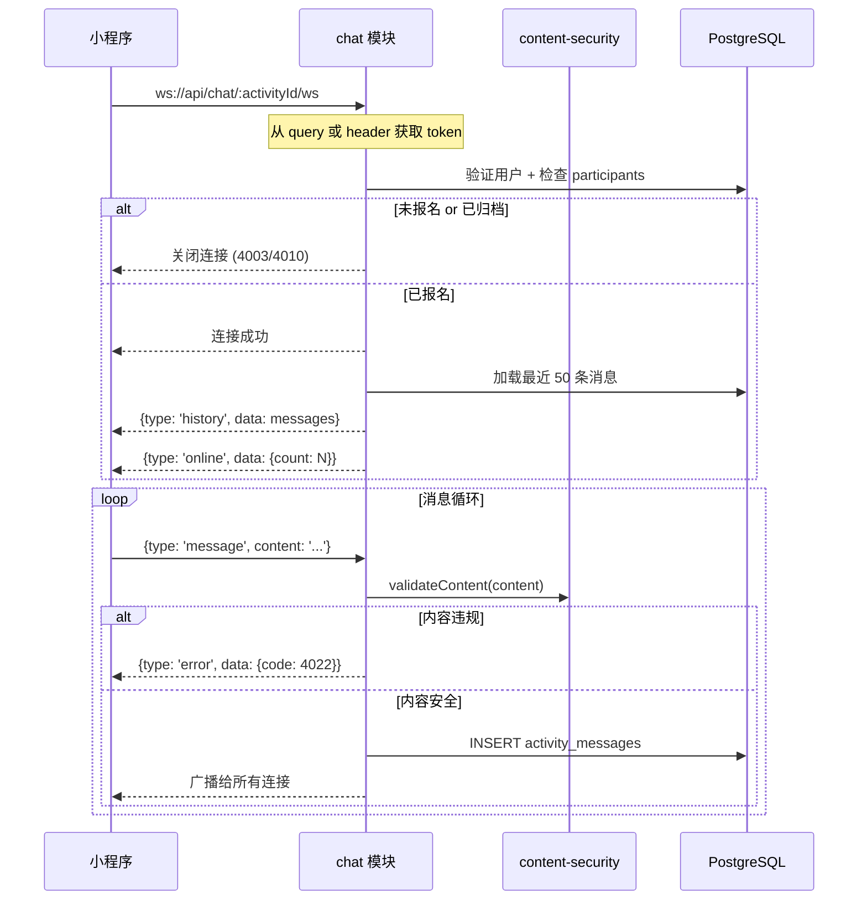

# Design Document: v4.7 Unified Discussion

## Overview

v4.7 版本包含三个核心功能和一个架构优化：

1. **清理 Chat Tool Mode**：移除 v4.8 中引入的 Chat Tool Mode 相关代码
2. **AI 海报生成**：使用千问 VL 生成活动背景图，Puppeteer 合成最终海报
3. **活动讨论区**：扩展现有 chat 模块，新增 WebSocket 实时通讯
4. **架构优化**：清理 wechat 模块中的 Chat Tool Mode 函数，统一通知策略

## Architecture

### 模块职责重新梳理

**现有模块职责（保持不变）**：

| 模块 | 职责 | 边界 |
|------|------|------|
| auth | 登录、Token | 不含用户资料 |
| users | 用户 CRUD、额度 | 不含认证 |
| activities | 活动 CRUD、报名、搜索 | 不含群聊 |
| chat | 活动群聊消息 | 不含 AI 对话 |
| ai | AI 解析、对话历史 | 不含活动群聊 |
| participants | 参与者管理 | - |
| notifications | 通知推送 | - |
| reports | 举报处理 | - |
| content-security | 内容安全检测 | - |
| wechat | 微信 API 封装 | - |

**本次变更**：

| 模块 | 变更类型 | 说明 |
|------|---------|------|
| chat | 扩展 | 新增 WebSocket 端点 |
| poster | 新增 | 海报生成（独立领域） |
| wechat | 清理+扩展 | 移除 Chat Tool Mode 函数，新增客服消息 |

### 系统架构图



### WebSocket 连接流程



## Components and Interfaces

### 1. chat 模块扩展

**目录结构**：

```
apps/api/src/modules/chat/
├── chat.controller.ts   # HTTP 路由（现有）
├── chat.service.ts      # 业务逻辑（现有，复用）
├── chat.model.ts        # Schema（扩展 WS 类型）
├── chat.ws.ts           # 新增：WebSocket 处理器
└── connection-pool.ts   # 新增：连接池管理
```

**WebSocket 消息协议**：

```typescript
// chat.model.ts 新增

// 客户端 -> 服务端
export const WsClientMessageSchema = t.Union([
  t.Object({
    type: t.Literal('message'),
    content: t.String({ maxLength: 500 }),
  }),
  t.Object({
    type: t.Literal('ping'),
  }),
]);

// 服务端 -> 客户端
export const WsServerMessageSchema = t.Object({
  type: t.Union([
    t.Literal('message'),   // 新消息
    t.Literal('history'),   // 历史消息
    t.Literal('online'),    // 在线人数
    t.Literal('join'),      // 用户加入
    t.Literal('leave'),     // 用户离开
    t.Literal('error'),     // 错误
    t.Literal('pong'),      // 心跳响应
  ]),
  data: t.Unknown(),
  ts: t.Number(),
});
```

**连接池管理**：

```typescript
// connection-pool.ts
// 纯函数式设计，无 class

interface Connection {
  ws: WebSocket;
  userId: string;
  activityId: string;
  connectedAt: number;
  lastPingAt: number;
}

// 内存存储（单实例部署）
const pool = new Map<string, Connection>();
const activityIndex = new Map<string, Set<string>>(); // activityId -> connIds

// 纯函数操作
export function addConnection(connId: string, conn: Connection): void {
  pool.set(connId, conn);
  if (!activityIndex.has(conn.activityId)) {
    activityIndex.set(conn.activityId, new Set());
  }
  activityIndex.get(conn.activityId)!.add(connId);
}

export function removeConnection(connId: string): void {
  const conn = pool.get(connId);
  if (conn) {
    activityIndex.get(conn.activityId)?.delete(connId);
    pool.delete(connId);
  }
}

export function getConnectionsByActivity(activityId: string): Connection[] {
  const connIds = activityIndex.get(activityId) || new Set();
  return Array.from(connIds).map(id => pool.get(id)!).filter(Boolean);
}

export function broadcastToActivity(activityId: string, message: unknown): void {
  const conns = getConnectionsByActivity(activityId);
  const payload = JSON.stringify(message);
  conns.forEach(conn => {
    try {
      conn.ws.send(payload);
    } catch (e) {
      // 发送失败，移除连接
      removeConnection(conn.ws.id);
    }
  });
}

export function getOnlineCount(activityId: string): number {
  return activityIndex.get(activityId)?.size || 0;
}
```

**WebSocket 处理器**：

```typescript
// chat.ws.ts
import { verifyToken } from '../auth/auth.service';
import { checkIsParticipant, checkIsArchived, getMessages, sendMessage } from './chat.service';
import { validateContent } from '../content-security/content-security.service';
import * as pool from './connection-pool';

export async function handleWsUpgrade(
  ws: WebSocket,
  activityId: string,
  token: string
): Promise<void> {
  // 1. 验证 token
  const user = await verifyToken(token);
  if (!user) {
    ws.close(4001, 'Unauthorized');
    return;
  }

  // 2. 检查参与状态
  const isParticipant = await checkIsParticipant(activityId, user.id);
  if (!isParticipant) {
    ws.close(4003, 'Not a participant');
    return;
  }

  // 3. 检查归档状态
  const isArchived = await checkIsArchived(activityId);
  if (isArchived) {
    ws.close(4010, 'Discussion archived');
    return;
  }

  // 4. 加入连接池
  const connId = crypto.randomUUID();
  pool.addConnection(connId, {
    ws,
    userId: user.id,
    activityId,
    connectedAt: Date.now(),
    lastPingAt: Date.now(),
  });

  // 5. 发送历史消息
  const { messages } = await getMessages(activityId, user.id, { limit: 50 });
  ws.send(JSON.stringify({ type: 'history', data: messages, ts: Date.now() }));

  // 6. 广播在线人数
  const count = pool.getOnlineCount(activityId);
  pool.broadcastToActivity(activityId, { type: 'online', data: { count }, ts: Date.now() });
}

export async function handleWsMessage(
  ws: WebSocket,
  activityId: string,
  userId: string,
  data: { type: string; content?: string }
): Promise<void> {
  if (data.type === 'ping') {
    ws.send(JSON.stringify({ type: 'pong', data: null, ts: Date.now() }));
    return;
  }

  if (data.type === 'message' && data.content) {
    // 1. 内容安全检测
    const validation = await validateContent(data.content, {
      userId,
      scene: 'message',
    });
    
    if (!validation.pass) {
      ws.send(JSON.stringify({
        type: 'error',
        data: { code: 4022, message: validation.reason },
        ts: Date.now(),
      }));
      return;
    }

    // 2. 持久化消息（复用现有 service）
    const result = await sendMessage(activityId, userId, { content: data.content });

    // 3. 广播消息
    pool.broadcastToActivity(activityId, {
      type: 'message',
      data: {
        id: result.id,
        content: data.content,
        senderId: userId,
        createdAt: new Date().toISOString(),
      },
      ts: Date.now(),
    });
  }
}

export function handleWsClose(ws: WebSocket, activityId: string): void {
  pool.removeConnection(ws.id);
  const count = pool.getOnlineCount(activityId);
  pool.broadcastToActivity(activityId, { type: 'online', data: { count }, ts: Date.now() });
}
```

### 2. poster 模块（新增）

**目录结构**：

```
apps/api/src/modules/poster/
├── poster.controller.ts   # HTTP 路由
├── poster.service.ts      # 业务逻辑
└── poster.model.ts        # TypeBox Schema
```

**API 设计**：

```typescript
// poster.model.ts
import { t } from 'elysia';

export const PosterStyleSchema = t.Union([
  t.Literal('simple'),    // 简约
  t.Literal('vibrant'),   // 活力
  t.Literal('artistic'),  // 文艺
]);

export const GeneratePosterRequestSchema = t.Object({
  activityId: t.String({ format: 'uuid' }),
  style: PosterStyleSchema,
});

export const GeneratePosterResponseSchema = t.Object({
  posterUrl: t.String(),
  expiresAt: t.String(),
});
```

**业务逻辑**：

```typescript
// poster.service.ts
import { getActivityById } from '../activities/activity.service';
import { generateQRCode } from '../wechat/wechat.service';

export async function generatePoster(
  activityId: string,
  style: 'simple' | 'vibrant' | 'artistic'
): Promise<{ posterUrl: string; expiresAt: string }> {
  // 1. 获取活动信息
  const activity = await getActivityById(activityId);
  if (!activity) {
    throw new Error('活动不存在');
  }

  // 2. 生成背景图（千问 VL）
  const backgroundUrl = await generateBackground(activity, style);

  // 3. 生成小程序码
  const qrcodeBuffer = await generateQRCode(
    `subpackages/activity/detail/index?id=${activityId}`
  );

  // 4. 合成海报（Puppeteer）
  const posterUrl = await composePoster({
    title: activity.title,
    startAt: activity.startAt,
    locationName: activity.locationName,
    locationHint: activity.locationHint,
    currentParticipants: activity.currentParticipants,
    maxParticipants: activity.maxParticipants,
    backgroundUrl,
    qrcodeBuffer,
  }, style);

  return {
    posterUrl,
    expiresAt: new Date(Date.now() + 24 * 60 * 60 * 1000).toISOString(),
  };
}

async function generateBackground(
  activity: Activity,
  style: string
): Promise<string> {
  // 调用千问 VL 生成背景图
  // 失败时返回默认背景
}

async function composePoster(
  data: PosterData,
  style: string
): Promise<string> {
  // 使用 Puppeteer 渲染 HTML 模板
  // 上传到 OSS 返回 URL
}
```

### 3. wechat 模块清理与扩展

**移除函数**：
- `updateDynamicMessage` - Chat Tool Mode 专用
- `sendGroupSystemMessage` - Chat Tool Mode 专用

**新增函数**：

```typescript
// wechat.service.ts 新增

/**
 * 发送客服消息（48h 内有效）
 * 用于活动讨论区离线通知
 */
export async function sendCustomerMessage(
  openId: string,
  content: string
): Promise<boolean> {
  const accessToken = await getAccessToken();
  
  const response = await fetch(
    `https://api.weixin.qq.com/cgi-bin/message/custom/send?access_token=${accessToken}`,
    {
      method: 'POST',
      headers: { 'Content-Type': 'application/json' },
      body: JSON.stringify({
        touser: openId,
        msgtype: 'text',
        text: { content },
      }),
    }
  );

  const data = await response.json();
  return data.errcode === 0;
}

/**
 * 生成小程序码
 */
export async function generateQRCode(path: string): Promise<Buffer> {
  const accessToken = await getAccessToken();
  
  const response = await fetch(
    `https://api.weixin.qq.com/wxa/getwxacode?access_token=${accessToken}`,
    {
      method: 'POST',
      headers: { 'Content-Type': 'application/json' },
      body: JSON.stringify({
        path,
        width: 280,
      }),
    }
  );

  return Buffer.from(await response.arrayBuffer());
}
```

## Data Models

### 数据库变更

**移除字段**：

```sql
-- activities 表
ALTER TABLE activities DROP COLUMN IF EXISTS group_openid;
ALTER TABLE activities DROP COLUMN IF EXISTS dynamic_message_id;

-- participants 表
ALTER TABLE participants DROP COLUMN IF EXISTS group_openid;

-- notifications 表
ALTER TABLE notifications DROP COLUMN IF EXISTS notification_method;

-- 移除枚举
DROP TYPE IF EXISTS notification_method;
```

**Schema 文件变更**：

```typescript
// packages/db/src/schema/activities.ts
// 移除: groupOpenId, dynamicMessageId

// packages/db/src/schema/participants.ts
// 移除: groupOpenId

// packages/db/src/schema/notifications.ts
// 移除: notificationMethod

// packages/db/src/schema/enums.ts
// 移除: notificationMethodEnum
```

### 现有表复用

`activity_messages` 表已满足讨论区需求：

| 字段 | 类型 | 说明 |
|------|------|------|
| id | uuid | 主键 |
| activityId | uuid | 活动 ID |
| senderId | uuid | 发送者（null 为系统消息） |
| messageType | enum | text / system |
| content | text | 消息内容 |
| createdAt | timestamp | 创建时间 |

### 小程序状态管理

```typescript
// src/stores/discussion.ts
import { createStore } from 'zustand/vanilla';

interface Message {
  id: string;
  content: string;
  senderId: string | null;
  senderNickname?: string;
  senderAvatarUrl?: string;
  createdAt: string;
}

interface DiscussionState {
  activityId: string | null;
  messages: Message[];
  onlineCount: number;
  isConnected: boolean;
  isArchived: boolean;
  
  // Actions
  connect: (activityId: string, token: string) => void;
  disconnect: () => void;
  sendMessage: (content: string) => void;
  loadMore: () => void;
}

export const discussionStore = createStore<DiscussionState>((set, get) => ({
  activityId: null,
  messages: [],
  onlineCount: 0,
  isConnected: false,
  isArchived: false,

  connect: (activityId, token) => {
    const ws = wx.connectSocket({
      url: `wss://api.juchang.app/chat/${activityId}/ws?token=${token}`,
    });
    
    ws.onMessage((res) => {
      const msg = JSON.parse(res.data);
      switch (msg.type) {
        case 'history':
          set({ messages: msg.data, isConnected: true });
          break;
        case 'message':
          set({ messages: [...get().messages, msg.data] });
          break;
        case 'online':
          set({ onlineCount: msg.data.count });
          break;
        case 'error':
          // 处理错误
          break;
      }
    });
    
    ws.onClose(() => set({ isConnected: false }));
  },

  disconnect: () => {
    // 关闭 WebSocket
  },

  sendMessage: (content) => {
    // 发送消息
  },

  loadMore: () => {
    // 加载更多历史消息（HTTP 接口）
  },
}));
```

## Correctness Properties

*A property is a characteristic or behavior that should hold true across all valid executions of a system—essentially, a formal statement about what the system should do.*

### Property 1: 连接权限验证

*For any* 用户和活动组合，WebSocket 连接成功当且仅当：
1. token 有效
2. participants 表中存在 (activityId, userId, status='joined') 记录
3. 活动未归档

**Validates: Requirements 3.3, 3.4**

### Property 2: 消息广播与持久化一致性

*For any* 通过 WebSocket 发送的有效消息，以下两个操作必须同时成功或同时失败：
1. 消息持久化到 activity_messages 表
2. 消息广播给活动内所有在线连接

**Validates: Requirements 4.1, 4.2**

### Property 3: 消息加载分页

*For any* 活动讨论区：
- 初始加载返回最近 50 条消息
- 分页加载每页 20 条
- 消息按 createdAt DESC 排序

**Validates: Requirements 4.4, 4.5**

### Property 4: 敏感词过滤

*For any* 消息内容，若 content-security 模块返回 pass=false，则：
1. 消息不会被持久化
2. 消息不会被广播
3. 发送者收到错误响应

**Validates: Requirements 5.2**

### Property 5: 讨论区归档行为

*For any* 活动，当 status ∈ {completed, cancelled} 时：
1. 新的 WebSocket 连接被拒绝 (4010)
2. 现有连接被断开
3. HTTP 接口返回 isArchived=true
4. 历史消息仍可通过 HTTP 接口读取

**Validates: Requirements 7.1, 7.3**

### Property 6: 海报内容完整性

*For any* 成功生成的海报，图片中必须包含：
1. 活动标题
2. 活动时间
3. 活动地点
4. 小程序码

**Validates: Requirements 2.3**

## Error Handling

### WebSocket 错误码

| 错误码 | 说明 | 客户端处理 |
|--------|------|-----------|
| 4001 | 未授权 | 跳转登录 |
| 4003 | 未报名 | 提示报名 |
| 4004 | 活动不存在 | 返回上一页 |
| 4010 | 已归档 | 显示只读模式 |
| 4022 | 内容违规 | 提示修改内容 |
| 4029 | 频率限制 | 稍后重试 |

### 海报生成错误

| 场景 | 处理方式 |
|------|---------|
| 活动不存在 | 返回 404 |
| AI 生成失败 | 使用默认背景图 |
| 小程序码失败 | 返回 502，提示重试 |
| 渲染超时 (>10s) | 返回 504 |

## Testing Strategy

使用 fast-check 进行属性测试，每个属性 100 次迭代。

**测试标签格式**：`Feature: v4.7-unified-discussion, Property N: {description}`

| 属性 | 测试策略 |
|------|---------|
| Property 1 | 生成随机 (userId, activityId, participantStatus)，验证连接结果 |
| Property 2 | 发送消息后，验证 DB 记录和广播消息一致 |
| Property 3 | 生成 100 条消息，验证分页返回正确 |
| Property 4 | 发送包含敏感词的消息，验证拒绝行为 |
| Property 5 | 改变活动状态，验证归档行为 |
| Property 6 | 生成海报，验证图片包含所有必要元素 |

## API Endpoints

### chat 模块

```
GET  /chat/:activityId/messages     # 现有：获取消息（HTTP 轮询）
POST /chat/:activityId/messages     # 现有：发送消息（HTTP）
WS   /chat/:activityId/ws           # 新增：WebSocket 连接
POST /chat/:activityId/report       # 新增：举报消息
```

### poster 模块

```
POST /poster/generate               # 生成海报
```

### 移除的端点

无需移除端点，Chat Tool Mode 相关功能未暴露为 API。
