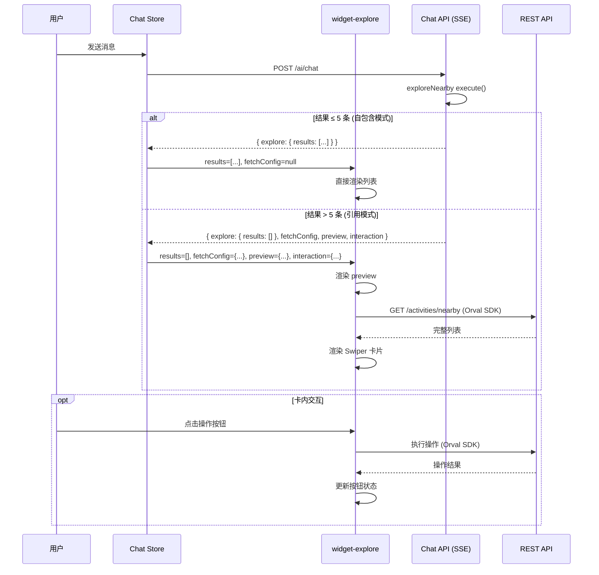

# 设计文档：增强型 Generative UI Widget 系统

## 概述

在现有 Widget 系统上增加"引用模式"（Reference Mode），使 Widget 组件能够自主获取数据并支持丰富的卡内交互。

### 设计哲学

聚场的 Gen UI 系统采用 A2UI（AI-to-UI）架构：AI Tool 返回结构化数据，前端根据数据类型渲染对应的 Widget 组件。当前所有 Widget 都是"自包含"的——Tool 返回完整数据，前端直接渲染。

本设计引入第二种数据模式——"引用模式"，通过在 `WidgetChunk` 上增加 `fetchConfig`（数据源声明）和 `interaction`（交互能力声明）两个可选字段，让 Widget 组件能够：
1. 自主从 REST API 获取数据（适用于大数据量、实时性场景）
2. 支持卡内交互（Swiper 浏览、半屏详情、报名/分享等操作）

**核心设计决策**：
- 协议层完整定义（所有数据源和操作类型），实现层渐进推进（当前只增强 explore）
- 不新增 Widget 类型、不修改 DB 枚举
- 所有增强均为可选字段，缺失时回退到现有行为

## 架构

### 数据流



## 组件与接口

### 0. Gen UI 完整架构概览

聚场的 Generative UI 系统是一套 A2UI（AI-to-UI）架构，AI Tool 返回结构化数据，前端根据数据类型渲染对应的 Widget 组件。以下是完整的数据结构和渲染设计。

#### Widget 类型目录

| Widget 类型 | messageType | 触发场景 | 数据来源 |
|------------|-------------|---------|---------|
| 进场欢迎 | `widget_dashboard` | 首次进入/新对话 | API `/ai/welcome` |
| 组局发射台 | `widget_launcher` | 查询我的活动 | Tool `getMyActivities` |
| 快捷操作 | `widget_action` | 快捷入口点击 | 前端静态配置 |
| 意图解析 | `widget_draft` | AI 识别创建意图 | Tool `createActivityDraft` / `refineDraft` |
| 创建成功 | `widget_share` | 活动发布成功 | Tool `publishActivity` |
| 探索卡片 | `widget_explore` | AI 识别探索意图 | Tool `exploreNearby` |
| 偏好追问 | `widget_ask_preference` | 信息不足需追问 | Tool `askPreference` |
| 错误提示 | `widget_error` | AI 解析/执行失败 | 异常捕获 |

#### 两种数据模式

```
┌─────────────────────────────────────────────────────────────┐
│                    WidgetChunk 数据结构                       │
├─────────────────────────────────────────────────────────────┤
│  messageType: string          ← Widget 类型标识              │
│  payload: Record<string, unknown>  ← Widget 数据             │
│  fetchConfig?: WidgetFetchConfig   ← 引用模式数据源声明       │
│  interaction?: WidgetInteraction   ← 交互能力声明             │
└─────────────────────────────────────────────────────────────┘

模式 A：自包含模式（Self-Contained）
  - fetchConfig 不存在
  - payload 包含完整数据
  - 前端直接渲染，零网络请求
  - 适用：数据量小（≤5 条）、静态数据

模式 B：引用模式（Reference）
  - fetchConfig 存在，声明数据源和查询参数
  - payload 仅包含 preview 预览数据
  - 前端 Widget 自主调用 REST API 获取完整数据
  - 适用：数据量大（>5 条）、需要实时性、需要深度交互
```

#### 端到端数据流

```
AI Tool execute()
  │
  ├─ 返回 ToolResult { success, data, widget? }
  │
  ▼
AI SDK streamText → onToolResult 回调
  │
  ├─ 提取 widget.messageType → 确定 Widget 类型
  ├─ 提取 widget.payload → Widget 数据
  ├─ 提取 fetchConfig / interaction（如有）
  │
  ▼
SSE 流 → data-tool-result 事件
  │
  ▼
小程序 data-stream-parser 解析
  │
  ▼
Chat Store onToolResult 回调
  │
  ├─ 按 messageType 分发到对应 Widget 组件
  ├─ 传递 payload + fetchConfig + interaction
  │
  ▼
Widget 组件渲染
  │
  ├─ 无 fetchConfig → 直接用 payload 渲染（自包含模式）
  └─ 有 fetchConfig → 先显示 preview → Widget Data Fetcher 拉取数据 → 渲染完整内容
                       │
                       └─ 有 interaction → 渲染交互元素（Swiper / 半屏详情 / 操作按钮）
                                            │
                                            └─ 操作按钮点击 → Action Handler 执行
                                                              │
                                                              ├─ 成功 + resultPayload → 渲染结果卡片
                                                              └─ 成功 + 无 resultPayload → 仅更新按钮状态
```

#### 渲染管线

小程序端 Widget 渲染遵循以下管线：

1. **类型分发**：Chat Store 根据 `messageType` 将数据分发到对应的 Widget 组件
2. **模式判断**：Widget 组件检查 `fetchConfig` 是否存在，决定自包含/引用模式
3. **数据加载**：引用模式下，通过 `Widget Data Fetcher` 调用 Orval SDK API 获取数据
4. **交互增强**：根据 `interaction` 配置渲染 Swiper、半屏详情、操作按钮等交互元素
5. **操作执行**：用户点击操作按钮时，通过 `Action Handler` 执行操作，返回 `ActionResult`
6. **结果展示**：操作成功且有 `resultPayload` 时渲染结构化结果卡片，否则仅更新按钮状态

### 1. Widget 协议层

**文件**：`apps/api/src/modules/ai/tools/widget-protocol.ts`（新建）

这是整个增强系统的协议定义。独立文件的原因：Widget 协议是跨 API 层和小程序层的契约，是 Gen UI 系统的核心规范，需要作为独立可引用的模块存在。

```typescript
/**
 * Widget Protocol — 聚场 Gen UI 协议层
 *
 * 定义 Widget 系统的数据获取和交互能力。
 * 所有 Widget 类型共享此协议，具体 Widget 按需使用。
 *
 * 三个正交维度：
 * - payload（必选）：Widget 数据，自包含模式下为完整数据，引用模式下为预览数据
 * - fetchConfig（可选）：数据源声明，存在时前端自主拉取完整数据
 * - interaction（可选）：交互能力声明，前端据此渲染交互元素
 */

// ── 数据源 ──

export type WidgetDataSource =
  | 'nearby_activities'        // GET /activities/nearby
  | 'activity_detail'          // GET /activities/:id
  | 'my_activities'            // GET /activities/mine
  | 'partner_intents_nearby'   // GET /partner-intents/nearby
  | 'activity_participants';   // GET /activities/:id/participants

export interface WidgetFetchConfig {
  /** 数据源标识，映射到具体 API 端点 */
  source: WidgetDataSource;
  /** 传递给 API 的查询参数 */
  params: Record<string, unknown>;
}

// ── 交互能力 ──

export type WidgetActionType =
  | 'join'           // 报名活动
  | 'cancel'         // 取消报名
  | 'share'          // 分享
  | 'detail'         // 查看详情（触发半屏）
  | 'publish'        // 发布活动
  | 'confirm_match'; // 确认搭子匹配

export interface WidgetAction {
  type: WidgetActionType;
  label: string;
  params: Record<string, unknown>;
}

export interface WidgetInteraction {
  /** 是否支持水平滑动浏览 */
  swipeable?: boolean;
  /** 是否支持半屏详情弹出 */
  halfScreenDetail?: boolean;
  /** 卡内操作按钮 */
  actions?: WidgetAction[];
}
```

**设计决策**：
- 数据源和操作类型完整定义系统能力边界，即使当前只实现部分
- 使用 union type 而非 enum，与项目风格一致
- `WidgetFetchConfig.params` 使用 `Record<string, unknown>` 保持灵活性

### 2. WidgetChunk 类型扩展

**文件**：`apps/api/src/modules/ai/tools/types.ts`

```typescript
import type { WidgetFetchConfig, WidgetInteraction } from './widget-protocol';

export interface WidgetChunk {
  messageType: string;
  payload: Record<string, unknown>;
  /** 引用模式：告诉前端从哪个 API 获取完整数据 */
  fetchConfig?: WidgetFetchConfig;
  /** 交互能力：告诉前端该 Widget 支持哪些交互 */
  interaction?: WidgetInteraction;
}
```

### 3. TypeBox Schema

**文件**：`apps/api/src/modules/ai/tools/widget-protocol.ts`（同文件底部）

```typescript
import { t } from 'elysia';

// TypeBox Schema（辅助类型，无对应 DB 表，允许手动定义）

export const WidgetFetchConfigSchema = t.Object({
  source: t.Union([
    t.Literal('nearby_activities'),
    t.Literal('activity_detail'),
    t.Literal('my_activities'),
    t.Literal('partner_intents_nearby'),
    t.Literal('activity_participants'),
  ]),
  params: t.Record(t.String(), t.Unknown()),
});

export const WidgetActionSchema = t.Object({
  type: t.Union([
    t.Literal('join'),
    t.Literal('cancel'),
    t.Literal('share'),
    t.Literal('detail'),
    t.Literal('publish'),
    t.Literal('confirm_match'),
  ]),
  label: t.String(),
  params: t.Record(t.String(), t.Unknown()),
});

export const WidgetInteractionSchema = t.Object({
  swipeable: t.Optional(t.Boolean()),
  halfScreenDetail: t.Optional(t.Boolean()),
  actions: t.Optional(t.Array(WidgetActionSchema)),
});
```

### 4. exploreNearby Tool 增强

**文件**：`apps/api/src/modules/ai/tools/explore-nearby.ts`

**关键事实**：Tool 的 `execute` 返回值通过 AI SDK 直接序列化到 SSE 流。前端 `result.result` 就是 `execute` 的返回值。

```typescript
import type { WidgetFetchConfig, WidgetInteraction } from './widget-protocol';

const REFERENCE_MODE_THRESHOLD = 5;

// execute 函数内部：
const results = scoredResults.map(toExploreResultItem);

if (results.length > REFERENCE_MODE_THRESHOLD) {
  // ── 引用模式 ──
  return {
    success: true as const,
    explore: {
      center,
      results: [],  // 空，前端通过 fetchConfig 获取
      title: `为你找到${center.name}附近的 ${results.length} 个活动`,
    },
    fetchConfig: {
      source: 'nearby_activities',
      params: {
        lat: center.lat,
        lng: center.lng,
        radius: radius * 1000,
        ...(type ? { type } : {}),
      },
    } satisfies WidgetFetchConfig,
    preview: {
      total: results.length,
      firstItem: {
        id: results[0].id,
        title: results[0].title,
        type: results[0].type,
        locationName: results[0].locationName,
        distance: results[0].distance,
      },
    },
    interaction: {
      swipeable: true,
      halfScreenDetail: true,
      actions: [
        { type: 'join', label: '报名', params: {} },
        { type: 'share', label: '分享', params: {} },
      ],
    } satisfies WidgetInteraction,
  };
} else {
  // ── 自包含模式（现有行为不变） ──
  return { success: true as const, explore: exploreData };
}
```

### 5. Chat Store 修改

**文件**：`apps/miniprogram/src/stores/chat.ts`

在 `onToolResult` 的 `widget_explore` 分支中读取新字段：

```typescript
if (widgetType === 'widget_explore') {
  const toolOutput = result.result as Record<string, unknown>;
  const exploreData = (toolOutput.explore || toolOutput) as ExploreData;

  widgetData = {
    results: exploreData?.results || [],
    center: exploreData?.center || {
      lat: 29.5647, lng: 106.5507, name: '附近',
    },
    title: exploreData?.title || '',
    // 引用模式字段（不存在时为 null → Widget 按自包含模式渲染）
    fetchConfig: (toolOutput.fetchConfig as any) || null,
    interaction: (toolOutput.interaction as any) || null,
    preview: (toolOutput.preview as any) || null,
  };
}
```

### 6. Widget Data Fetcher

**文件**：`apps/miniprogram/src/utils/widget-fetcher.ts`（新建）

```typescript
import { getActivitiesNearby, getActivitiesId } from '@/api';

export type FetchState = 'idle' | 'loading' | 'success' | 'error';

export interface FetchResult<T = unknown> {
  state: FetchState;
  data: T | null;
  error: string | null;
}

/** 数据源 → API 调用映射（按需扩展） */
const handlers: Record<string, (params: Record<string, unknown>) => Promise<unknown>> = {
  nearby_activities: async (params) => {
    const res = await getActivitiesNearby(params as any);
    if (res.status === 200) return res.data;
    throw new Error('获取附近活动失败');
  },
  activity_detail: async (params) => {
    const res = await getActivitiesId(params.id as string);
    if (res.status === 200) return res.data;
    throw new Error('获取活动详情失败');
  },
};

export async function fetchWidgetData(
  source: string,
  params: Record<string, unknown>,
): Promise<FetchResult> {
  const handler = handlers[source];
  if (!handler) {
    return { state: 'error', data: null, error: `未知数据源: ${source}` };
  }
  try {
    const data = await handler(params);
    return { state: 'success', data, error: null };
  } catch (err) {
    return {
      state: 'error',
      data: null,
      error: err instanceof Error ? err.message : '数据加载失败',
    };
  }
}
```

### 7. Widget Action Handler

**文件**：`apps/miniprogram/src/utils/widget-actions.ts`（新建）

```typescript
import { postParticipants } from '@/api';

export type ActionState = 'idle' | 'loading' | 'success' | 'error';

export interface ActionResult {
  state: ActionState;
  error: string | null;
}

/** 操作结果详情项 */
export interface ActionResultDetail {
  label: string;
  value: string;
}

/** 操作结果载荷 — 用于渲染结构化结果卡片 */
export interface ActionResultPayload {
  /** 结果标题，如"报名成功" */
  title: string;
  /** 结果摘要，如"你已成功报名观音桥火锅局" */
  summary: string;
  /** 关键信息列表 */
  details: ActionResultDetail[];
  /** 下一步操作建议（可选） */
  nextAction?: WidgetAction;
}

export interface ActionResult {
  state: ActionState;
  error: string | null;
  /** 操作成功时的结构化结果（可选，不存在时仅更新按钮状态） */
  resultPayload?: ActionResultPayload;
}

export async function executeWidgetAction(
  actionType: string,
  params: Record<string, unknown>,
): Promise<ActionResult> {
  try {
    if (actionType === 'join') {
      const res = await postParticipants({ activityId: params.activityId as string });
      if (res.status === 200 || res.status === 201) {
        const activity = res.data;
        return {
          state: 'success',
          error: null,
          resultPayload: {
            title: '报名成功',
            summary: `你已成功报名「${activity?.title || '活动'}」`,
            details: [
              { label: '活动', value: activity?.title || '' },
              { label: '时间', value: activity?.startAt || '' },
              { label: '地点', value: activity?.locationName || '' },
            ].filter(d => d.value),
            nextAction: {
              type: 'detail',
              label: '查看活动详情',
              params: { activityId: params.activityId },
            },
          },
        };
      }
      return { state: 'error', error: '报名失败，请重试' };
    }
    // share: 由组件层调用 wx.shareAppMessage
    // detail: 由组件层触发半屏详情
    return { state: 'error', error: `未支持的操作: ${actionType}` };
  } catch (err) {
    return {
      state: 'error',
      error: err instanceof Error ? err.message : '操作失败',
    };
  }
}
```

### 8. 增强型 Explore Widget

**文件**：`apps/miniprogram/components/widget-explore/`

增强现有组件：

```typescript
properties: {
  // 现有（不变）
  results: { type: Array, value: [] },
  center: { type: Object, value: {} },
  title: { type: String, value: '' },
  // 新增
  fetchConfig: { type: Object, value: null },
  interaction: { type: Object, value: null },
  preview: { type: Object, value: null },
},

data: {
  displayResults: [],
  headerTitle: '',
  // 新增
  fetchState: 'idle',
  fetchedResults: [],
  swiperMode: false,
  activeIndex: 0,
  actionStates: {},          // { [activityId_actionType]: ActionState }
  halfScreenVisible: false,
  halfScreenActivityId: '',
},
```

**渲染逻辑**：

```
有 fetchConfig?
├── 是 → 引用模式：先显示 preview，调用 fetchWidgetData，成功后渲染
└── 否 → 自包含模式：直接用 results 渲染（现有逻辑，零改动）

interaction.swipeable?
├── true → Swiper 水平卡片
└── false/无 → 垂直列表（现有）

interaction.halfScreenDetail?
├── true → 点击卡片弹半屏详情
└── false/无 → 点击跳转详情页（现有）

interaction.actions?
├── 有值 → 渲染卡内操作按钮
└── 无 → 保持现有 A2UI 报名按钮
```

### 9. 半屏详情组件

**文件**：`apps/miniprogram/components/half-screen-detail/`（新建）

```typescript
properties: {
  visible: { type: Boolean, value: false },
  activityId: { type: String, value: '' },
},

data: {
  activity: null,
  loading: true,
},
```

- 从底部滑入，覆盖 ~70% 屏幕
- 显示活动标题、描述、时间、地点、参与人数
- 底部固定操作栏（报名/分享）
- 加载失败降级：关闭半屏，跳转详情页

### 10. Home 页面 WXML 更新

**文件**：`apps/miniprogram/pages/home/index.wxml`

```xml
<widget-explore
  results="{{part.data.results}}"
  center="{{part.data.center}}"
  title="{{part.data.title}}"
  fetchConfig="{{part.data.fetchConfig}}"
  interaction="{{part.data.interaction}}"
  preview="{{part.data.preview}}"
  bind:expandmap="onExploreExpandMap"
/>
```

## 数据模型

### 数据库影响

**无**。不修改任何表或枚举。扩展字段仅存在于 Tool 返回值（运行时）和 SSE 流（传输时）。


## 正确性属性

*正确性属性是系统在所有有效执行中都应保持为真的特征或行为。*

### Property 1：向后兼容

*对于任意* 不包含 `fetchConfig` 的 Tool 返回值，Widget 组件接收到的数据应与增强前完全一致，渲染行为不变。

**Validates: Requirements 1.6, 6.2**

### Property 2：阈值驱动的模式切换

*对于任意* exploreNearby 搜索结果集，当结果数量 > 5 时返回值包含 `fetchConfig` 且 `explore.results` 为空数组；当结果数量 ≤ 5 时返回值不包含 `fetchConfig` 且 `explore.results` 包含完整数据。两种模式互斥且完备。

**Validates: Requirements 2.1, 2.2**

### Property 3：预览数据正确性

*对于任意* 引用模式的 exploreNearby 返回结果，`preview.total` 等于实际搜索结果总数，`preview.firstItem.id` 等于实际结果集第一条记录的 id。

**Validates: Requirements 2.3**

### Property 4：Fetcher 结果状态约束

*对于任意* `fetchWidgetData` 调用的返回结果，`state` 为 `success` 时 `data` 不为 null 且 `error` 为 null；`state` 为 `error` 时 `error` 不为 null。

**Validates: Requirements 3.2**

### Property 5：Swipeable 标志决定渲染模式

*对于任意* Explore Widget 实例，`interaction.swipeable` 为 true 时 `swiperMode` 为 true；为 false 或不存在时 `swiperMode` 为 false。

**Validates: Requirements 4.1, 4.2**

### Property 6：操作按钮状态机

*对于任意* Widget Action 执行，按钮状态遵循：`idle` → `loading` → `success`（成功，不可点击）或 `idle`（失败，恢复可点击）。`loading` 期间不可点击。

**Validates: Requirements 5.1, 5.4, 5.5**

### Property 7：操作结果卡片正确性

*对于任意* `executeWidgetAction` 返回 `state === 'success'` 的结果，若 `resultPayload` 存在，则 `resultPayload.title` 和 `resultPayload.summary` 不为空字符串，`resultPayload.details` 为数组（可为空）。若 `resultPayload.nextAction` 存在，则 `nextAction.type` 为合法的 `WidgetActionType`。

**Validates: Requirements 7.1, 7.2, 7.4**

## 错误处理

| 场景 | 处理 |
|------|------|
| exploreNearby 搜索失败 | 返回 `{ success: false }`，前端显示 widget_error |
| 引用模式构建异常 | 回退到自包含模式 |
| fetchWidgetData 失败 | 显示 preview + 重试按钮 |
| 半屏详情加载失败 | 关闭半屏，跳转详情页 |
| Action 执行失败 | Toast 提示，按钮恢复 idle |
| 未知 source/actionType | 忽略，按现有行为处理 |

降级原则：所有增强均为渐进增强，任何环节失败都回退到现有行为。

## 测试策略

### 属性测试（fast-check，≥100 次迭代）

- **Feature: widget-enhanced-interaction, Property 2** — 随机长度活动数组，验证阈值切换
- **Feature: widget-enhanced-interaction, Property 3** — 随机活动数据，验证 preview 一致性
- **Feature: widget-enhanced-interaction, Property 4** — 随机数据源+参数，验证 FetchResult 约束
- **Feature: widget-enhanced-interaction, Property 6** — 随机操作序列，验证状态机

### 单元测试

- exploreNearby 阈值边界（5 条、6 条）
- fetchWidgetData 各数据源的成功/失败路径
- executeWidgetAction join 的成功/失败路径
- Chat Store explore 数据解析（有/无 fetchConfig）
