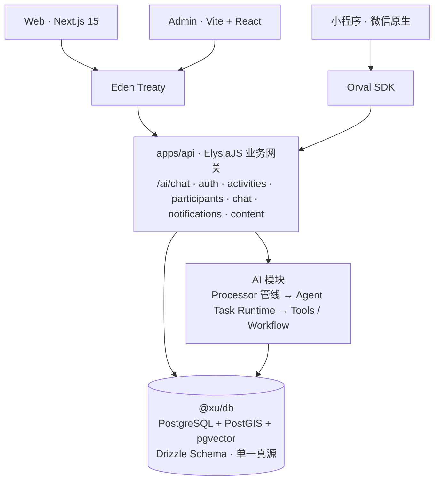
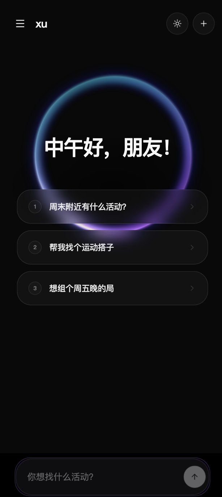
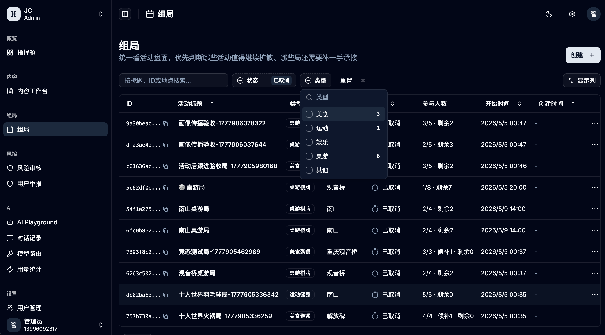
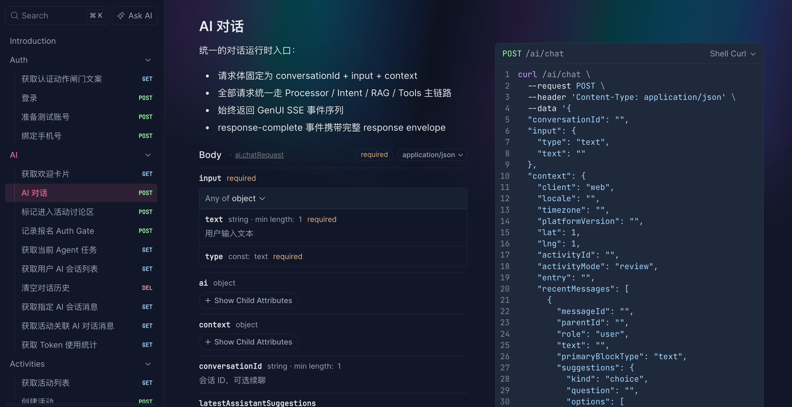
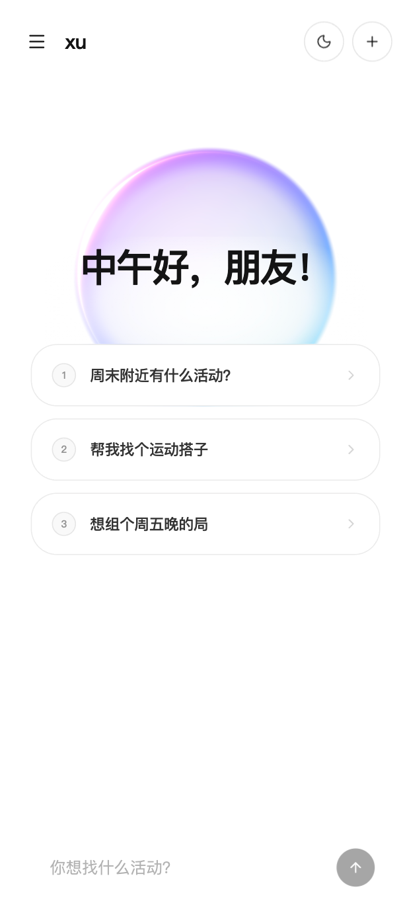
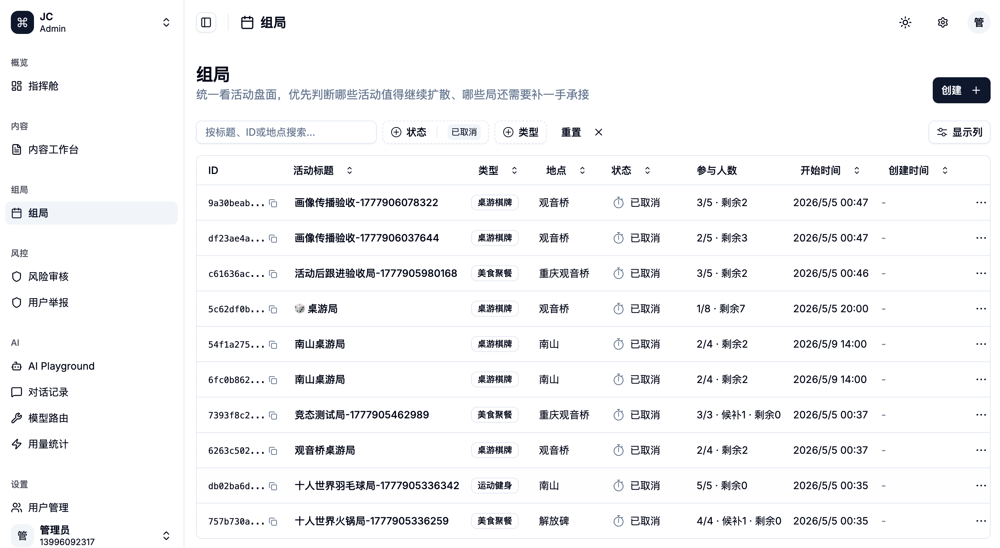
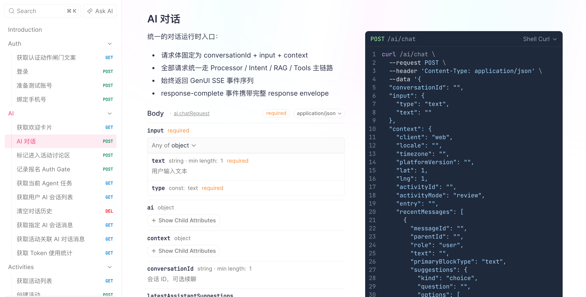

# xu

> "今天有什么想玩的?" — Agent 驱动的社交组局产品。把"组局 / 找搭子 / 报名"建模为可中断、可恢复的 Agent 长任务,跨 Web / H5 / 小程序 / Admin 四端共用一条 SSE 对话主链。

状态:在建中 · 独立开发

---

## 系统总览



四端共享同一组协议与 SDK,API 按领域建模而不按客户端拆模块,AI 模块在 `/ai/chat` 统一收口,所有数据真源回到 `@xu/db`。

---

## 产品截图

### 深色模式

<table>
  <tr>
    <td width="30%" valign="top" align="center">
      <b>H5 · <code>/chat</code> 状态首页</b><br/>
      
    </td>
    <td width="70%" valign="top">
      <b>Admin · 组局工作台</b><br/>
      <br/><br/>
      <b>API · OpenAPI 文档</b><br/>
      
    </td>
  </tr>
</table>

### 浅色模式

<table>
  <tr>
    <td width="30%" valign="top" align="center">
      <b>H5 · <code>/chat</code> 状态首页</b><br/>
      
    </td>
    <td width="70%" valign="top">
      <b>Admin · 组局工作台</b><br/>
      <br/><br/>
      <b>API · OpenAPI 文档</b><br/>
      
    </td>
  </tr>
</table>

---

## 前端架构

跨端共用同一组领域协议(GenUI Block + Eden Treaty / Orval SDK),不重复实现业务逻辑。

| 端 | 技术栈 | 职责 |
|---|--------|------|
| `apps/web` | Next.js 15 App Router + Tailwind + AI SDK Elements | H5 / Web,`/chat` 是首页主路由,承接状态首页、对话、详情、分享态 |
| `apps/miniprogram` | 微信原生 + TypeScript + Zustand Vanilla + Orval SDK | 微信内低摩擦完成动作的主承接端,禁用 `wx.request` |
| `apps/admin` | Vite + React + TanStack Router + Eden Treaty | 内部运营后台,按 概览 / 内容 / 组局 / 风控 / AI / 设置 分组 |

**关键设计:**
- **GenUI Block 协议** — `packages/genui-contract` 定义 `text / choice / entity-card / list / form / cta-group / alert` 七种结构化界面块,跨端共用消费层。改一处协议即可同步三端,避免 Web 改完小程序又重复实现一遍。
- **类型零漂移** — Admin 走 Eden Treaty 直接拿 API 类型,小程序走 Orval 从 OpenAPI 生成 SDK,都不手写 DTO。后端字段一改前端立刻编译失败,杜绝慢慢飘移的手写契约。
- **运行时边界** — 小程序不依赖 monorepo 内任何跨端运行时,只消费 SDK + 协议类型。微信沙盒不能引入 Node 运行时,边界划清才能让小程序不被跨端实现拖死。

---

## 后端架构

`apps/api` 是 ElysiaJS + TypeBox + JWT 业务网关,**按领域能力建模,不按客户端拆模块**。

```
auth          # 微信登录 + 手机号绑定 + JWT
ai            # /ai/chat 统一对话入口(SSE) + Agent Task Runtime
activities    # 活动 CRUD + 状态机(draft / active / completed / cancelled)
participants  # 报名管理 + 状态流转 + 配额
chat          # 活动讨论区 + 消息聚合
notifications # 通知中心 + 任务收件箱
content       # 内容运营选题 / 出稿 / 配置 / 效果回填
```

支撑域:`content-security`(风控)、`hot-keywords`(热词)、`reports`(举报)、`wechat`(微信回调)、`users`(画像)。

**关键设计:**
- **客户端无关** — API 先按"没有任何客户端消费"设计,差异通过显式参数(`client / entry / userId / activityId`)承接,后端不为 H5 / Admin / 小程序拆同义模块。三端各自分叉后端会让领域逻辑分裂三份,改一次报名要改三处。
- **`/ai/chat` 统一协议** — 请求体固定为 `conversationId? + input + context`,主响应固定为 SSE 事件流,`response-complete` 事件携带完整 envelope。三端只学一次协议;Agent 长任务的中断 / 恢复也只在这一个入口处理。
- **OpenAPI 自动生成** — `/openapi/json`,Eden Treaty 与 Orval 都从此派生。后端契约即文档,前端 SDK 永不手写,版本错漂直接在 CI 编译失败。

---

## 数据库设计

`packages/db` 是**绝对的单一数据真源** — Drizzle ORM(PostgreSQL + PostGIS + pgvector)+ drizzle-typebox。

**核心表:**

| 表 | 角色 |
|---|------|
| `users` | 用户主表(`wxOpenId / phoneNumber / aiCreateQuotaToday`) |
| `activities` + `participants` | 活动 + 报名,主流程 |
| `conversations` + `conversation_messages` | AI 会话与消息持久化 |
| `agent_tasks` + `agent_task_events` | Agent 长任务态 + trace 回放 |
| `partner_intents` + `intent_matches` + `match_messages` | 找搭子主链(意向 / 撮合 / 群聊) |
| `user_memories` | 用户长期画像(真实社交结果反哺) |
| `activity_messages` | 活动讨论区 |
| `notifications` | 通知中心 / 任务收件箱 |
| `ai_requests` + `ai_tool_calls` | AI 调用观测 |

**Schema 即真源**:

```typescript
// packages/db/src/schema/users.ts
import { pgTable, uuid, varchar, integer } from 'drizzle-orm/pg-core';
import { createInsertSchema, createSelectSchema } from 'drizzle-typebox';

export const users = pgTable('users', {
  id: uuid('id').primaryKey().defaultRandom(),
  wxOpenId: varchar('wx_open_id', { length: 64 }).unique(),
  phoneNumber: varchar('phone_number', { length: 20 }),
  nickname: varchar('nickname', { length: 50 }),
  aiCreateQuotaToday: integer('ai_create_quota_today').default(3),
});

// 自动派生 — API 层 validation 永远跟 DB 同步,禁止手写表 Schema
export const insertUserSchema = createInsertSchema(users);
export const selectUserSchema = createSelectSchema(users);
export type User = typeof users.$inferSelect;
```

**关键设计:**
- **Schema → TypeBox 派生** — `createInsertSchema(users)` / `createSelectSchema(users)` 自动生成 TypeBox,**禁止手写表 Schema**。手写 DTO 会跟真实表慢慢漂移,`drizzle-typebox` 让 API 层 validation 永远绑定 DB schema。
- **空间 + 向量索引** — `PostGIS` 撑活动地理查询,`pgvector` 撑语义召回(1536 维 Qwen embedding)。附近探索靠 GIST 索引、语义召回靠近邻查询,放在同一库才能做联合过滤。
- **正确性约束显式化** — `docs/TAD.md` 内登记每一条 Correctness Property(CP-1 / CP-2 / ...),覆盖数据一致性、认证、对话持久化、找搭子状态机。比如 CP-1 (`currentParticipants` 必须等于 joined 实际行数)不写下来只能事后对账,登记后 review 时直接照着核对。
- **本地联调** — 默认 `bun run db:push` 快速同步,需要保留迁移历史时再走 `db:generate` / `db:migrate`。Schema 探索期省掉迁移噪音,真正落地长期演化时再补迁移。

---

## AI 模块设计

围绕 `/ai/chat` 的统一 SSE 主链 + Processor 管线 + Agent 长任务态构建。**不是一次性 chat,是可中断、可恢复的 Agent 流程**。

```text
用户输入 (text + action + context)
   ↓
/ai/chat SSE 入口  ──  规范化请求语义
   ↓
Processor 管线  ──  输入护栏 / 用户画像 / 语义召回 / 意图分类 / Token 限制 / 输出护栏
   ↓
是结构化动作?
   ├─ 是  →  Voice 层(轻量 LLM 兜回复)
   └─ 否  →  Tool / Workflow / Model Router 完整推理
   ↓
Agent Task Runtime  ──  任务态持久化(可中断 / 可恢复 / trace 回放)
   ↓
GenUI Blocks  ──  结构化界面块
   ↓
SSE 流式返回  →  Web / 小程序 / Admin
```

**核心子模块**(`apps/api/src/modules/ai/`):

| 子目录 | 职责 |
|--------|------|
| `processors/` | Processor 管线(纯函数):`input-guard / user-profile / semantic-recall / intent-classify / token-limit / save-history / extract-preferences / output-guard` |
| `tools/` | Tool 实现:`explore_nearby / find_partner / search_partners / create_activity / join_activity / publish_draft` |
| `workflow/` | 多步任务编排 |
| `models/` | 模型路由:Moonshot Kimi(主力)+ Qwen `text-embedding-v4`(仅向量) |
| `rag/` | 语义召回 + 本地 rerank |
| `memory/` | working memory + 长期记忆(`user_memories` 表) |
| `task-runtime/` | Agent Task 状态机 |
| `runtime/chat-response.ts` | SSE 响应组装 + GenUI block 映射 |
| `user-action/` | 结构化动作快速出口 |
| `guardrails / moderation / anomaly` | 护栏 / 审核 / 异常检测 |

**Processor 纯函数范式**:

```typescript
// apps/api/src/modules/ai/processors/user-profile.ts
export async function userProfileProcessor(
  context: ProcessorContext,
): Promise<ProcessorResult> {
  const startTime = Date.now();
  try {
    if (!context.userId) {
      return { success: true, context, executionTime: Date.now() - startTime };
    }
    const profile = await loadUserProfile(context.userId);
    return {
      success: true,
      context: { ...context, userProfile: profile },
      executionTime: Date.now() - startTime,
    };
  } catch (error) {
    return {
      success: false,
      context,
      executionTime: Date.now() - startTime,
      error: error instanceof Error ? error.message : '未知错误',
    };
  }
}

userProfileProcessor.processorName = 'user-profile';
```

**关键设计:**
- **Processor 是纯函数** — 相同输入产相同输出,禁止 class,可组合可观测,失败返回 `success: false` 不抛异常。纯函数才能组合、回放、单点观测;改一个 processor 不影响其他链路。
- **Action 快速出口** — 结构化动作(报名 / 发布 / 探索)不走完整 LLM 推理,Voice 层用轻量 LLM 兜话术。用户点按钮不需要重新推理一次,主链路只对自由文本走完整推理,省 token、省延迟。
- **真实结果驱动 Memory** — `join` 只算轻信号,强反馈来自 `confirm-fulfillment` / `rebook-follow-up` 这类真实社交结果。报名不等于喜欢,只看 join 会让画像漂向"看起来感兴趣"而不是"真的喜欢"。
- **AI 对话自动持久化** — 有 `userId` 的对话自动入 `conversation_messages`,Tool 返回的 `activityId` 自动关联到响应消息。Agent 任务可中断 / 可恢复的前提就是状态可持久化,trace 回放、画像反哺、跨端拉取都依赖此。

---

## 仓库结构

```
xu/
├─ apps/
│  ├─ api/            # Elysia API
│  ├─ web/            # Next.js 15
│  ├─ miniprogram/    # 微信原生小程序
│  └─ admin/          # Vite + React Admin
├─ packages/
│  ├─ db/             # Drizzle Schema(单一真源)
│  ├─ genui-contract/ # GenUI Block 协议
│  └─ utils/          # 跨端工具
├─ docs/
│  ├─ PRD.md          # 产品需求文档
│  ├─ TAD.md          # 技术架构文档
│  └─ agent-guides/   # 测试分层与发布门禁
└─ scripts/           # 场景化回归脚本
```

---

## 快速开始

### 前置

- Bun `>= 1.3.4` · Docker · (可选)微信开发者工具

### 一键启动

```bash
bun run setup   # 初始化环境变量 + 安装依赖 + 启动数据库容器 + db:push
bun run dev     # 启动 api + admin + web
```

### 服务地址

- API: <http://localhost:3000> · OpenAPI: `/openapi/json`
- Admin: <http://localhost:1113>
- Web: <http://localhost:1114>
- 小程序:用微信开发者工具打开 [`apps/miniprogram`](./apps/miniprogram)

### 质量门禁

```bash
bun run test:api               # API 集成测试
bun run regression:sandbox     # 主流程沙盒回归
bun run regression:protocol    # SSE / GenUI 协议回归
bun run release:gate           # 发布前完整门禁
```

---

## 完整文档

- [产品需求文档 PRD](./docs/PRD.md) — 产品哲学、状态首页、Agent 主链、长流程验收
- [技术架构文档 TAD](./docs/TAD.md) — 数据库 Schema、API 设计、AI 7 层链路、正确性约束
- [测试分层与发布门禁](./docs/agent-guides/TEST-LAYERS.md)
- [项目协作规范 AGENTS.md](./AGENTS.md)

License: [MIT](./LICENSE)
