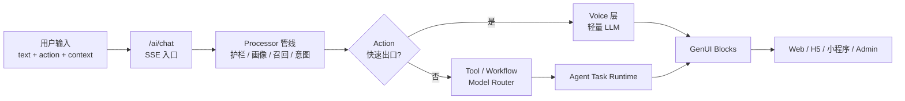

# xu

## AI 组局伙伴 — 群主分身型社交 Agent

> **"今天有什么想玩的?"** — 这是 xu 在用户打开时主动问的第一句话。围绕这句话,产品要把"想出门"翻译成"今晚已经在某个局里"。

xu 把"组局 / 找搭子 / 报名"建模为可中断、可恢复的 Agent 长任务,跨 **Web / H5 / 小程序 / Admin** 四端共用一条 SSE 对话主链。

状态:在建中 · 独立开发

---

## 产品截图

<!-- 截图就位后,把下方 placehold.co URL 替换为 ./docs/assets/readme/*.png -->

> 截图正在补完中,以下为占位预览。

### 移动端(Web/H5 + 小程序)

| 状态首页 | 活动详情 | 找搭子主链 |
|---------|---------|-----------|
|  |  |  |

### 管理后台(Admin Cockpit)

| 概览 / 内容工作台 | AI Playground |
|-------------------|---------------|
|  |  |

---

## 这个项目有意思的地方

### 1. 一个人做了 4 端,共用一套对话协议

API 一条 `/ai/chat` SSE 主链 + 一套自研 GenUI Block 协议(`text` / `choice` / `entity-card` / `list` / `form` / `cta-group` / `alert`),Web、H5、小程序、Admin 共用消费层。**多端差异通过显式上下文参数承接,后端不按客户端拆领域模块**。

### 2. Agent Task Runtime — 不是一次性 chat,是可恢复长任务

组局、找搭子、报名是真实社交流程,不能用 chat 上下文模拟。`agent_tasks` 表把任务态显式建模:用户中途关掉小程序,下次回来 AI 还知道"上次说到了哪一步"。配套 `agent_task_events` 做 trace 回放。

### 3. Visitor-First + Action-Gated Auth — 有判断的产品决策

浏览、对话、附近探索不需要登录,**只在写入动作(报名 / 发布 / 找搭子确认)时才亮登录闸门**。这样能拿到"对话漏斗"的真实数据,而不是用注册墙把用户挡在门外。

### 4. Real-Result-Driven Memory — 真实社交结果反哺画像

只把"报名"算轻信号,**强反馈来自 `confirm-fulfillment` / `rebook-follow-up` 这类真实社交结果**。AI 长期记忆只信"实际去成的局",不被点击和报名等弱意图污染。

### 5. DB-First / Zero Redundancy — 单一数据真源

`@xu/db`(Drizzle ORM + drizzle-typebox)是绝对真源,所有 TypeBox Schema 从 `pgTable` 派生,**禁止手写表 Schema**。Admin 走 Eden Treaty,小程序走 Orval SDK,跨端类型零漂移。

### 6. 显式登记的正确性约束 + 场景化回归矩阵

`docs/TAD.md` 内**显式登记每一条正确性约束**(Correctness Properties,CP-1 / CP-2 / ...),覆盖数据一致性、认证规则、对话持久化、找搭子状态机。配套 `regression-scenario-matrix` 把 PRD 用户旅程映射成可执行回归脚本,`release:gate` 做发布前门禁。

---

## 一张图看懂架构



完整 7 层链路、Processor 设计、模型路由、记忆架构详见 [docs/TAD.md](./docs/TAD.md)。

---

## 技术栈

| 层 | 技术 |
|---|------|
| Runtime | Bun + Turborepo |
| API | ElysiaJS + TypeBox + JWT |
| 数据库 | PostgreSQL + PostGIS + pgvector + Drizzle ORM |
| AI | Moonshot Kimi(主力) + Qwen embedding + 自研 Processor 管线 + RAG |
| Web | Next.js App Router + Tailwind + AI SDK Elements |
| 小程序 | 微信原生 + TypeScript + Zustand Vanilla + Orval SDK |
| Admin | Vite + React + TanStack Router + Eden Treaty |
| GenUI | 自研 `@xu/genui-contract` 块协议 |

---

## 仓库结构

```
xu/
├─ apps/
│  ├─ api/            # Elysia API,核心领域模块(auth / ai / activities / participants / chat / notifications / content)
│  ├─ web/            # Next.js 15,/chat 是首页主路由
│  ├─ miniprogram/    # 微信原生小程序
│  └─ admin/          # Vite + React,极简管理后台
├─ packages/
│  ├─ db/             # Drizzle Schema,单一数据真源
│  ├─ genui-contract/ # GenUI Block 协议定义
│  └─ utils/          # 跨端工具
├─ docs/
│  ├─ PRD.md          # 完整产品需求文档
│  ├─ TAD.md          # 完整技术架构文档
│  └─ agent-guides/   # 测试分层与发布门禁
└─ scripts/           # 场景化回归脚本
```

---

## Local development

### 前置

- Bun `>= 1.3.4`
- Docker
- (可选)微信开发者工具

### 一键启动

```bash
bun run setup   # 初始化环境变量 + 安装依赖 + 启动数据库容器 + db:push
bun run dev     # 启动 api + admin + web
```

### 服务地址

- API: <http://localhost:3000>(OpenAPI: `/openapi/json`)
- Admin: <http://localhost:1113>
- Web: <http://localhost:1114>
- 小程序:用微信开发者工具打开 [`apps/miniprogram`](./apps/miniprogram)

### 质量门禁

```bash
bun run test:api               # API 集成测试
bun run regression:sandbox     # 主流程沙盒回归
bun run regression:protocol    # SSE / GenUI 协议回归
bun run release:gate           # 发布前完整门禁
```

---

## 核心文档

- [产品需求文档 PRD](./docs/PRD.md) — 产品哲学、状态首页、Agent 主链、长流程验收
- [技术架构文档 TAD](./docs/TAD.md) — 数据库 Schema、API 设计、AI 7 层链路、正确性约束
- [测试分层与发布门禁](./docs/agent-guides/TEST-LAYERS.md)
- [项目协作规范 AGENTS.md](./AGENTS.md)

---

## About

xu 是一个**独立开发的 AI 产品作品**,关注的是"AI 怎么把真实社交动作做下去",而不是"AI 怎么聊得更像人"。完整产品判断和技术决策见 PRD / TAD。

License: [MIT](./LICENSE)
