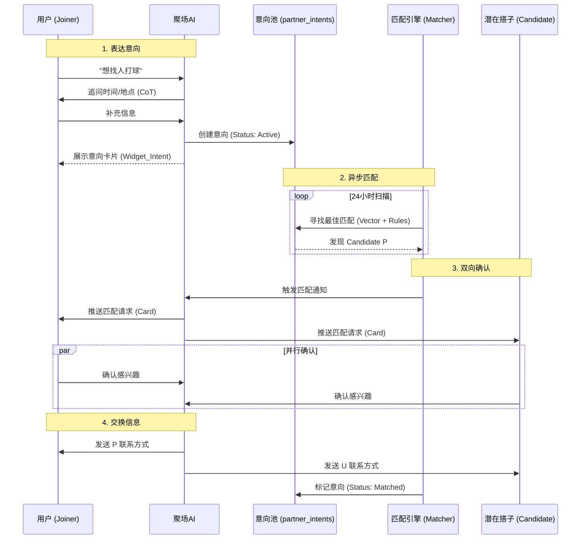
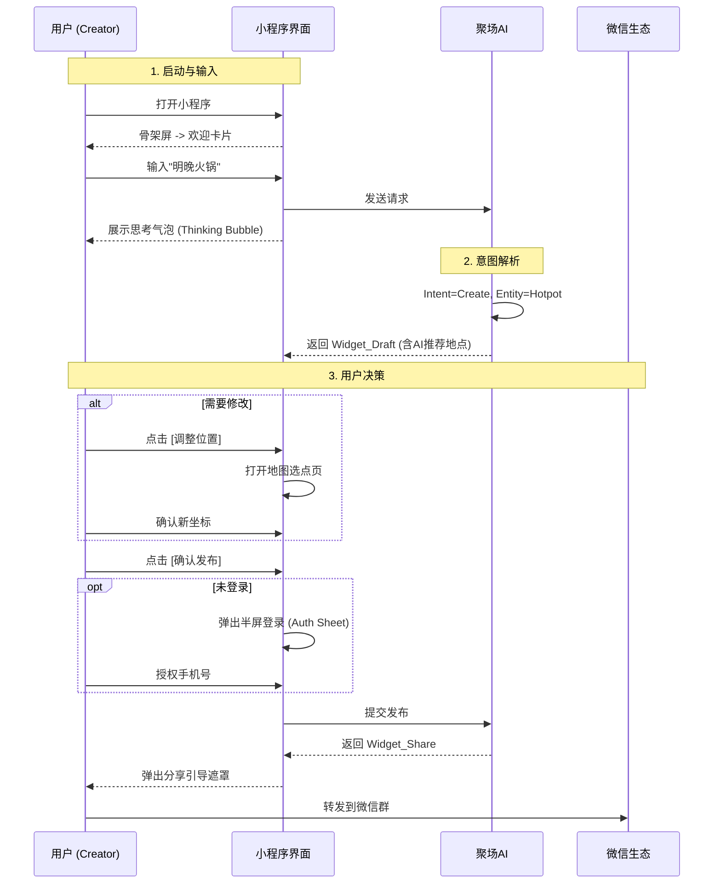
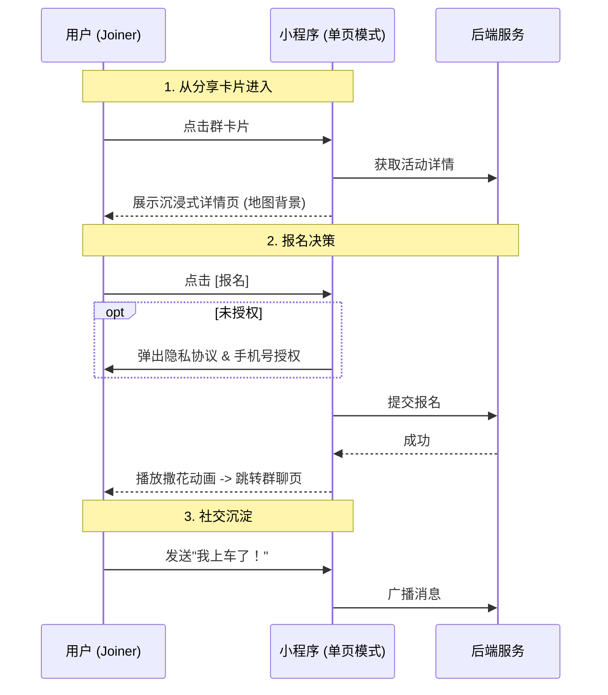

# 聚场 (JuChang) 产品需求文档

> **版本**：v5.3 (Real Social Loop + Structured Action Flow + Action-Gated Auth)
> **更新日期**：2026-03-30
> **App 名称**：聚场 (JuChang)
> **产品定位**：Personal Social Agent (个人社交代理人)
> **核心 Slogan**：想怎么玩？跟小聚说说。
> **AI 角色名**：小聚 (XiaoJu)

---

## 0. 产品哲学：从工具到 Agent

### 0.0 我们不是工具，我们是 Agent

> **工具是被动的（人去操作它），Agent 是主动的（人与它协作，甚至它为人服务）。**

> **口径分层（v5.4 收口）**：
> - **对内原型**：小聚是“高频组局群主日常工作的数字化身”。产品要复刻的，不是抽象 AI 能力，而是“听懂群里一句话、知道这是什么局、知道下一步该怎么接、能把事续到成局或收尾”的组织能力。
> - **对外角色**：小聚是“组局助手”。对外只讲它帮用户解决什么，不讲“我的化身”、不讲 `agent runtime`。
> - **技术实现**：`Agent` 只代表系统内部的持续任务运行时、上下文恢复和结果闭环能力，不代表任何对外品牌表达。

| 维度 | 传统工具 (SaaS) | 聚场 (Agent as a Service) |
|------|----------------|--------------------------|
| **交互模式** | 用户填表单、点按钮 | 用户说话，AI 理解并执行 |
| **界面生成** | 静态 UI，所有人看到一样的 | Generative UI，根据意图动态生成 |
| **服务对象** | 只服务"群主"（发起者） | 服务每一个人（发起者 + 参与者） |
| **用户关系** | 用完即走 | 记住你，下次更懂你 |
| **核心价值** | 效率工具 | 社交秘书 |

**唯一大脑原则（v5.4）**：

- 用户看到的是一个“小聚”，系统内部也必须尽量表现为一个持续拥有任务的运行时，而不是若干页面和按钮在接力
- 对同一件事，系统需要有一个持续存在的任务对象，至少记录：`用户目标`、`当前阶段`、`下一步动作`、`最后结果`
- 第一阶段先把 `join_activity` 做成真任务链路：从“附近有什么局”到报名成功、进入讨论区、活动后跟进，尽量由同一个任务持续推进
- 第二阶段把 `find_partner` 纳入异步任务链路，让“发意向、等匹配、确认成局/取消继续等”仍属于同一件事
- 第三阶段把 `create_activity` 纳入持续任务链路，让“想组一个局、生成草稿、修改、发布”也由同一个任务对象拥有

**第一性用户场景（来自真实群聊语境）**：

- “有没有 xx 搭子”
- “附近有没有局”
- “我想组个局”
- “麻将差一个有没有人”
- “这场结束了，要不要复盘 / 再约”

聚场不是从抽象 AI 往场景里找落点，而是从这些高频、口语化、碎片化但结果导向极强的真实表达出发，设计一个能持续接住它们的组局助手。

### 0.1 Chat-First：不是噱头，是架构

**为什么首页是对话，而不是列表/地图？**

传统 App 的首页是"货架"——你来挑。
聚场的首页是"对话"——你说，我帮你办。

这不是 UI 风格的选择，而是**产品定位的选择**：
- 货架模式 = 你是顾客，我是商城
- 对话模式 = 你是老板，我是秘书

**Chat-First 的三个核心优势**：

| 优势 | 说明 |
|------|------|
| **零门槛** | 不需要学习操作，会说话就会用 |
| **意图理解** | 用户不需要知道"该点哪个按钮"，AI 理解意图后自动执行 |
| **情绪价值** | 有人回应的感觉，比冷冰冰的界面温暖 |

### 0.2 Generative UI：界面是流动的

**传统 App**：界面是死的。无论谁来，看到的都是九宫格、列表、Banner。

**聚场**：界面是流动的。AI 根据你的意图，动态生成最合适的 Widget。

| 用户意图 | 生成的 UI |
|---------|----------|
| "明晚观音桥打麻将" | Widget_Draft（表单模式） |
| "附近有什么好玩的" | Widget_Explore（地图模式） |
| "这周五晚上不知道干嘛" | Widget_Explore + AI 推荐语 |
| "上次那个火锅局怎么样" | 文本回复 + 相关活动卡片 |

**这是聚场区别于所有竞品的杀手锏**：
- 对于发起者，它是高效的表单生成器
- 对于迷茫者，它是地图探索器
- 对于管理者，它是仪表盘

### 0.3 服务每一个人，不只是群主

**旧逻辑（工具）**：
```
用户打开 App → 看到卡片 → 报名 → 关闭
```
对于参与者来说，聚场只是一个"填坑的入口"。

**新逻辑（Agent）**：
```
用户不知道干嘛 → 问小聚 → 小聚推荐 → 报名 → 小聚提醒 → 结束后小聚询问反馈
```
小聚是每个人的社交秘书，不只是群主的工具。

**普通用户（非群主）为什么要和小聚聊天？**

| 场景 | 小聚的价值 |
|------|-----------|
| "这周五晚上不知道干嘛" | 理解情绪，推荐合适的活动 |
| "附近有什么好玩的" | 探索发现，降低决策成本 |
| "上次那个火锅局感觉怎么样" | 记住你的偏好，下次推荐更准 |
| "帮我算算人均多少钱" | 活动后的贴心服务 |

---

| 原则 | 说明 |
|------|------|
| **页面 (Page) 越少越好** | 保持沉浸，减少跳转 |
| **模态 (Modal/Sheet) 适度使用** | 解决中断，不打断主流程 |
| **流 (Stream) 是核心** | 对话不能断，状态要连贯 |

### 0.4 Digital Ascension (数字飞升)：从线下到线上的流量入口

> **v4.8 战略转向**：不再依赖传统 App 分发，而是通过**直播间 + 命令码**实现流量的"数字飞升"。

**核心理念**：用户在线下场景（直播间、活动现场、海报）看到一个**命令码**（如"仙女山"），在聚场输入后，Agent 立即返回预设的活动卡片或推荐内容。

**Digital Ascension 的三个入口**：

| 入口类型 | 场景 | 用户行为 | Agent 响应 |
|---------|------|---------|-----------|
| **直播间口播** | 主播说"想去仙女山玩的，打开聚场输入'仙女山'" | 用户打开小程序，输入"仙女山" | 返回预设的仙女山活动卡片/推荐 |
| **线下海报** | 景区/商场海报印有"聚场命令码：观音桥火锅" | 用户扫码进入，自动填充命令 | 返回观音桥火锅相关活动 |
| **社群传播** | 群友分享"今晚有个局，命令码：麻将3缺1" | 用户复制命令码，粘贴到聚场 | 返回对应的活动详情 |

**为什么这是 v4.8 的核心战略？**

传统 App 的流量获取方式（应用商店、广告投放）成本高、转化低。Digital Ascension 通过**命令码**将线下流量直接导入 Agent，实现：
- **零门槛**：不需要下载 App，微信小程序即开即用
- **精准触达**：命令码直接对应具体场景，无需用户搜索
- **病毒传播**：命令码可以口口相传、截图分享

**技术实现**：命令码本质上是**全局关键词（Global Keywords）**，在意图识别引擎中拥有最高优先级（P0），无需 NLP 处理，直接返回预设内容。

### 0.5 Dual-Mode Drive (双模驱动)：快车道与慢车道

> **v4.8 交互升级**：Agent 同时支持两种交互模式，用户可以根据场景自由切换。

**双模驱动的核心逻辑**：

| 模式 | 别名 | 适用场景 | 交互方式 | 响应速度 |
|------|------|---------|---------|---------|
| **Global Commands** | **快车道** | 明确知道要什么（如"仙女山"） | 输入关键词，直接命中 | <0.5s |
| **Natural Language** | **慢车道** | 模糊表达需求（如"周末想放松"） | 自然语言，NLP 解析 | 1-2s |

**快车道（Global Commands）**：
- **本质**：热词匹配，后端维护一个全局关键词库
- **优势**：极速响应，无需 AI 推理，适合高频场景
- **示例**：
  - 用户输入"仙女山" → 直接返回仙女山活动推荐卡片
  - 用户输入"火锅" → 返回附近火锅局列表
  - 用户输入"麻将" → 返回麻将找搭子意向卡片

**慢车道（Natural Language）**：
- **本质**：NLP 意图识别，AI 理解用户的复杂表达
- **优势**：灵活性强，能处理长尾需求
- **示例**：
  - 用户输入"这周末想找个安静的地方喝茶聊天" → AI 解析意图，推荐茶馆活动
  - 用户输入"明天下午有空，不知道干嘛" → AI 根据用户偏好推荐活动

**双模无缝切换**：
- 用户不需要知道背后有两种模式
- Agent 自动判断：先尝试快车道（关键词匹配），失败则走慢车道（NLP）
- 对用户来说，体验是统一的：**说话 → Agent 响应**

**为什么需要双模驱动？**

| 单一模式的问题 | 双模驱动的解决方案 |
|--------------|------------------|
| 只有 NLP：响应慢，成本高，不适合高频场景 | 快车道处理高频场景，降低成本 |
| 只有关键词：不够智能，无法处理复杂需求 | 慢车道兜底，保证灵活性 |

### 0.6 Context-Agnostic (上下文无关)：Agent 的统一响应原则

> **v4.8 设计哲学**：无论用户从哪里来（直播间、海报、群聊），Agent 的响应逻辑是统一的。

**Context-Agnostic 的核心原则**：

Agent 不关心用户的"来源上下文"，只关心用户的"当前输入"。无论用户是从直播间听到命令码，还是在群里看到分享，输入同一个关键词，得到的响应是一致的。

**为什么这很重要？**

| 传统 App 的问题 | Context-Agnostic 的优势 |
|---------------|----------------------|
| 不同入口有不同的落地页，用户体验割裂 | 统一的 Agent 入口，体验一致 |
| 需要为每个渠道定制页面，开发成本高 | 一套 Agent 逻辑，适配所有场景 |
| 用户需要学习不同入口的操作方式 | 用户只需要学会"跟 Agent 说话" |

**实现方式**：

无论用户从哪里进入聚场（扫码、分享卡片、直播间引导），最终都会进入**首页 Chat Stream**。Agent 通过**关键词匹配 + NLP 意图识别**统一处理所有输入。

**示例**：
- 直播间用户输入"仙女山" → Agent 返回仙女山活动卡片
- 老用户在首页输入"仙女山" → Agent 返回相同的仙女山活动卡片
- 群聊分享进入的用户输入"仙女山" → Agent 返回相同的仙女山活动卡片

**这就是 Context-Agnostic 的威力**：一套 Agent 逻辑，服务所有场景。

---

## 1. 产品定位与核心价值

### 1.1 三大核心优势

#### 🎯 响应感 —— 治愈"无人回应的焦虑"

| 旧世界（微信群） | 新世界（聚场） |
|-----------------|---------------|
| 发消息后死一般的寂静 | AI 秒回，0.5s 内开始响应 |
| 运气好有人回表情包 | 流式反馈：文字逐字显示，Widget 卡片逐步展开 |

**Agent 响应节奏原则（v5.3 收口）**：
- 小聚必须先“说清楚”，再“给动作”；正文是主战场，生成式 UI 是正文之后的承接
- 当一轮回复同时包含说明和交互时，用户应先看到流式文字，再在下一行看到按钮、结果卡、表单或下一步操作
- 生成式 UI 不应重复解释正文已经说过的意思；它只负责承载选择、填写、浏览和执行
- 如果没有结构化交互必要，就只返回正文；不要为了“有 UI”强行补一层卡片

#### 📍 秩序感 —— 把"混乱的流"变成"确定的卡片"

| 旧世界（微信群） | 新世界（聚场） |
|-----------------|---------------|
| 信息是流（Flow），瞬间被冲走 | 信息是卡片（Widget），24小时内雷打不动 |
| 想找刚才那个人？翻聊天记录 | 对话历史持久化，下次打开还在 |

#### ⚡ 零门槛 —— 不改变习惯，只提升效率

| 旧世界（填表单） | 新世界（AI 输入坞） |
|-----------------|-------------------|
| 选时间、选地点、填标题 | 在群里怎么说话，在这里就怎么说话 |
| 需要学习新操作 | 直接把群里的乱七八糟复制过来，自动变整齐 |

### 1.2 v3.4 架构：Chat-First + Generative UI + 小聚人格

| 版本 | 架构 | 问题 |
|------|------|------|
| v1.0 | 地图 + 表单 | 门槛高，用户要填表单，冷启动地图空白 |
| v2.0 | Card Feed | 信息密度低，不够直接 |
| v3.2 | Chat-First + Generative UI | 零门槛，像聊天一样组局 |
| v3.3 | + 小聚人格 + 竞品差异化 | 有灵魂，不是冷冰冰的系统 |
| **v3.4** | **+ 文案体系精修** | ✅ 统一品牌调性，强调 AI 执行力 |

**核心交互哲学**：
1. **首页即对话**：小程序打开不再是地图，而是一个无限滚动的 Chat View
2. **功能即气泡**：所有功能都封装在对话流的 Widgets 中
3. **去 Tabbar 化**：底部取消导航栏，改为悬浮的 AI Dock
4. **Generative UI**：AI 根据意图动态生成最合适的 Widget 类型

---

### 1.2 核心业务流程 (The Business Flows)

#### 1.2.0 结果导向总漏斗（首页 → 找到搭子 / 找到局）

> **北极星不是“聊得久”，而是“完成得快”。**
>
> 用户从进入首页开始，必须在一次连续交互里完成至少一个结果：
> 1) 找到局（报名成功 / 发布成功）
> 2) 找到搭子（匹配确认 / 进入匹配中状态）

**完整漏斗（Result Funnel）**：

| 阶段 | 用户感知 | AI Workflow 节点 | 生成式界面输出 | 结果判定 |
|------|----------|------------------|----------------|----------|
| **S1 进站** | “我刚打开，不知道干嘛” | Welcome + Context（时间/城市/位置） | 欢迎卡 + 快捷动作 | 用户有首击行为（输入或点击） |
| **S2 表达** | “我想找局/找搭子” | Chat Gateway 接收 `text/action` | 输入回显 + 思考气泡 | 成功进入意图识别或结构化动作链路 |
| **S3 理解** | “它懂我在说什么吗” | Intent/P0 热词/Processor 管线 | 精准追问或直接卡片 | 关键信息完整率 ≥ 80% |
| **S4 执行** | “别只说，直接办” | Tool 或结构化动作执行 | Draft/Explore/Intent 卡片 | 产生可执行 CTA（报名/发布/匹配） |
| **S5 决策** | “我要不要点确认” | 风险校验（登录、手机号、额度） | 半屏授权/提示/纠错 | 用户完成关键点击 |
| **S6 成果** | “我真的搞定了吗” | 写库 + 状态流转 + 通知 | 成功卡片 + 下一步建议 | 达成 `join/publish/matched` 之一 |
| **S7 回流** | “然后呢” | 后链路触达（提醒/推荐/复访） | 消息触达 + 快捷入口 | 24h 内二次活跃 |

**任务 ownership 要求（v5.4 首版）**：

- 当用户目标是“找一个能参加的局”时，系统必须形成一条 `join_activity` 任务链，而不是只保留聊天记录
- 该任务至少覆盖这些阶段：`intent_captured → explore → action_selected → auth_gate → joined → discussion → post_activity → done`
- 登录 / 绑手机号不应被视为任务终止，而应视为任务挂起点；登录后要继续推进同一条任务
- 讨论区、消息中心、活动后 follow-up 都不是新的孤立流程，而是同一条任务在不同阶段的承接面

**首版硬指标（Result KPI）**：

- `TTV`（Time to Value）：首页首击到首次可执行卡片 ≤ 45 秒
- `TTR`（Time to Result）：首页首击到“报名/发布/匹配中” ≤ 120 秒
- `Action CTR`：关键 CTA 点击率 ≥ 35%
- `Result Rate`：会话级结果达成率（找到局/找到搭子）≥ 25%

#### 1.2.0.1 Bump 借鉴与我们必须直面的错误

**可借鉴（保留）**：
- **目的先于功能**：先让用户说“今晚想干嘛”，再给操作，而不是先给复杂入口
- **行动卡片优先**：一屏内给出可执行选项，减少“继续聊聊”的空转
- **轻承诺路径**：先加入/先意向，不强迫一步到位，降低决策压力

**我们当前错误（必须修正）**：
- **错误 1：Action 退化成文本**，用户点按钮后又走一遍 NLP，丢失“秒办”体验
- **错误 2：位置上下文没有全链路传递**，导致“附近推荐”不稳定
- **错误 3：成功态表达弱**，用户完成关键动作后缺少“下一步”引导
- **错误 4：流程目标不统一**，链路优化围绕组件而非围绕“找到局/找到搭子”

**产品原则（用于所有后续需求评审）**：
- 任何新功能都要回答：它把 `TTR` 缩短了多少？
- 任何新卡片都要回答：它对“找到局/找到搭子”转化贡献多少？
- 任何新流程都要有可回收结果状态：`draft/active/joined/matched/completed`

**v5.1 第二批落地（结果增强）**：
- **成功态下一步 CTA**：用户完成报名/发布/探索后，立即出现“下一步动作”而不是只给一句“成功”
- **找搭子进度卡**：追问阶段展示 `匹配进度 x/2`，完成后给“继续补充 / 看看同类局”分流入口

#### 1.2.0.2 P0/P1 执行任务清单（结果导向）

| 优先级 | 任务 | 目标节点 | 当前状态 |
|--------|------|----------|----------|
| **P0** | Action 透传（点击即执行） | S2 表达 → S4 执行 | ✅ 已完成 |
| **P0** | 位置上下文透传（多端一致） | S1 进站 → S3 理解 | ✅ 已完成 |
| **P0** | 成功态 nextActions（操作后不空白） | S6 成果 | ✅ 已完成 |
| **P0** | 找搭子进度卡（x/2） | S4 执行 → S5 决策 | ✅ 已完成 |
| **P1** | Web 端定位接入（welcome/chat） | S1 进站 → S3 理解 | ✅ 已完成 |
| **P1** | 结果埋点与回放可读性 | S6 成果 → S7 回流 | ✅ 已完成 |
| **P1** | 匹配成功通知卡（确认/取消） | S6 成果 | ✅ 已完成 |
| **P1** | 活动后反馈引导卡（post_activity） | S7 回流 | ✅ 已完成 |

#### 1.2.0.3 当前四大真实场景支持度判断（v5.4 盘点）

> **判断标准**：不是“功能是否存在”，而是“群里一句话冒出来时，小聚能不能像一个真正会张罗的群主一样，把这件事顺着接住并办下去”。

| 场景 | 用户真实表达 | 当前判断 | 已成立能力 | 仍未到完美的点 |
|------|-------------|----------|-----------|---------------|
| **找局** | “附近有什么局”“观音桥有没有火锅局”“这个活动我能不能直接报” | **已支持，但未到完美** | 首页 Chat 可进入 explore；`join_activity` 已形成从探索、报名、auth gate、讨论区到活动后 follow-up 的连续任务；报名被打断后可恢复同一条动作；报名成功后统一进入讨论区 | 前台承接感还不够强，用户不一定明显感知到“还是同一个小聚在继续办这件事” |
| **组局** | “想组个周五晚上的局”“帮我发个桌游局”“这个草稿改下时间/人数” | **主链路已成立，接近成熟** | `create_activity -> draft_ready -> published -> done` 已形成连续任务；草稿真实写库；`edit_draft / save_draft_settings` 不再分叉新任务；发布成功后有下一步 CTA | 技术链路已通，但产品感还不够像“群主顺手帮你把局张罗出来” |
| **找搭子** | “有没有麻将搭子”“谁组我就去”“帮我看看附近有没有同类人”“差一个有没有人” | **能用，但四条里最需要继续打磨** | 已切到 `Search-First + Optional Pool`；首轮不再默认弹完整 form 或直接入池；没有真实 `intent_match` 前不会误进 `match_ready`；真匹配后可从消息中心直接承接 | 这是最依赖灰度判断、也最像真实群主工作的场景；“搜一下 / 继续帮我留意 / 正式发意向”之间的边界仍需继续磨 |
| **活动后续上** | “这场怎么样”“帮我复盘一下”“下次还想约”“谁真正到场了” | **闭环已打通，但体验还没完全长出来** | `confirm-fulfillment`、review、rebook、memory 写回已成真链路；带 `activityId + followUpMode` 的入口会挂回原活动；`join_activity` 可推进到 `post_activity -> done` | 逻辑已完整，但用户心智还没完全建立成“小聚最擅长接后半段”的招牌体验 |

**当前成熟度排序**：

1. 找局
2. 组局
3. 活动后续上
4. 找搭子

**当前继续完善优先级**：

1. 找搭子
2. 活动后续上
3. 首页 / 消息中心的连续承接感
4. 组局链路的顺手感与情绪价值

**结论**：

- 当前 Chat 对“找局”和“组局”已形成可验证的连续主链路
- 对“活动后续上”已形成真实闭环，不再是活动结束后的空白地带
- “找搭子”已完成关键机制纠偏，但仍是最需要继续打磨、最不应自满的真实群聊场景

#### 1.2.0.4 当前阶段判断（团队内部同步口径）

> **当前阶段**：聚场已经走出“方向验证期”，进入“体验收口期”。

这意味着：

- 不需要推翻产品原点或交互骨架
- 主矛盾不再是“做什么”，而是“把最重要的真实场景做顺、做稳、做得像人”
- 后续判断标准不是“有没有再加功能”，而是“小聚是否更像一个真的会张罗组局的群主”

**已经成立**：

- 产品原点成立：不是抽象 AI 概念，而是来自真实群聊里的找局、组局、找搭子、活动后续上
- Chat-First 成立：用户可以像在群里说话一样开口，不需要先学复杂模块
- `join_activity` 主链路成立：探索、报名、auth gate、讨论区、活动后 follow-up 已经形成连续任务
- `create_activity` 主链路成立：草稿、修改、发布已形成同一条连续任务
- 活动后续上闭环成立：履约确认、复盘、再约、memory 写回已经不是空白
- 方向收口成立：对外是“组局助手”，`Agent` 只作为内部技术实现

**还不能自满**：

- `find_partner` 仍未达到“像群主本人一样会判断”的程度
- 首页和消息中心的连续承接感还不够强，用户未必始终感知到“还是同一个小聚在继续办”
- 活动后续上虽已形成闭环，但还没长成特别强的招牌体验
- 文档、界面和语气刚开始围绕同一原型收稳，仍需要继续固化

**下一阶段只盯三件事**：

1. `找搭子`
2. 首页 / 消息中心的连续承接感
3. 活动后续上的产品感

**一句话结论**：

聚场现在已经是一个“方向对、主链路成立、但仍需继续收口”的产品；接下来最重要的不是怀疑要不要重做，而是把最关键的真实场景打磨到更像一个会张罗的群主。

#### 1.2.1 [Flow] 找搭子 (Partner Matching) - 核心痛点攻坚

> **痛点 vs 解法**
> | 旧世界（微信群/朋友圈） | 新世界（聚场 AI Agent） | 业务价值 |
> |-------------------------|-------------------------|----------|
> | 喊话即消失：消息被淹没，有效期短 | 意向池化：需求转为 Struct 存入数据库，24h 有效 | 需求不丢失 |
> | 被动等待：能否成局看缘分，效率低 | 主动撮合：AI 24小时扫描匹配，精准推送 | 效率提升 10x |
> | 隐私顾虑：不想公开微信号给陌生人 | 虚拟中介：确认匹配意向后才交换联系方式 | 安全感提升 |

**业务剧本**：

1.  **表达 (Express)**
    - 用户："想找人周末剧本杀，不要太硬核的。"
    - AI："收到。有几个细节确认下：1. 具体是周六还是周日？2. 想要几个人？" (Slot Filling via CoT)
    - 用户："周六 afternoon，4-6人吧。"
    - AI："OK，已为你生成[剧本杀·找搭子意向卡片]。系统将在后台持续寻找匹配，有合适的我会第一时间通知你。"

2.  **存储与检索 (Store & Search)**
    - 系统将需求写入 `partner_intents` 表，状态为 `active`。
    - 启动 `PartnerMatcher` 定时任务，扫描活跃意向。
    - 发现匹配：距离 3km 内、同为"剧本杀"类别、时间重叠、Tag 相似度 > 80%。

3.  **双向确认 (Handshake)**
    - AI (对 A 仅可见)："帮你找到一个搭子！也是周六想玩本，就在你附近 2km。查看匹配详情？"
    - AI (对 B 仅可见)："有位朋友也想周六剧本杀，我看你们偏好挺像，要不要认识下？"

4.  **成局 (The Deal)**
    - A 点击 [感兴趣]，系统记录状态。
    - B 点击 [感兴趣]，匹配达成 (Matched)。
    - AI："太好了！这是对方的微信/二维码，你们聊！" (交换联系方式)
    - (Future)：AI 直接创建一个新的 Group Chat。

**流程图**：



#### 1.2.2 [Flow] 极速组局 (Activity Creation)

> **痛点 vs 解法**
> | 旧世界（APP 表单） | 新世界（AI Chat） | 业务价值 |
> |--------------------|-------------------|----------|
> | 填表单：标题、时间、地点一个个填 | 一句话生成：AI 自动从自然语言提取要素 | 降低门槛 |
> | 缺信息：不知道地点在哪 | 模糊补全：AI 根据上下文推荐合适地点 | 辅助决策 |
> | 改来改去：调整很麻烦 | 对话修改："把时间改成明天" | 自然交互 |

**业务剧本与关键交互 (Creator Journey)**：

| 步骤 | 用户行为 | 系统/界面响应 | ⚠️ 体验细节点 (Micro-Interactions) |
|------|----------|---------------|----------------------------------|
| **1. 触发** | 打开小程序 | 显示首页 Chat 流 + 欢迎卡片 | **Loading 骨架屏** (防止冷启动白屏) |
| **2. 输入** | 粘贴一段乱七八糟的群接龙 | 底部 AI Dock 弹起，输入框聚焦 | **键盘避让动画** (确保输入框不被遮挡) |
| **3. 思考** | 点击发送 | Chat 流底部出现"呼吸气泡" | **AI 思考动效** (三个跳点呼吸灯，安抚焦虑) |
| **4. 预览** | AI 返回 `Widget_Draft` | 显示地图预览 + 关键信息 | **地图选点页** (若 AI 选点不准，用户可点击纠正) |
| **5. 确认** | 点击 [确认发布] | 检查手机号绑定状态 | **半屏授权弹窗** (Auth Sheet，不生硬跳转) |
| **6. 引导** | 发布成功 | Chat 流出现 `Widget_Share` | **全屏分享引导** (箭头指向右上角，消除"然后呢") |
| **7. 闭环** | 转发到群 | 微信原生分享卡片 | **卡片文案优化** (确保标题够骚，图片不裂) |

**流程图**：



#### 1.2.3 [Flow] 参与者体验 (Participant Journey)

> **痛点 vs 解法**
> | 旧世界（群接龙） | 新世界（聚场 Widget） | 用户体验 |
> |------------------|-----------------------|----------|
> | 信息杂乱：要翻好几页聊天记录 | 结构化卡片：时间地点一目了然 | 清晰 |
> | 信任缺失：不知道谁发起的，靠谱吗 | 信任背书：精美地图、倒计时、已报名头像 | 专业 |
> | 报名繁琐：要复制粘贴+1 | 一键上车：点击按钮即完成报名 | 爽快 |

**业务剧本与关键交互 (Joiner Journey)**：

| 步骤 | 用户行为 | 系统/界面响应 | ⚠️ 体验细节点 |
|------|----------|---------------|---------------|
| **1. 触达** | 在群里点击卡片 | 单页模式启动小程序 | **全局 Loading** (数据加载时的反馈) |
| **2. 决策** | 查看活动详情 | 显示活动邀请函详情页 | **法务条款入口** (点击报名时需同意) |
| **3. 行动** | 点击 [🙋‍♂️ 报名] | 检查手机号 → 成功报名 | **报名成功反馈动画** (撒花/震动，情绪价值) |
| **4. 连接** | 报名后去哪？ | 自动跳转到活动群聊 | **群聊空状态引导** (提示"打个招呼吧") |
| **5. 留存** | 想看看别的 | 点击左上角 [返回] | **首页回流兜底** (单页模式下重定向到首页) |

**统一任务要求（v5.4）**：
- 参与者从“看局”到“报名”再到“讨论”，必须属于同一条 `join_activity` 任务
- 当用户点了报名但被登录/绑手机号拦住时，这条任务进入 `auth_gate`，而不是丢失
- 登录完成后，系统恢复原任务继续报名，不要求用户重新理解界面或重新表达一次
- 报名成功后，讨论区不是单纯跳页，而是该任务从 `joined` 推进到 `discussion`

**流程图**：



---

#### 1.2.4 [Flow] 智能探索 (Smart Exploration)

> **痛点 vs 解法**
> | 旧世界（APP 列表页） | 新世界（AI 意图检索） | 体验提升 |
> |----------------------|-----------------------|----------|
> | 机械筛选：自己选区域、类型、排序 | 语义理解："想轻松点的局" -> 自动映射 Tags | 懂你 |
> | 列表枯燥：一张张图看过去 | 地图沉浸：可以展开的全屏地图，拖动即搜 | 直观 |

**业务剧本与关键交互**：

| 步骤 | 用户行为 | 系统/界面响应 | ⚠️ 体验细节点 |
|------|----------|---------------|---------------|
| **1. 提问** | "附近有啥好玩的" | AI 识别意图 `intent: explore` | **Thinking Bubble** |
| **2. 预览** | 等待 1s | AI 返回 `Widget_Explore` (带静态地图预览) | **多点 Marker** (地图上显示多个活动点) |
| **3. 沉浸** | 点击卡片或 [展开] | 展开为全屏地图模式 (Bottom Sheet 交互) | **动画过渡** (从气泡平滑展开全屏) |
| **4. 交互** | 拖动地图 / 切换 Tag | 即时刷新可视区域内的活动 | **动态加载** (无需手动刷新) |
| **5. 详情** | 点击地图 Pin | 底部弹出简略信息卡片 | **轻触反馈** |
| **6. 决策** | 点击卡片 | 跳转活动详情页 | - |

**全屏地图模式结构 (Immersive Map)**：

```
┌─────────────────────────────────────────────────────────┐
│  [←]              探索附近              [筛选]          │
├─────────────────────────────────────────────────────────┤
│  [全部] [美食] [运动] [桌游] [娱乐]                     │
├─────────────────────────────────────────────────────────┤
│                                                         │
│                    Full Screen Map                      │
│         📍          📍                                  │
│                📍                                       │
├─────────────────────────────────────────────────────────┤
│  ┌─────────────────────────────────────────────────┐   │
│  │ ═══════════════════════════════════════════════ │   │
│  │ 🍲 观音桥火锅局 · 500m · 今晚 19:00         [>] │   │
│  │ 🎴 麻将局·3缺1 · 800m · 明天 14:00          [>] │   │
│  └─────────────────────────────────────────────────┘   │
└─────────────────────────────────────────────────────────┘
```

---

### 1.3 竞品分析与差异化定位

> **这不是竞争，这是错位打击。**

#### 1.3.1 市场格局：粗门 vs 聚场

粗门（CuMen）是这个赛道里的"重装坦克"，走的是典型的 **"公域流量 + 商业化俱乐部 + 强运营"** 的 B2C/B2B2C 路线。他们的界面像是一个热闹的活动电商平台（像美团/大众点评的活动版）。

**如果我们跟他们硬碰硬（去抢俱乐部、搞大活动、拼流量分发），我们必死无疑。**

但好消息是：我们的 **Chat-First + Gen UI 架构**，刚好站在了他们的反面。

#### 1.3.2 本质模型的差异：商城 vs. 秘书

| 维度 | 粗门 (The Mall) | 聚场 (The Agent) |
|------|-----------------|------------------|
| **核心定义** | 活动电商平台 (Marketplace) | AI 组局效能工具 (Utility) |
| **发起人是谁** | B端 / Big C (俱乐部主理人、商家、职业领队) | Small C (普通群主、你、你的朋友、热心群友) |
| **为了什么** | 赚钱 / 搞流量 / 卖票 | 省事 / 怕冷场 / 攒个局 |
| **流量逻辑** | 公域分发 (算法推荐热门活动，像刷抖音) | 私域流转 (在微信群里点对点传播，像发红包) |
| **操作成本** | 极高 (填表、传海报、写文案、设置票种) | 极低 (给 AI 发一句话) |

**结论**：
- **粗门是给卖铲子的人用的**
- **聚场是给想挖坑种树的普通人用的**

#### 1.3.3 用户痛点 = 我们的机会点

很多用户不喜欢粗门，痛点通常集中在以下几点：

#### 痛点 A：商业味太浓，缺乏人情味

| 粗门现状 | 聚场解法 |
|----------|----------|
| 进去全是卖票的（9.9元/99元），全是专业的宣传海报 | **Soft Tech**：界面干净、没有广告、没有推销 |
| 用户感觉自己是"韭菜"，而不是"朋友" | 用户感觉这是"我和朋友的局"，是 AA 制的、平等的 |

#### 痛点 B：圈子固化，新人门槛高

| 粗门现状 | 聚场解法 |
|----------|----------|
| 需要加入某个 Club，里面有等级、有熟人圈子 | **一次性成局**：不强制加圈子 |
| 社恐进去很尴尬 | 基于当下的活动群（Lite Chat），活动结束就解散（或归档），没有社交压力 |

#### 痛点 C：组个小局太重了

| 粗门现状 | 聚场解法 |
|----------|----------|
| 我就想约 3 个朋友吃个火锅，还要去粗门建个活动、审核、发布？疯了吗？ | **一句话成局**：这就是 Chat-First 的绝对统治区 |
| 对于"高频、低客单价、熟人/半熟人"的局，粗门是大炮打蚊子 | 聚场是精准手术刀 |

#### 1.3.4 场景的绝对隔离 (Scenario Split)

这是我们和粗门的楚河汉界：

| 场景 | 谁占优势 | 为什么？ |
|------|----------|----------|
| 商业活动 (百人徒步、飞盘局、收费教学) | 🔴 **粗门 胜** | 需要票务系统、核销、公域流量招募陌生人 |
| 兴趣社群 (每周固定的羽毛球俱乐部) | 🔴 **粗门 胜** | 需要会员管理、积分体系、排行榜 |
| 朋友聚餐 (火锅、烧烤、家宴) | 🟢 **聚场 胜** | 粗门做不了。太重了，用户不会为了吃饭去发个商业活动 |
| 临时起意 (今晚去哪喝一杯？谁有空？) | 🟢 **聚场 胜** | 唯快不破。Chat-First 3秒生成，直接甩群里摇人 |
| 半熟人拼车/拼单 (剧本杀缺1、拼车去机场) | 🟢 **聚场 胜** | 信任感。基于群聊的信任背书，加上 Widget 的清晰展示 |
| 不知道去哪 (探索周边) | 🟢 **聚场 胜** | AI 意图识别。粗门要你自己在列表里搜，聚场是直接告诉你"附近有啥" |

**差异化总结**：
- **粗门垄断了头部 20% 的"严肃/商业活动"**
- **聚场要吃掉长尾 80% 的"生活/社交活动"**

#### 1.3.5 杀手锏：Gen UI vs. Static UI

**粗门的 UI** 是典型的 Web 2.0 货架式 UI：
- 复杂的 Tabbar（首页、圈子、发布、消息、我的）
- 密密麻麻的 Banner 和瀑布流
- 如果你想发布活动，你需要适应它的表单

**聚场的 UI** 是 Web 3.0 / Agent UI：
- **Chat-First**：只有一个对话框
- **Generative**：如果你想发布活动，系统适应你的语言
- **活动邀请函**：生成的不是一个"商品详情页"，而是一张"社交邀请函"

> 这种体验上的降维打击，会让用惯了粗门的用户感到震惊：**"原来组个局可以这么简单？"**

#### 1.3.6 战略定位：不做平台，做工具

**不要试图模仿粗门去做**：
- ❌ 俱乐部入驻机制
- ❌ 主理人激励计划（那个复杂的贡献值/奖金池）
- ❌ 年度盛典/排行榜

**我们要极致地做**：
- ✅ **微信群的外挂**：我们是寄生在微信群里的 AI，而不是想把人拉到 App 里的平台
- ✅ **发起人的面子**：让那个只会说"来吃饭"的群主，变成能发出精美邀请函的"主理人"
- ✅ **AI 的智能**：粗门没有 AI，他们靠运营堆砌内容。我们靠 AI 整理内容

#### 1.3.7 一句话差异化

如果投资人或用户问你："你们和粗门有什么区别？"

你的回答：

> **"粗门是给俱乐部卖票的电商平台；聚场是你的 AI 活动助理。"**
>
> **"你想去参加百人徒步，去粗门。你想约几个朋友吃火锅、打麻将、拼个车，用聚场。"**

#### 1.3.8 名字的意义

现在回看"聚场"这个名字：

> **我们守住的是生活里最真实的那些"小聚"，而那里才是 99% 的流量所在。**

---

### 1.4 活动讨论区 (Activity Discussion) ⭐ v4.9 核心能力

> **v4.9 核心功能**：基于 WebSocket 的实时通讯功能，为活动参与者提供讨论空间。

#### 1.4.1 为什么需要活动讨论区

**核心场景**：

| 场景 | 说明 |
|------|------|
| **活动讨论** | 报名了火锅局，问"几点集合？" |
| **找搭子匹配后** | 匹配成功后，双方在这里沟通细节 |
| **多人活动** | 5 人徒步群，大家讨论路线 |

**产品定位**：
- 称为"活动讨论区"而非"群聊"或"聊天室"
- 强调是"围绕活动的讨论"
- 只有报名了活动的人才能参与
- 活动结束后讨论区自动归档

**作为 Agent 任务阶段的定位（v5.4）**：
- 对 `join_activity` 而言，讨论区不是独立功能页，而是 `discussion` 阶段的主要承接面
- 用户从报名成功进入讨论区时，系统需要明确记录“任务已进入协作阶段”
- 后续活动提醒、活动后复盘/再约，都应从这条任务继续推进，而不是重新起一条无关对话

#### 1.4.2 核心功能

**功能 1：实时消息**

基于 WebSocket 的实时通讯，消息即时送达。

```
用户 A 发送消息
  ↓
WebSocket 服务器接收
  ↓
内容安全检测 (msgSecCheck)
  ↓
持久化到 activity_messages 表
  ↓
广播给活动内所有在线用户
```

**功能 2：在线状态**

显示当前在线人数，增强社交氛围。

```
┌─────────────────────────────────────────────────────────┐
│  [←]        观音桥火锅局讨论区        👥 3人在线       │
├─────────────────────────────────────────────────────────┤
│                                                         │
│  [头像] 小明                                            │
│  几点集合？                                             │
│                                              14:30      │
│                                                         │
│                                    [头像] 我            │
│                                    7点在地铁口见        │
│                                              14:31      │
│                                                         │
├─────────────────────────────────────────────────────────┤
│  ┌─────────────────────────────────────────────────┐   │
│  │ 输入消息...                              [发送] │   │
│  └─────────────────────────────────────────────────┘   │
└─────────────────────────────────────────────────────────┘
```

**功能 3：历史消息**

进入讨论区时自动加载最近 50 条历史消息，支持分页加载更多。

**功能 4：离线通知**

用户离线时，通过客服消息（48h 内）或服务通知推送新消息提醒。

| 通知方式 | 条件 | 说明 |
|---------|------|------|
| 客服消息 | 48h 内有互动 | 优先使用，无需授权 |
| 服务通知 | 客服消息失败 | 兜底方案 |

#### 1.4.3 生命周期管理

| 活动状态 | 讨论区状态 | 说明 |
|---------|-----------|------|
| `active` | 开放 | 可发送消息 |
| `completed` | 归档 | 只读，不可发送 |
| `cancelled` | 归档 | 只读，不可发送 |

**归档行为**：
- 断开所有 WebSocket 连接
- 保留历史消息可查看
- 禁止新消息发送

#### 1.4.4 内容安全

| 措施 | 说明 |
|------|------|
| **msgSecCheck** | 接入微信内容安全 API，检测敏感词 |
| **敏感词过滤** | 违规内容拒绝发送，提示用户修改 |
| **用户举报** | 支持举报消息，管理员审核处理 |
| **违规记录** | 记录违规日志，用于风控分析 |

#### 1.4.5 成功指标

| 指标 | 说明 | 目标 |
|------|------|------|
| 讨论区使用率 | 活动参与者进入讨论区的比例 | ≥ 40% |
| 消息发送率 | 进入讨论区后发送消息的比例 | ≥ 30% |
| 活动成局率提升 | 有讨论区互动的活动成局率 | +15% |

---

### 1.5 ~~AI 海报生成~~ → H5 邀请函替代 (v5.0 调整)

> **v5.0 策略调整**：v4.9 设计的 Puppeteer 截图海报方案已被 H5 邀请函链接（`/invite/:id`）完全替代。

#### 为什么废弃海报方案？

| 维度 | 海报方案 (v4.9) | H5 邀请函 (v5.0) |
|------|----------------|------------------|
| 依赖 | Puppeteer（重量级） | Next.js SSR（已有） |
| 分享形式 | 图片（需保存到相册） | 链接（一键分享） |
| OG 预览 | 无 | 自动生成标题+描述+图片 |
| 跨平台 | 仅微信内 | 抖音/小红书/直播间/任何浏览器 |
| 互动性 | 静态图片 | 动态背景 + 讨论区预览 + 一键跳转小程序 |
| 维护成本 | 高（Puppeteer + CDN） | 低（复用 Web 应用） |

**结论**：H5 邀请函在所有维度上都优于海报方案，`poster` 模块已从代码中移除。

> 当前内容生成能力统一使用 `POST /ai/generate/content` 与 `POST /content/topic-suggestions`。生成结果除正文外，还应包含可直接用于首图的短文案与配图提示词，并支持基于平台与内容类型生成可点击填入的 AI 主题建议；生成文案必须避免站外引流表达（如加群、私信、扣 1、主页联系等）。

---

### 1.6 合规性 (Compliance) ⭐ v4.9 新增

> **v4.9 合规策略**：确保活动讨论区功能符合微信小程序规范。

#### 1.6.1 类目选择

| 项目 | 选择 |
|------|------|
| **小程序类目** | 社区/论坛 |
| **资质要求** | ICP 备案（非经营性互联网信息服务备案核准） |

#### 1.6.2 功能包装

| 策略 | 说明 |
|------|------|
| ✅ 称为"活动讨论区" | 而非"群聊"或"聊天室" |
| ✅ 强调"围绕活动的讨论" | 不是陌生人交友 |
| ✅ 限制参与者 | 只有报名了活动的人才能参与 |
| ✅ 自动归档 | 活动结束后讨论区自动归档 |

#### 1.6.3 内容安全措施

| 措施 | 说明 |
|------|------|
| **微信内容安全 API** | 接入 msgSecCheck 进行敏感词检测 |
| **敏感词过滤** | 违规内容拒绝发送 |
| **用户举报机制** | 支持举报，管理员审核 |
| **违规记录** | 记录违规日志 |

#### 1.6.4 审核准备

| 准备项 | 说明 |
|--------|------|
| ICP 备案证明 | 提前准备好备案截图 |
| 功能说明文档 | 说明讨论区是围绕活动的讨论功能 |
| 内容安全说明 | 说明已接入微信内容安全 API |
| 审核时间预留 | 首次审核预留 7 天时间 |

---

### 1.7 H5 Web 应用 (H5 Web Application) ⭐ v5.0 核心能力

> **v5.0 核心战略**：基于 Next.js 的 H5 Web 应用，支撑 Digital Ascension 战略（PRD 0.4），让聚场的活动链接能在抖音、小红书、直播间、线下海报等微信外平台传播。

#### 1.7.1 跨平台分享策略

**核心问题**：微信小程序的分享链接只能在微信内打开，无法在抖音、小红书、直播间、线下海报等场景传播。

**解决方案**：通过 `apps/web`（Next.js）提供跨平台的 H5 Web 入口，任何浏览器都能打开。

| 传播场景 | 传统方式（小程序） | H5 Web 方式 |
|---------|------------------|-------------|
| 抖音直播间 | ❌ 无法分享小程序链接 | ✅ 分享 `juchang.app/invite/xxx` |
| 小红书笔记 | ❌ 无法嵌入小程序 | ✅ 文末附 H5 链接 |
| 线下海报 | 只能放小程序码 | ✅ 放 H5 链接 + 小程序码双入口 |
| 微信群 | ✅ 小程序卡片 | ✅ H5 链接（额外入口） |
| 朋友圈 | 小程序卡片不够吸引 | ✅ H5 链接带 OG 预览图 |

**H5 Web 的定位**：
- **不是替代小程序**，而是小程序的**跨平台延伸**
- **核心 KPI**：制造 FOMO（主题背景 + 社交氛围 + 报名人数），激发用户去微信内参与
- **流量模型**：外部曝光 → H5 邀请函 → 微信内转化

#### 1.7.2 `/invite/:id` 活动邀请函

**URL 格式**：`https://juchang.app/invite/{activityId}`

**页面定位**：精美的活动邀请函展示页，SSR 渲染，自动生成 OG 标签，支持社交平台预览。

**页面内容**：

```
┌─────────────────────────────────────────────────────────┐
│                                                         │
│              [主题背景渲染层]                            │
│                                                         │
│  ┌─────────────────────────────────────────────────┐   │
│  │                                                 │   │
│  │  🍲 观音桥火锅局                                │   │
│  │  今晚 19:00 · 观音桥                            │   │
│  │  3/4人 · 还差1人！                              │   │
│  │                                                 │   │
│  │  [发起人头像] 渣渣辉 发起                        │   │
│  │  [头像1] [头像2] [头像3] 已报名                  │   │
│  │                                                 │   │
│  └─────────────────────────────────────────────────┘   │
│                                                         │
│  ┌─ 讨论区预览 ───────────────────────────────────┐   │
│  │ [头像] 小明：几点集合？                         │   │
│  │ [头像] 小红：7点地铁口见                        │   │
│  │ [头像] 渣渣辉：好的，不见不散！                  │   │
│  └─────────────────────────────────────────────────┘   │
│                                                         │
│  ┌─────────────────────────────────────────────────┐   │
│  │         [打开小程序，立即报名]                    │   │  ← 微信跳转引导
│  └─────────────────────────────────────────────────┘   │
│                                                         │
└─────────────────────────────────────────────────────────┘
```

**核心特性**：

| 特性 | 说明 |
|------|------|
| **SSR 渲染** | Next.js 服务端渲染，自动生成 OG meta 标签 |
| **OG 标签** | `og:title`、`og:description`（含报名人数 FOMO 文案）、`og:image`、`og:url` |
| **主题背景** | 根据活动主题渲染轻量 CSS 背景（Aurora/Ballpit/Particles 风格） |
| **讨论区预览** | 展示最近 2-3 条讨论消息，营造社交氛围 |
| **微信跳转** | 微信内使用 URL Scheme 跳转小程序，非微信显示小程序码 |
| **响应式设计** | Mobile-First，桌面端 `max-w-lg` 居中约束 |
| **状态展示** | 活动已结束/已取消时显示对应状态 |

**v5.0 策略决策**：

> **H5 邀请函为只读展示页，不包含报名功能。** 所有报名操作收敛到小程序内完成。
>
> **理由**：聚场的流量模型是"外部曝光 → 微信内转化"。H5 的核心 KPI 是制造 FOMO（主题背景 + 社交氛围 + 报名人数），激发用户去微信内参与。加 H5 登录态会显著增加复杂度（JWT 管理、手机号验证 UI、非微信用户通知策略），拖慢交付。
>
> **当前执行**：H5 继续只做浏览、邀请函和消息中心抽屉内详情，不引入 H5 报名，也不单独做完整 H5 匹配系统页面。

#### 1.7.3 `/chat` 小聚对话（降级方案）

**URL 格式**：`https://juchang.app/chat`

**页面定位**：H5 版小聚对话，作为小程序不可用时的承接方案。

**核心特性**：

| 特性 | 说明 |
|------|------|
| **AI SDK Elements** | 使用官方 AI Elements 组件（Conversation、Message、PromptInput、Suggestion 等） |
| **流式响应** | 通过 `fetch + SSE` 调用 Elysia `POST /ai/chat`（`stream=true`） |
| **生成式 UI** | 同一条 assistant 气泡内渲染文本 + 结构化组件（choice/entity-card/list/form/cta-group） |
| **动作协议** | 只接受正式结构化动作集合，不再生成 `choose_location` 这类影子动作 |
| **响应式设计** | Mobile-First，固定移动端容器 `max-w-[430px]` |
| **游客模式** | H5 Chat 默认无登录态，不依赖手机号/JWT，会话仅用于当次承接 |

**页面布局**：

```
┌─────────────────────────────────────────────────────────┐
│              小聚 · 你的 AI 活动助理                     │  ← Header
├─────────────────────────────────────────────────────────┤
│                                                         │
│  [AI] 晚上好！想怎么玩？跟我说说。                       │
│                                                         │
│  [用户] 明晚观音桥打麻将                                 │
│                                                         │
│  [AI] ▶ 思考中...                                       │
│  收到！帮你整理一下：                                    │
│  🀄 观音桥麻将局                                        │
│  ⏰ 明晚 · 📍 观音桥                                   │
│                                                         │
├─────────────────────────────────────────────────────────┤
│  ┌─────────────────────────────────────────────────┐   │
│  │ 想找点乐子？还是想约人？跟我说说... [发送]       │   │  ← PromptInput
│  └─────────────────────────────────────────────────┘   │
└─────────────────────────────────────────────────────────┘
```

**降级场景**：

| 场景 | 说明 |
|------|------|
| 小程序审核中 | 新版本提交审核期间，用户可通过 H5 继续使用 AI 对话 |
| 小程序故障 | 小程序出现 bug 时，H5 作为备用入口 |
| 非微信环境 | 用户在浏览器中想体验小聚对话 |

#### 1.7.4 微信环境检测与跳转

**跳转策略**：

| 环境 | 检测方式 | 跳转行为 |
|------|---------|---------|
| 微信内 | `navigator.userAgent` 包含 `MicroMessenger` | 显示"打开小程序"按钮，使用 URL Scheme 跳转 |
| 非微信 | 不包含 `MicroMessenger` | 显示小程序码，引导用户扫码 |

**小程序跳转路径**：`subpackages/activity/detail/index?id={activityId}`

#### 1.7.5 技术选型

| 维度 | 选择 | 理由 |
|------|------|------|
| 框架 | Next.js | SSR 天然生成 OG 标签，AI SDK Elements 开箱即用 |
| API 调用 | Fetch + AI SDK Transport | 现阶段 H5 聚焦降级承接，最小依赖、快速交付 |
| 动态背景 | ThemeBackground | 轻量背景渲染器，按主题配置生成 CSS 背景 |
| AI 对话 UI | AI SDK Elements | Vercel 官方组件，copy-paste 模式安装 |
| 样式 | Tailwind CSS | 与 admin 保持一致 |

**关键约束**：
- Next.js 只做前端渲染层，**不使用 API Routes**
- 所有数据请求走 Elysia API（无 BFF）
- `/chat` 仅做游客承接，不依赖登录态，不承载消息中心
- AI 对话通过 `POST /ai/chat`（流式响应）

#### 1.7.6 v5.2 当前交付范围（执行约束）

> 为保证上线节奏，H5 当前阶段严格收敛到「邀请函展示 + 游客对话降级」两条链路。

| 模块 | 当前状态 | 说明 |
|------|---------|------|
| `/invite/:id` 邀请函 | ✅ 交付 | SSR + OG + 微信跳转引导 |
| `/chat` 游客对话 | ✅ 交付 | 无登录态承接，移动端单栏布局 |
| H5 消息中心 | ❌ 不做 | 消息中心收敛到小程序侧 |
| H5 报名/发布 | ❌ 不做 | 统一引导至小程序完成 |

#### 1.7.7 成功指标

| 指标 | 说明 | 目标 |
|------|------|------|
| H5→小程序转化率 | 从 H5 邀请函跳转到小程序的比例 | ≥ 15% |
| OG 标签展示率 | 社交平台正确展示 OG 预览的比例 | ≥ 90% |
| H5 页面加载时间 | 首屏渲染完成时间 | < 2s |
| 跨平台分享量 | 非微信渠道的 H5 链接访问量 | 持续增长 |

---

### 1.8 活动主题系统 (Activity Theme System) ⭐ v5.0 新增

> **v5.0 视觉升级**：为每个活动分配独立的视觉主题，让邀请函更有吸引力，提升分享转化率。

#### 1.8.1 核心价值

| 痛点 | 解决方案 |
|------|---------|
| 所有活动看起来一样，缺乏个性 | 每个活动有独立的视觉主题 |
| 邀请函不够吸引人 | 动态背景 + 配色方案 + 文字效果 |
| 用户需要手动选择主题 | AI 创建活动时自动分配合适的主题 |

#### 1.8.2 6 种预设主题

| 主题名称 | 代号 | 动态背景 | 配色风格 | 适用场景 |
|---------|------|---------|---------|---------|
| 极光 | `aurora` | Aurora（极光流动） | 紫蓝渐变，白色文字 | 通用、高端活动 |
| 派对 | `party` | Ballpit（彩球弹跳） | 红橙暖色，白色文字 | 娱乐、聚会 |
| 简约 | `minimal` | Gradient（静态渐变） | 灰色系，深色文字 | 商务、正式活动 |
| 霓虹 | `neon` | Threads（线条交织） | 青紫色，白色文字 | 桌游、电竞 |
| 暖色 | `warm` | Gradient（暖色渐变） | 橙黄暖色，深色文字 | 美食、聚餐 |
| 运动 | `sport` | Particles（粒子运动） | 绿蓝色，白色文字 | 运动、户外 |

#### 1.8.3 活动类型自动映射

AI 创建活动时，根据活动类型自动分配预设主题：

| 活动类型 | 自动映射主题 | 理由 |
|---------|------------|------|
| `food`（美食） | `warm`（暖色） | 暖色调营造食欲和温馨感 |
| `entertainment`（娱乐） | `party`（派对） | 彩球弹跳营造欢乐氛围 |
| `sports`（运动） | `sport`（运动） | 粒子运动体现活力 |
| `boardgame`（桌游） | `neon`（霓虹） | 霓虹线条体现科技感和竞技感 |
| `other`（其他） | `minimal`（简约） | 简约风格适配所有场景 |

**映射规则**：
- 当 `theme = "auto"`（默认值）时，系统根据活动类型自动映射
- 用户可手动指定预设主题（如 `theme = "aurora"`）
- AI 创建活动时自动设置 theme 字段和对应的 themeConfig

#### 1.8.4 自定义主题（v5.1 预留）

**当前 v5.0**：只支持 6 种预设主题 + AI 自动分配。

**v5.1 规划**：
- `theme = "custom"` + `themeConfig` JSON 字段
- 在 Admin 后台或小程序活动确认页加"选择主题"步骤
- 使用 React Bits Background Studio（https://reactbits.dev/tools/background-studio）做可视化配置
- 导出 JSON 存到 `themeConfig` 字段，H5 邀请函渲染时读取

**ThemeConfig 数据结构**：

```json
{
  "background": {
    "component": "Aurora",
    "config": { "colorStops": ["#3A29FF", "#FF94B4", "#FF3232"], "speed": 0.5 }
  },
  "textEffect": "gradient",
  "colorScheme": {
    "primary": "#6366F1",
    "secondary": "#A78BFA",
    "text": "#FFFFFF"
  }
}
```

#### 1.8.5 主题展示场景

| 场景 | 主题应用方式 |
|------|------------|
| H5 邀请函 (`/invite/:id`) | 全屏动态背景 + 配色方案 |
| 微信分享卡片 | 使用主题配色风格 |
| 小程序活动详情页 | 未来可扩展主题背景 |
| OG 标签预览图 | 使用主题配色生成预览图 |

---

### 1.9 活动全生命周期 (Activity Full Lifecycle) ⭐ v5.0 新增

> **v5.0 体验补全**：修复当前活动生命周期"后半段空白"问题，补全报名→讨论→活动前→活动后→反馈的完整闭环。

#### 1.9.1 当前问题

| 阶段 | v4.9 现状 | v5.0 补全 |
|------|----------|----------|
| 创建活动 | ✅ AI 一句话创建 | ✅ 保持不变 |
| 分享邀请 | ✅ 微信分享卡片 | ✅ + H5 跨平台分享 |
| 报名 | ✅ 一键报名 | ✅ + 报名后自动跳转讨论区 |
| 报名后 | ❌ 空白，不知道干嘛 | ✅ 自动进入讨论区 + 系统消息 |
| 活动前 | ❌ 没有提醒 | ✅ 活动前 1 小时提醒 |
| 活动中 | ✅ 讨论区沟通 | ✅ 保持不变 |
| 活动后 | ❌ 空白，活动就这么结束了 | ✅ 自动完成 + 反馈推送 |

#### 1.9.2 报名后自动跳转讨论区 + 系统消息 [P0]

**用户体验**：

```
用户从活动详情 / 半屏详情 / AI 推荐卡点击 [报名]
  ↓
如未完成动作闸门 → 先拉起 auth-sheet（登录 + 手机号绑定）
  ↓
报名成功 → Toast "报名成功"
  ↓
约 800ms 后统一进入活动讨论区
  ↓
讨论区显示系统消息："XX 刚刚加入了！"
  ↓
首次进入显示轻引导："先打个招呼吧"
  ↓
给出 2~3 条默认破冰话术，用户无需自己想第一句话
```

**统一性要求**：
- 不管用户从活动详情、半屏详情还是 AI 推荐卡报名，成功后的下一步都必须一致
- 统一进入活动讨论区，而不是留在原页或只给 Toast
- 讨论区首屏不能是空白，要有系统消息 + 轻引导 + 默认破冰话术
- H5 在这一阶段仍只承担浏览和邀请函能力，不扩展 H5 报名
- 报名成功后，`join_activity` 任务必须更新到 `joined`，进入讨论区后继续推进到 `discussion`
- 如果报名前被 auth gate 拦住，登录完成后恢复的仍然是同一条任务，而不是一次新的按钮点击

**核心价值**：
- 消除报名后的"空白感"，用户立刻融入社交氛围
- 系统消息营造热闹感，鼓励互动
- 引导提示和默认话术降低社交破冰门槛
- 报名成功后的路径统一，减少不同入口体验割裂

**系统消息与引导规则**：
- 消息类型：`messageType = 'system'`
- 消息内容：`"{昵称} 刚刚加入了！"`
- 发送者：`senderId = null`（系统消息无发送者）
- 存储：写入 `activity_messages` 表
- 首次进入引导：仅在 `join_success` 入口展示，采用轻提示，不引入额外复杂 AI 调用
- 默认破冰话术：固定 2~3 条，强调"先打招呼"、"确认到场时间"、"同步出发节奏"

#### 1.9.3 新人报名通知所有参与者 [P0]

**通知规则**：

| 通知对象 | 通知类型 | 通知内容 |
|---------|---------|---------|
| 活动创建者 | `join`（保持不变） | "有人报名了你的活动" |
| 所有已报名参与者（不含新加入者和创建者） | `new_participant` | "XX 也来了！「活动标题」又多了一位小伙伴" |

**核心价值**：
- 让已报名的参与者感受到活动热度
- 制造 FOMO 效应，增强参与感
- 异步发送，不阻塞报名主流程

#### 1.9.4 活动详情页嵌入讨论区预览 [P1]

**展示位置**：活动详情页，参与者列表下方。

```
┌─────────────────────────────────────────────────────────┐
│  参与者 (3人)                                           │
│  [头像1] [头像2] [头像3]                                │
├─────────────────────────────────────────────────────────┤
│  讨论区                                    查看更多 ›   │
│  ┌─────────────────────────────────────────────────┐   │
│  │ [头像] 小明：几点集合？                         │   │
│  │ [头像] 小红：7点地铁口见                        │   │
│  └─────────────────────────────────────────────────┘   │
└─────────────────────────────────────────────────────────┘
```

**核心价值**：
- 不用跳转就能感受到活动氛围
- 讨论区有内容 → 活动更真实、更有吸引力
- "查看更多"入口引导用户进入完整讨论区

#### 1.9.5 Post-Activity Flow：活动后自动流程 [P1]

**自动完成与真实结果写回规则**：

```
活动 startAt + 2 小时
  ↓
系统自动将活动状态从 active → completed
  ↓
向所有参与者发送 post_activity 通知
  ↓
通知内容："玩得怎么样？「活动标题」结束了，来聊聊感受吧～"
  ↓
用户点击通知 → 进入 AI 对话（复盘 / 再约）
  ↓
发起人在活动确认页提交真实履约结果（谁到场、谁未到场）
  ↓
系统将真实活动结果写入 workingMemory
  ↓
后续 Explore / AI 推荐 / 再约 prompt 优先参考真实社交结果
```

**真实结果写回字段**：
- 是否真实到场（`attended / no_show`）
- 活动类型
- 地点
- 是否触发再约
- 复盘摘要（如有）
- 活动发生时间与最近更新时间

**信号强弱原则**：
- 报名（join）只算轻信号，不能直接当成强正反馈
- 强正反馈来自真实履约：用户真的到场、活动顺利结束、且有进一步再约意愿
- 再约意愿是独立有效信号，需要单独写入 memory，而不是只停留在 prompt 文本里

**定时任务**：
- 注册到 `scheduler.ts`，每 5 分钟检查一次
- 查找 `startAt + 2h < now` 且 `status = 'active'` 的活动
- 批量更新状态并推送通知

**反馈收集与复用**：
- `post_activity` 通知承接"去复盘 / 去再约"两个后续动作
- 消息中心 / 履约确认页在触发 AI 时，会透传 `activityId + followUpMode`，确保这次 follow-up 明确绑定到真实活动
- 发起人在履约确认页提交到场结果后，系统为发起人和成员分别记录真实结果
- AI 产出的复盘正文会提炼为 `reviewSummary` 并写回 workingMemory，后续再约、推荐和欢迎卡优先参考这份真实结果
- 后续 AI 在生成复盘、再约文案和推荐活动时，优先参考真实参加过且结果较好的活动，而不是只依赖聊天文本

**任务推进要求（v5.4）**：
- 带 `activityId + followUpMode` 的活动后 AI 入口，必须优先尝试恢复对应 `join_activity` 任务，并推进到 `post_activity`
- 当履约确认、复盘摘要或再约意愿写回成功后，这条任务应记录真实结果，并进入 `done`
- 这样系统才能回答“这轮找局最后有没有做成”，而不只是知道用户曾经聊过什么

#### 1.9.6 活动前提醒 [P2]

**提醒规则**：

| 时机 | 通知类型 | 通知内容 |
|------|---------|---------|
| 活动开始前 1 小时 | `activity_reminder` | "活动马上开始啦！「活动标题」还有 1 小时开始，地点：{地点}" |

**定时任务**：
- 注册到 `scheduler.ts`，每 5 分钟检查一次
- 查找 `startAt - 1h < now < startAt` 且 `status = 'active'` 的活动
- 向所有已报名参与者发送提醒通知
- 通知包含活动标题、时间、地点和讨论区入口

#### 1.9.7 分享卡片优化 [P2]

**FOMO 文案策略**：

| 场景 | 分享卡片标题 |
|------|------------|
| 还有空位 | "已有3人报名，还差2人！\| 观音桥火锅局" |
| 即将满员 | "已有4人报名，仅剩1个名额！\| 观音桥火锅局" |
| 已满员 | "5人已满员！\| 观音桥火锅局" |

**H5 邀请函 OG 标签**同样包含报名人数信息，在社交平台分享时展示 FOMO 文案。

#### 1.9.8 完整生命周期流程图

```
创建活动 (AI 一句话)
  ↓
分享邀请 (微信卡片 + H5 链接)
  ↓
用户报名
  ├─→ 系统消息："XX 刚刚加入了！"
  ├─→ 通知创建者："有人报名了"
  ├─→ 通知所有参与者："XX 也来了！"
  └─→ 自动跳转讨论区 + 轻量破冰引导
  ↓
活动前 1 小时
  └─→ 提醒通知："活动马上开始啦！"
  ↓
活动进行中
  └─→ 讨论区实时沟通
  ↓
活动 startAt + 2h
  ├─→ 自动完成 (active → completed)
  └─→ 反馈推送："玩得怎么样？"
  ↓
履约确认 + 复盘 / 再约
  └─→ 写入真实活动结果到 workingMemory，优化下次推荐
```

#### 1.9.9 成功指标

| 指标 | 说明 | 目标 |
|------|------|------|
| 报名后讨论区进入率 | 报名成功后进入讨论区的比例 | ≥ 70% |
| 讨论区首条消息率 | 进入讨论区后发送第一条消息的比例 | ≥ 30% |
| 活动前提醒点击率 | 收到提醒后点击查看的比例 | ≥ 40% |
| 反馈收集率 | 收到反馈推送后实际反馈的比例 | ≥ 20% |
| 分享卡片点击率提升 | FOMO 文案对比旧文案的点击率提升 | +20% |

---

## 2. 商业模式 (MVP)

### 2.1 核心策略：全免费

**MVP 阶段目标**：验证产品价值，积累用户数据

| 功能 | 额度 | 说明 |
|------|------|------|
| AI 创建活动 | 3次/天 | 防止滥用，满足正常需求 |
| AI 探索附近 | 5次/天 | 探索场景额度 |
| 报名参与 | ✅ 无限 | 核心功能 |
| 群聊沟通 | ✅ 无限 | 核心功能 |
| 分享活动 | ✅ 无限 | 增长引擎 |

### 2.2 MVP 砍掉的功能

| 功能 | 砍掉原因 |
|------|----------|
| 付费推广 | MVP 阶段验证核心价值 |
| 会员订阅 | 用户量不足 |
| 幽灵锚点 | 运营成本高 |
| 靠谱度系统 | 复杂度高 |
| 图片上传 | 开发成本高 |
| 俱乐部入驻 | 不做平台，做工具（见 1.3.6 战略定位） |
| 主理人激励计划 | 不做平台，做工具（见 1.3.6 战略定位） |

---

## 3. 核心功能：Chat-First 首页

### 3.1 首页三层结构

```
┌─────────────────────────────────────────────────────────┐
│  [≡]              聚场              [⋮]                │  ← Custom Navbar
├─────────────────────────────────────────────────────────┤
│                                                         │
│  ┌─────────────────────────────────────────────────┐   │
│  │ 🤖 晚上好，渣渣辉                               │   │  ← Widget Dashboard
│  │                                                 │   │
│  │ 📅 今日待参加                                   │   │
│  │ ┌─────────────────────────────────────────┐    │   │
│  │ │ 🍲 观音桥火锅局 · 今晚 19:00            │    │   │
│  │ └─────────────────────────────────────────┘    │   │
│  └─────────────────────────────────────────────────┘   │
│                                                         │
│                    Chat Stream                          │  ← 对话流
│                                                         │
├─────────────────────────────────────────────────────────┤
│  ┌─────────────────────────────────────────────────┐   │
│  │ 粘贴群聊天记录，或直接告诉我怎么玩... [📋] [🎤]│   │  ← AI Dock
│  └─────────────────────────────────────────────────┘   │
└─────────────────────────────────────────────────────────┘
```

### 3.2 Custom Navbar

| 位置 | 元素 | 功能 |
|------|------|------|
| 左侧 | Menu 图标 (≡) | 跳转个人中心 |
| 中间 | 品牌词"聚场" | - |
| 右侧 | More 图标 (⋮) | 显示下拉菜单 |

**下拉菜单 (Dropmenu)**：
- [消息中心] → 跳转消息列表
- [新对话] → 清空对话历史

### 3.3 Widget 类型 (Generative UI)

| Widget | 说明 | 触发时机 |
|--------|------|----------|
| Widget_Dashboard | 进场欢迎卡片 | 首次进入/新对话 |
| Widget_Draft | 意图解析卡片 | AI 识别为"创建意图" |
| Widget_Share | 创建成功卡片 | 活动发布成功 |
| **Widget_Explore** | **探索卡片** | **AI 识别为"探索意图"** |
| Widget_AskPreference | 单步偏好追问卡片 | 只缺 1 个关键信息时 |
| GenUI_Form | 结构化表单卡片 | 需要一次收集多项偏好时 |
| Widget_Launcher | 组局发射台 | 查询我的活动 |
| Widget_Action | 快捷操作卡片 | 快捷入口点击 |
| Widget_Error | 错误提示卡片 | AI 解析失败 |

#### 3.3.1 Gen UI 数据架构

聚场的 Generative UI 系统采用**结构化动作驱动的组件渲染架构**：AI Tool 返回结构化数据（`WidgetChunk`），前端根据 `messageType` 渲染对应的 Widget 组件。系统支持两种数据模式，根据场景自动切换。

**WidgetChunk 数据结构**：

```
┌─────────────────────────────────────────────────────────────┐
│                    WidgetChunk 数据结构                       │
├─────────────────────────────────────────────────────────────┤
│  messageType: string          ← Widget 类型标识              │
│  payload: Record<string, any> ← Widget 数据                  │
│  fetchConfig?: WidgetFetchConfig   ← 引用模式数据源声明       │
│  interaction?: WidgetInteraction   ← 交互能力声明             │
└─────────────────────────────────────────────────────────────┘
```

**两种数据模式**：

| 模式 | 名称 | fetchConfig | payload 内容 | 网络请求 | 适用场景 |
|------|------|-------------|-------------|---------|---------|
| A | 自包含模式 (Self-Contained) | 不存在 | 完整数据 | 零请求，直接渲染 | 数据量小（≤5 条）、静态数据 |
| B | 引用模式 (Reference) | 存在，声明数据源 | 仅 preview 预览 | Widget 自主调用 REST API | 数据量大（>5 条）、需实时性、需深度交互 |

**模式切换规则**：以 `exploreNearby` 为例，当搜索结果 > 5 条时自动切换到引用模式，≤ 5 条时保持自包含模式。阈值由 Tool 内部决定，前端无感知。

**引用模式扩展字段**：

| 字段 | 类型 | 说明 |
|------|------|------|
| `fetchConfig.source` | WidgetDataSource | 数据源标识，映射到具体 API 端点 |
| `fetchConfig.params` | Record | 传递给 API 的查询参数（经纬度、半径、筛选条件等） |
| `interaction.swipeable` | boolean | 是否支持水平 Swiper 滑动浏览 |
| `interaction.halfScreenDetail` | boolean | 是否支持点击弹出半屏详情 |
| `interaction.actions` | WidgetAction[] | 卡内操作按钮（报名、分享等） |
| `preview.total` | number | 结果总数（加载前即时展示） |
| `preview.firstItem` | object | 第一条结果摘要（加载前即时展示） |

**数据源枚举 (WidgetDataSource)**：

| 数据源 | 对应 API | 说明 |
|--------|---------|------|
| `nearby_activities` | GET /activities/nearby | 附近活动列表 |
| `activity_detail` | GET /activities/:id | 活动详情 |
| `my_activities` | GET /activities/user/:userId | 我的活动 |
| `partner_intents_nearby` | GET /partner-intents/nearby | 附近搭子意向 |
| `activity_participants` | GET /activities/:id/participants | 活动参与者 |

**操作类型枚举 (WidgetActionType)**：

| 操作类型 | 说明 | 触发行为 |
|---------|------|---------|
| `join` | 报名活动 | 调用报名 API，成功后渲染结果卡片 |
| `cancel` | 取消报名 | 调用取消 API |
| `share` | 分享 | 触发微信分享 |
| `detail` | 查看详情 | 弹出半屏详情面板 |
| `publish` | 发布活动 | 调用发布 API |
| `confirm_match` | 确认搭子匹配 | 调用确认 API |

#### 3.3.2 操作结果卡片 (ActionResult)

当用户在 Widget 内执行操作（如报名）成功后，系统返回结构化的操作结果卡片，提供清晰的反馈和下一步引导。

**结果卡片结构**：

```
┌─────────────────────────────────────────┐
│  ✅ 报名成功                             │  ← title
│  你已成功报名「观音桥火锅局」             │  ← summary
│                                         │
│  活动：观音桥火锅局                      │  ← details[0]
│  时间：2026-02-22 19:00                  │  ← details[1]
│  地点：观音桥步行街                      │  ← details[2]
│                                         │
│  [ 查看活动详情 → ]                      │  ← nextAction
└─────────────────────────────────────────┘
```

**resultPayload 字段说明**：

| 字段 | 类型 | 说明 |
|------|------|------|
| `title` | string | 结果标题，如"报名成功" |
| `summary` | string | 结果摘要，如"你已成功报名「观音桥火锅局」" |
| `details` | `{ label, value }[]` | 关键信息列表（活动名、时间、地点等） |
| `nextAction` | WidgetAction (可选) | 下一步操作建议（如"查看活动详情"） |

**设计原则**：
- `resultPayload` 为可选字段，不存在时仅更新按钮状态（如"已报名"）
- 存在时在操作按钮下方渲染结构化卡片，提供更丰富的反馈
- `nextAction` 复用 `WidgetAction` 类型，点击后触发对应操作（如弹出半屏详情）

#### 3.3.3 端到端数据流

```
AI Tool execute()
  │
  ├─ 返回 ToolResult { success, data, widget? }
  │
  ▼
AI SDK streamText → onToolResult 回调
  │
  ├─ 提取 widget.messageType → 确定 Widget 类型
  ├─ 提取 widget.payload → Widget 数据
  ├─ 提取 fetchConfig / interaction（如有）
  │
  ▼
SSE 流 → data-tool-result 事件
  │
  ▼
小程序 data-stream-parser 解析
  │
  ▼
Chat Store onToolResult 回调
  │
  ├─ 按 messageType 分发到对应 Widget 组件
  ├─ 传递 payload + fetchConfig + interaction
  │
  ▼
Widget 组件渲染
  │
  ├─ 无 fetchConfig → 直接用 payload 渲染（自包含模式）
  └─ 有 fetchConfig → 先显示 preview → Widget Data Fetcher 拉取数据 → 渲染完整内容
                       │
                       └─ 有 interaction → 渲染交互元素（Swiper / 半屏详情 / 操作按钮）
                                            │
                                            └─ 操作按钮点击 → Action Handler 执行
                                                              │
                                                              ├─ 成功 + resultPayload → 渲染结果卡片
                                                              └─ 成功 + 无 resultPayload → 仅更新按钮状态
```

#### 3.3.4 Explore Widget 交互设计

Explore Widget 是首个支持引用模式的 Widget，交互设计如下：

**自包含模式（结果 ≤ 5 条）**：
- 垂直列表展示活动卡片
- 点击卡片跳转活动详情页
- 保持现有行为不变

**引用模式（结果 > 5 条）**：

```
┌─────────────────────────────────────────┐
│  为你找到观音桥附近的 12 个活动          │  ← title
│                                         │
│  ┌─────────┐ ┌─────────┐ ┌─────────┐  │
│  │ 🍲 火锅局│ │ 🏸 羽毛球│ │ 🎮 桌游局│  │  ← Swiper 水平滑动
│  │ 观音桥   │ │ 解放碑   │ │ 南坪    │  │
│  │ 0.5km   │ │ 1.2km   │ │ 2.1km   │  │
│  │          │ │          │ │          │  │
│  │ [报名]   │ │ [报名]   │ │ [报名]   │  │  ← 卡内操作按钮
│  │ [分享]   │ │ [分享]   │ │ [分享]   │  │
│  └─────────┘ └─────────┘ └─────────┘  │
│       ●  ○  ○  ○                       │  ← Swiper 指示器
└─────────────────────────────────────────┘
```

**半屏详情面板**：

```
┌─────────────────────────────────────────┐
│                                         │  ← 遮罩层（点击关闭）
│                                         │
├─────────────────────────────────────────┤  ← 从底部滑入，覆盖 ~70%
│  ━━━━━━━━━━━━━━━━━━━━━━━━━━━━━━━━━━━━  │  ← 拖拽指示条
│                                         │
│  🍲 观音桥火锅局                         │  ← 活动标题
│  周六晚上 19:00 · 观音桥步行街           │  ← 时间 + 地点
│                                         │
│  约几个朋友一起吃火锅，地道重庆味...      │  ← 活动描述
│                                         │
│  👥 3/6 人已报名                         │  ← 参与人数
│                                         │
├─────────────────────────────────────────┤
│  [ 报名参加 ]          [ 分享给朋友 ]    │  ← 底部固定操作栏
└─────────────────────────────────────────┘
```

**降级策略**：半屏详情加载失败时，自动关闭半屏并跳转到活动详情页。

### 3.4 意图识别引擎：三层优先级系统 (Intent Recognition Engine)

> **v4.8 核心升级**：从单一 NLP 识别升级为**三层优先级系统**，支持 Digital Ascension 战略。

**系统架构**：

```
用户输入
  ↓
P0: 全局关键词匹配 (Global Keywords) ← 快车道
  ↓ (未命中)
P1: 意图识别 (Intent Recognition) ← 慢车道
  ↓ (未命中)
P2: 兜底引导 (Fallback Guidance)
```

#### 3.4.1 P0 层：全局关键词（热词直达）

**定义**：后端维护的热词库，用户输入后**直接返回预设卡片**，无需 NLP 处理。

**核心价值**：
- **极速响应**：<0.5s，无 AI 推理成本
- **精准触达**：直播间/海报场景的流量入口
- **动态配置**：运营可实时更新热词库

**热词匹配规则**：

| 匹配方式 | 说明 | 示例 |
|---------|------|------|
| 完全匹配 | 用户输入与热词完全一致 | "仙女山" → 仙女山活动卡片 |
| 前缀匹配 | 用户输入以热词开头 | "仙女山攻略" → 仙女山活动卡片 |
| 模糊匹配 | 用户输入包含热词（可选） | "想去仙女山玩" → 仙女山活动卡片 |

**热词示例**：

| 热词 | 返回内容 | 使用场景 |
|------|---------|---------|
| 仙女山 | 仙女山旅游活动推荐卡片 | 直播间口播、景区海报 |
| 观音桥火锅 | 观音桥火锅局列表 | 美食探店直播 |
| 麻将3缺1 | 麻将找搭子意向卡片 | 社群快速组局 |
| 周末去哪 | 周末活动推荐列表 | 通用引流关键词 |

**技术实现**：
- 热词库存储在后端数据库（可考虑 Redis 缓存）
- 每个热词关联一个 `preset_response`（预设响应）
- 支持 A/B 测试：同一热词可配置多个响应，随机返回

**运营配置界面**（Admin 后台）：
```
热词管理
├─ 添加热词
│  ├─ 关键词：仙女山
│  ├─ 匹配方式：完全匹配
│  ├─ 响应类型：Widget_Explore
│  ├─ 响应内容：{ location: "仙女山", radius: 5km }
│  └─ 有效期：2026-02-01 至 2026-02-28
├─ 热词列表
│  ├─ 仙女山 (活跃中) - 命中 1,234 次
│  ├─ 观音桥火锅 (活跃中) - 命中 567 次
│  └─ 春节活动 (已过期) - 命中 89 次
└─ 数据分析
   └─ 热词命中率、转化率统计
```

#### 3.4.2 P1 层：意图识别（NLP 解析）

**定义**：当 P0 层未命中时，使用 NLP 模型识别用户意图。

**意图分类表**：

| 用户输入 | 意图类型 | 返回 Widget | 说明 |
|---------|---------|-------------|------|
| "明晚观音桥打麻将，3缺1" | Create（创建） | Widget_Draft | 明确的组局意图 |
| "周六下午踢球，解放碑" | Create（创建） | Widget_Draft | 包含时间、地点、活动类型 |
| "想找人打球，谁组我就去" | Partner（找搭子） | GenUI_Form（PartnerIntent） | 参与意图，非发起；优先结构化收集偏好 |
| "观音桥附近有什么好玩的活动" | Explore（探索） | Widget_Explore | 探索附近活动 |
| "推荐一下附近的局" | Explore（探索） | Widget_Explore | 模糊探索需求 |
| "这周末想放松一下" | Explore（探索） | Widget_Explore + AI 推荐 | 情绪化表达 |
| "上次那个火锅局怎么样" | Query（查询） | 文本回复 + 活动卡片 | 查询历史活动 |
| "我的活动" | Query（查询） | 跳转活动列表页 | 查询个人活动 |

**意图识别流程**：

```
用户输入 → LLM 分析 → 提取实体（时间、地点、类型）→ 返回对应 Widget
```

**实体提取示例**：

输入："明晚观音桥打麻将，3缺1"
```json
{
  "intent": "create",
  "entities": {
    "time": "明晚",
    "location": "观音桥",
    "activity_type": "麻将",
    "participant_count": 4,
    "current_count": 1
  }
}
```

#### 3.4.3 P2 层：兜底引导（Fallback）

**定义**：当 P0、P1 层都无法识别时，引导用户使用热词或提供示例。

**兜底策略**：

| 场景 | 用户输入 | Agent 响应 |
|------|---------|-----------|
| 完全无关 | "今天天气怎么样" | "我是你的活动助理小聚，可以帮你组局、找搭子、探索附近活动。试试这样说：'明晚观音桥火锅'、'周末想玩点啥'。" |
| 意图模糊 | "想玩" | "想玩什么呢？可以告诉我具体的活动类型，比如'火锅'、'麻将'、'运动'，或者直接说'附近有什么好玩的'。" |
| 信息不足 | "组个局" | "好的！需要确认几个信息：1. 什么时候？2. 在哪里？3. 玩什么？可以一起告诉我，比如'明晚观音桥打麻将'。" |

**热词推荐**：

当用户输入无法识别时，Agent 可以推荐当前热门的全局关键词：

```
抱歉，我没理解你的意思。试试这些热门关键词：
🔥 仙女山 - 周末旅游推荐
🔥 观音桥火锅 - 附近火锅局
🔥 麻将3缺1 - 快速找搭子
```

#### 3.4.4 三层系统的优势

| 维度 | 单一 NLP 系统 | 三层优先级系统 |
|------|-------------|--------------|
| **响应速度** | 1-2s（所有请求都走 LLM） | P0: <0.5s, P1: 1-2s, P2: <0.5s |
| **成本** | 高（所有请求都消耗 Token） | 低（P0 层无 AI 成本） |
| **精准度** | 依赖 NLP 准确率 | P0 层 100% 精准 |
| **运营灵活性** | 需要重新训练模型 | P0 层可实时配置 |
| **流量承载** | 受 LLM QPS 限制 | P0 层可承载高并发 |

**实际效果预估**：

假设日活 10,000 次对话：
- P0 层命中率 30%（3,000 次）→ 节省 3,000 次 LLM 调用
- P1 层命中率 60%（6,000 次）→ 正常 LLM 处理
- P2 层兜底 10%（1,000 次）→ 模板响应，无 AI 成本

**成本节省**：30% 的请求无需 LLM，降低 30% 的 AI 成本。

### 3.5 进场欢迎卡片 (Widget_Dashboard & Entry Experience)

> **设计灵感**：参考蚂蚁阿福的 Welcome 界面，将「健康档案」概念映射为「社交档案」，让用户一进来就看到自己的社交成就，有归属感。

#### 3.5.1 Welcome 页布局

```
┌─────────────────────────────────────────────────────────┐
│  Hi～✨ [nickname]，今天想约啥？                         │  ← 动态问候语 (3.5.2)
│                                                         │
│  ┌─ 我的社交档案 ──────────────────────────────── ∨ ┐  │
│  │                                                   │  │
│  │  🎯 参与 12 场        📍 发起 3 场                │  │  ← 社交数据
│  │                                                   │  │
│  │  ✨ 完善偏好，获得更精准推荐                       │  │  ← 引导文案
│  │                                                   │  │
│  │                    [去完善 →]                      │  │
│  └───────────────────────────────────────────────────┘  │
│                                                         │
│  ┌─────────────────────────────────────────────────┐   │  ← 快捷入口
│  │  # 周末附近有什么活动？                      →  │   │
│  └─────────────────────────────────────────────────┘   │
└─────────────────────────────────────────────────────────┘
```

#### 3.5.2 动态问候语

> **原则**：根据时间动态变化，且必须包含"引导输入"的暗示，强调 AI 的执行力。

| 时间 | 问候语 |
|------|--------|
| 周末 | "周末愉快～✨ [昵称]，今天想约啥？" |
| 工作日晚 | "晚上好～✨ [昵称]，今晚有什么安排？" |
| 深夜 | "这么晚还没睡？✨ 想约宵夜还是找人聊天？" |

#### 3.5.3 Dashboard 四态设计

Widget_Dashboard 根据用户状态显示不同内容，**确保对话永远不会"死"在空白状态**：

| 状态 | 显示内容 | 用户行动 |
|------|---------|---------|
| **首次进入** | 问候语 + 社交档案卡片 + 快捷入口 | 完善偏好/点击快捷入口 |
| **有待参加活动** | 问候语 + 社交档案卡片(收起) + 活动列表（最多 3 个） | 点击查看活动详情 |
| **有未发布草稿** | 问候语 + 草稿提醒卡片 + 快捷入口 | 继续编辑草稿 |
| **空状态** | 问候语 + 引导文案 + 热门 Prompt | 点击 Prompt 直接填充输入框 |

**社交档案卡片数据来源**：

| 字段 | 来源 | 说明 |
|------|------|------|
| 参与活动数 | `users.participationCount` | 累计参与的活动数量 |
| 发起活动数 | `users.activitiesCreatedCount` | 累计发起的活动数量 |
| 偏好完善度 | `users.workingMemory` | 根据 preferences 数组长度计算 |

**偏好设置页 (PreferencePage)**：

路径：`subpackages/setting/preference/index`

```
┌─────────────────────────────────────────────────────────┐
│  [←]              我的偏好                              │
├─────────────────────────────────────────────────────────┤
│                                                         │
│  🎯 活动类型                                            │
│  ┌─────────────────────────────────────────────────┐   │
│  │ [火锅] [运动] [桌游] [KTV] [户外] [+更多]       │   │
│  └─────────────────────────────────────────────────┘   │
│                                                         │
│  ⏰ 时间偏好                                            │
│  ┌─────────────────────────────────────────────────┐   │
│  │ [工作日晚] [周末白天] [周末晚上] [随时都行]      │   │
│  └─────────────────────────────────────────────────┘   │
│                                                         │
│  📍 常去地点                                            │
│  ┌─────────────────────────────────────────────────┐   │
│  │ [观音桥] [解放碑] [南坪] [+添加]                 │   │
│  └─────────────────────────────────────────────────┘   │
│                                                         │
│  👥 社交偏好                                            │
│  ┌─────────────────────────────────────────────────┐   │
│  │ [小规模(≤4人)] [中等(5-8人)] [大型(>8人)]       │   │
│  └─────────────────────────────────────────────────┘   │
│                                                         │
│                    [保存偏好]                           │
│                                                         │
└─────────────────────────────────────────────────────────┘
```

**偏好数据存储**：保存到 `users.workingMemory` 字段，格式遵循 `EnhancedUserProfile`

**空状态设计（冷启动核心）**：
```
┌─────────────────────────────────────────────────────────┐
│  💬                                                     │
│  最近没局？有些朋友可能在等你开口。                      │
│                                                         │
│  试试这样说：                                           │
│  ┌─────────────────────────────────────────────────┐   │
│  │ "今晚观音桥打麻将，3缺1"                        │   │
│  │ "周末解放碑吃火锅"                              │   │
│  │ "明天下午踢球，差2人"                           │   │
│  │ "周六晚上 KTV，有人吗"                          │   │
│  └─────────────────────────────────────────────────┘   │
└─────────────────────────────────────────────────────────┘
```

点击任意 Prompt → 自动填充到 AI Dock 输入框 → 引导用户创建活动

> **Agent 设计原则**：永远不让对话死掉，永远引导用户下一步行动。

#### 3.5.4 输入框设计哲学 (Agent-First)

> **弱化"发布"按钮，强化"输入框"** —— 不要让用户觉得"我没有活动要发就不能用这个 App"。

| 旧设计 (工具思维) | 新设计 (Agent 思维) |
|------------------|-------------------|
| "粘贴群聊天记录..." | "想找点乐子？还是想约人？跟我说说。" |
| 暗示：你要组局 | 暗示：我是你的助理 |

**输入框占位符的心理暗示**：
- ❌ "粘贴群聊天记录，或直接告诉我怎么玩..." → 暗示用户必须有明确目的
- ✅ "想找点乐子？还是想约人？跟我说说。" → 暗示小聚是你的社交秘书

**热门 Prompt 引导**：
当用户不知道说什么时，显示可点击的快捷入口：
- "附近有什么好玩的？"
- "这周末想放松一下"
- "帮我组个火锅局"

#### 3.5.5 Hot Chips 组件 (v4.8 新增)

> **v4.8 核心交互升级**：在输入框上方显示可点击的热词胶囊，配合 Digital Ascension 战略，降低用户输入门槛。

**组件定位**：

```
┌─────────────────────────────────────────────────────────┐
│                    Chat Stream                          │
│                                                         │
├─────────────────────────────────────────────────────────┤
│  🔥 仙女山   🍲 观音桥火锅   🀄 麻将3缺1              │  ← Hot Chips
├─────────────────────────────────────────────────────────┤
│  ┌─────────────────────────────────────────────────┐   │
│  │ 想找点乐子？还是想约人？跟我说说... [📋] [🎤]  │   │  ← AI Dock
│  └─────────────────────────────────────────────────┘   │
└─────────────────────────────────────────────────────────┘
```

**核心功能**：

| 功能 | 说明 |
|------|------|
| **位置** | 固定在输入框正上方，始终可见 |
| **内容** | 显示当前热门的全局关键词（来自 P0 层热词库） |
| **交互** | 点击后自动发送该关键词到 AI |
| **样式** | 胶囊形状，带 emoji 前缀，主色调背景 |
| **数量** | 最多显示 3-5 个，横向滚动 |

**Hot Chips 示例**：

| Hot Chip | 点击后行为 | 使用场景 |
|---------|-----------|---------|
| 🔥 仙女山 | 自动发送"仙女山"，返回仙女山活动推荐 | 直播间引流 |
| 🍲 观音桥火锅 | 自动发送"观音桥火锅"，返回火锅局列表 | 美食探店 |
| 🀄 麻将3缺1 | 自动发送"麻将3缺1"，返回找搭子卡片 | 快速组局 |
| 🏀 周末运动 | 自动发送"周末运动"，返回运动活动推荐 | 通用引流 |
| 🎭 剧本杀 | 自动发送"剧本杀"，返回剧本杀活动列表 | 娱乐场景 |

**动态配置**：

Hot Chips 的内容由后端动态配置，支持以下策略：

| 配置策略 | 说明 | 示例 |
|---------|------|------|
| **热度排序** | 根据热词命中次数排序 | 最近 7 天命中最多的热词 |
| **时间相关** | 根据时间段显示不同热词 | 周末显示"周末去哪"，工作日显示"下班聚餐" |
| **地理位置** | 根据用户位置显示附近热词 | 观音桥用户显示"观音桥火锅" |
| **运营推荐** | 手动置顶特定热词 | 直播间推广"仙女山"时置顶 |
| **A/B 测试** | 不同用户看到不同热词 | 测试哪些热词转化率更高 |

**视觉设计**：

```css
.hot-chip {
  display: inline-flex;
  align-items: center;
  padding: 8rpx 16rpx;
  background: linear-gradient(135deg, #5B75FB 0%, #7B8FFF 100%);
  border-radius: 24rpx;
  color: #FFFFFF;
  font-size: 28rpx;
  margin-right: 16rpx;
  box-shadow: 0 4rpx 12rpx rgba(91, 117, 251, 0.2);
}

.hot-chip:active {
  transform: scale(0.95);
  opacity: 0.8;
}
```

**交互流程**：

```
用户进入首页
  ↓
加载 Hot Chips（从后端获取当前热词列表）
  ↓
用户点击 "🔥 仙女山"
  ↓
自动填充输入框并发送（等同于用户手动输入"仙女山"）
  ↓
触发 P0 层全局关键词匹配
  ↓
返回预设的仙女山活动卡片
```

**数据埋点**：

| 事件 | 说明 | 用途 |
|------|------|------|
| hot_chip_show | Hot Chip 曝光 | 统计曝光量 |
| hot_chip_click | 用户点击 Hot Chip | 统计点击率 |
| hot_chip_convert | 点击后完成转化（报名/发布） | 统计转化率 |

**运营价值**：

| 价值 | 说明 |
|------|------|
| **降低输入门槛** | 用户无需打字，点击即可触发 |
| **引导流量** | 直播间/海报引流后，用户看到对应 Hot Chip 立即点击 |
| **提升转化** | 热词直达预设内容，转化路径最短 |
| **数据反馈** | 通过点击率优化热词策略 |

**与 P0 层的关系**：

Hot Chips 是 P0 层全局关键词的**前端可视化**。后端配置的热词会自动同步到 Hot Chips 显示。

```
后端热词库 (P0 层)
  ↓
API: GET /api/hot-keywords
  ↓
前端 Hot Chips 组件
  ↓
用户点击 → 触发 P0 层匹配
```

**实施优先级**：

| 阶段 | 内容 | 价值 |
|------|------|------|
| P0 | 基础组件 + 静态热词 | 跑通链路 |
| P1 | 动态配置 + 热度排序 | 运营能力 |
| P2 | 地理位置 + 时间相关 | 个性化 |
| P3 | A/B 测试 + 数据分析 | 优化转化 |

---

## 8. 个人中心 (Profile Page)

### 8.1 页面风格

**Inset Grouped List**：浅灰背景 + 白色圆角卡片组

### 8.2 页面结构

```
┌─────────────────────────────────────────────────────────┐
│  [←]              个人中心                              │
├─────────────────────────────────────────────────────────┤
│                                                         │
│  ┌─────────────────────────────────────────────────┐   │
│  │  [头像]  渣渣辉                                  │   │  ← Header
│  │          一起来组局吧                            │   │
│  └─────────────────────────────────────────────────┘   │
│                                                         │
│  ┌─────────────────────────────────────────────────┐   │
│  │  [📝] 我发布的                              [>] │   │  ← Group 1
│  │  [🎯] 我参与的                              [>] │   │
│  │  [📦] 已结束活动                            [>] │   │
│  └─────────────────────────────────────────────────┘   │
│                                                         │
│  ┌─────────────────────────────────────────────────┐   │
│  │  [📱] 手机绑定                        已认证    │   │  ← Group 2
│  │  [🔒] 隐私设置                              [>] │   │
│  └─────────────────────────────────────────────────┘   │
│                                                         │
│  ┌─────────────────────────────────────────────────┐   │
│  │  [ℹ️] 关于聚场                              [>] │   │  ← Group 3
│  │  [💬] 意见反馈                              [>] │   │
│  └─────────────────────────────────────────────────┘   │
│                                                         │
└─────────────────────────────────────────────────────────┘
```

---

## 9. 消息中心 (Message Center)

> 注：本章描述的是小程序消息中心能力。H5 Web 当前阶段不提供消息中心页面。

### 9.1 功能

- 顶部先展示 `任务收件箱`，按“等你处理 / 继续推进中”分组展示 active tasks
- 每个任务卡直接给出下一步动作，点击后恢复同一条任务，而不是让用户自己重新找入口
- 系统通知退居为 `结果更新`，承接异步结果和阶段变化
- 显示所有参与的活动群聊列表
- 显示活动标题、最后一条消息、未读数量
- 点击跳转到活动群聊页面

### 9.2 群聊状态

| 状态 | 显示 |
|------|------|
| 活跃 | 正常显示 |
| 已归档 | 显示"已归档"标识 |

---

## 10. 活动群聊 (Lite Chat)

### 10.1 基本规则

- 活动创建后立即开启群聊
- 仅支持文字消息
- 活动开始后 24 小时自动归档（只读）

### 10.2 轮询机制

- 前台：每 5-10 秒轮询新消息
- 后台：停止轮询
- 回到前台：立即请求一次 + 恢复轮询

---

## 11. 延迟验证策略：Visitor-First + Action-Gated Auth

> **v5.4 策略对齐（当前生效）**：主流程采用 **Visitor-First + Action-Gated Auth**。未登录用户可浏览、试聊、填写找搭子偏好并查看搜索结果；涉及建立连接、发起组局、持续代找与站内/微信触达时，再要求登录/绑定手机号。

### 11.1 当前执行策略：Visitor-First + Action-Gated Auth (v5.4)

**三态用户定义（当前主流程）**：

| 用户状态 | 标识 | 核心能力 |
|---------|------|---------|
| **Visitor** | 无登录态 | 可浏览公开内容、探索附近、体验 AI 对话 |
| **Logged-In / Unbound** | 已登录，`phoneNumber = null` | 可继续浏览和对话；执行报名/发布等动作时触发绑定 |
| **Registered** | 已登录，`phoneNumber != null` | 可执行完整闭环（报名、发布、讨论区等） |

**动作门槛矩阵（当前生效）**：

| 操作 | Visitor | Logged-In / Unbound | Registered | 说明 |
|------|---------|---------------------|------------|------|
| 浏览对话（首页 Chat） | ✅ | ✅ | ✅ | Visitor-First 范围 |
| 查看活动详情（公开） | ✅ | ✅ | ✅ | Visitor-First 范围 |
| 探索附近活动 | ✅ | ✅ | ✅ | Visitor-First 范围 |
| AI 对话（游客承接） | ✅ | ✅ | ✅ | Visitor 可用，不落历史 |
| 找搭子偏好填写 | ✅ | ✅ | ✅ | Visitor 可直接体验，不等价于入池 |
| 搜索搭子结果 | ✅ | ✅ | ✅ | Visitor 可查看结果卡与匹配理由 |
| 对某个搭子发起“搭一下 / 帮我问问 / 询问组局” | ❌ 需先登录 | ✅ 可继续；必要时再触发绑定 | ✅ | 属于明确社交动作 |
| 继续帮我留意（入意向池） | ❌ 需先登录 | ❌ 需先绑定手机号 | ✅ | 涉及持续匹配与通知触达 |
| 报名活动 | ❌ 需先登录 | ❌ 需先绑定手机号 | ✅ | Action-Gated Auth |
| 发布活动 | ❌ 需先登录 | ❌ 需先绑定手机号 | ✅ | Action-Gated Auth |
| 进入活动讨论区 | ❌ 需先登录并满足参与条件 | ❌ 需先绑定手机号并满足参与条件 | ✅ | 限制社交风险 |
| 查看联系方式/手机号 | ❌ | ❌ | ✅ | 隐私保护 |

**统一动作闸门**：
```
用户触发高价值动作（报名 / 发布 / 联系方式 / 讨论区）
  ↓
检查登录态（token）
  ├─ 未登录 → 登录
  └─ 已登录
      ↓
      检查手机号绑定（phoneNumber）
      ├─ 未绑定 → Auth Sheet 绑定手机号
      └─ 已绑定 → 执行动作
```

## 12. 活动管理

### 12.1 发起人操作

| 时机 | 可用操作 |
|------|----------|
| 活动未开始 | 删除活动 |
| 活动开始后 | 确认成局 / 取消活动 |

### 12.2 状态流转

```
draft → active → completed
              → cancelled
```

---

## 13. 视觉设计：Soft Tech (柔和科技)

### 13.1 设计灵感

**蚂蚁阿福 (Ant Ah Fu)** 的疗愈科技风格：清爽、柔和、高信任感

### 13.2 配色方案

| 用途 | 浅色模式 | 深色模式 |
|------|----------|----------|
| 页面背景 | #F5F7FA | #0F172A |
| 卡片背景 | #FFFFFF | #1E293B |
| 主文字 | #1F2937 | #F1F5F9 |
| 次文字 | #6B7280 | #94A3B8 |
| 主色 (矢车菊蓝) | #5B75FB | #6380FF |
| 背景渐变顶部 | #E6EFFF | #1E1B4B |
| 辅助色 - 淡蓝 | #93C5FD | - |
| 辅助色 - 淡紫 | #C4B5FD | - |
| 辅助色 - 薄荷青 | #6EE7B7 | - |

### 13.3 卡片风格 (Soft Card)

- 纯白背景（深色模式：深板岩灰）
- 大圆角 32rpx
- 柔和阴影（深色模式：淡边框代替）

### 13.4 深色模式

- 从 Day 1 支持
- 使用语义化 CSS 变量
- 深色背景使用 Slate/Navy 色板，非纯黑

---

## 13.5 活动详情页交互策略

### 13.5.0 当前执行策略 (v5.3)

> **当前生效策略**：活动详情采用**统一详情页（Page-First 执行）**。Chat-First 负责发现与表达，报名/复制/克隆等确定性动作在详情页完成。

**当前策略要点**：
- 详情页统一全屏承载，不再把 Chat Tool Mode 作为主流程分叉
- 保留半屏交互能力用于授权与局部补充（如 Auth Sheet），不承担独立报名主链路
- 从首页 Chat、探索卡片、分享入口进入时，统一落到同一详情页与同一动作闸门
- 关键动作统一遵循 `Visitor-First + Action-Gated Auth`

**当前验收指标（详情页链路）**：
| 指标 | 说明 | 目标 |
|------|------|------|
| 详情页到报名点击率 | 到达详情页后点击“我要报名”的比例 | ≥ 35% |
| 报名链路完成率 | 点击报名后完成登录/绑定并报名成功的比例 | ≥ 70% |
| 详情页二次转化率 | 点击“复制文案”或“我也组一个”的比例 | ≥ 15% |

### 13.5.1 页面布局

**全屏详情页布局**：

```
┌─────────────────────────────────────────────────────────┐
│  [←]              活动详情              [⋮]            │  ← 标准导航栏
├─────────────────────────────────────────────────────────┤
│                                                         │
│  [地图背景图]                                           │  ← 活动地图
│                                                         │
│  ┌─────────────────────────────────────────────────┐   │
│  │ 🍲 观音桥火锅局                                 │   │  ← 活动信息卡片
│  │ 今晚 19:00 · 观音桥                             │   │
│  │ 3/4人 · AA制                                    │   │
│  └─────────────────────────────────────────────────┘   │
│                                                         │
│  活动详情                                               │
│  ┌─────────────────────────────────────────────────┐   │
│  │ 想吃火锅了，观音桥老火锅走起！                   │   │
│  └─────────────────────────────────────────────────┘   │
│                                                         │
│  参与者 (3人)                                           │
│  [头像1] [头像2] [头像3]                                │
│                                                         │
├─────────────────────────────────────────────────────────┤
│  [🙋‍♂️ 我要报名]                                        │  ← 底部固定按钮
└─────────────────────────────────────────────────────────┘
```

**交互特点**：
- 顶部导航栏：显示"活动详情"标题，左侧返回按钮，右侧更多菜单
- 全屏滚动：用户可以查看完整的活动信息
- 底部固定按钮：[🙋‍♂️ 我要报名] 始终可见
- Auth Sheet、复制文案、活动克隆等补充动作在同一详情页上下文内完成

### 13.5.2 辅助功能按钮

**[📋 复制文案] 按钮**：

位置：活动详情卡片右上角

功能：一键复制活动文案到剪贴板，方便用户转发到其他群

使用场景：
- 用户想在多个群分享同一个活动
- 用户想编辑文案后再分享
- 作为系统通知的补充方案

**示例文案**：
```
🍲 观音桥火锅局
⏰ 今晚 19:00
📍 观音桥
👥 3/4人 · AA制

想吃火锅了，观音桥老火锅走起！

点击查看详情：[小程序链接]
```

**[👯‍♂️ 我也组一个] 活动克隆按钮**：

位置：活动详情页底部，报名按钮旁边

功能：克隆当前活动，跳转到首页并自动填充 AI 输入框

使用场景：
- 用户看到别人的活动，想组一个类似的
- 用户想在不同时间/地点组同类型活动
- 降低创建活动的门槛

**交互流程**：
```
用户点击 [👯‍♂️ 我也组一个]
  ↓
跳转到首页（全屏模式）
  ↓
AI 输入框自动填充：
"我也想组个火锅局，明晚观音桥，4个人"
  ↓
用户可以修改后发送，或直接发送
  ↓
AI 生成 Widget_Draft
```

**克隆逻辑**：
- 保留：活动类型、地点、人数、费用方式
- 修改：时间（自动调整为"明天"或"本周末"）
- 转换：用户角色从 Joiner 变为 Creator

### 13.5.3 成功指标

| 指标 | 说明 | 目标 |
|------|------|------|
| Chat Tool Mode 使用率 | 从群聊进入的比例 | ≥ 60% |
| 半屏报名转化率 | Chat Tool Mode 下的报名率 | ≥ 25% |
| 活动克隆使用率 | 点击"我也组一个"的比例 | ≥ 10% |
| 文案复制使用率 | 点击"复制文案"的比例 | ≥ 15% |

---

## 14. 语气规范 (Tone of Voice) 🗣️

### 14.1 核心原则

> **不要让 UI 的高级感变成"距离感"**
> 虽然我们用了精美的活动邀请函、Generative UI，但文案和交互必须接地气。

#### AI 角色设定

| 属性 | 设定 |
|------|------|
| **名字** | 小聚 (XiaoJu) |
| **定位** | 用户的 AI 活动助理，不是冷冰冰的系统 |
| **称呼用户** | 根据场景灵活使用（如"主理人"、"[昵称]"） |
| **自我介绍** | "Hi，我是小聚。想怎么玩？跟我说说，我来安排。" |
| **语气** | 温暖、接地气、像朋友一样，但强调执行力 |

> **"聚场"是空间，"小聚"是服务者** —— 这解决了"平台感太重"的问题。

### 14.2 小聚回复示例 (v3.4 优化)

| ❌ 反例（太装逼） | ✅ 正例（小聚风格） |
|------------------|------------------|
| "已为您构建全息活动契约，请确认地理围栏坐标。" | "帮你把局组好了！就在观音桥，离地铁口 200 米，把这张卡片发群里吧。" |
| "正在解析您的意图向量..." | "收到，小聚正在整理你的安排..." |
| "活动实体已成功持久化至数据库。" | "卡片做好了！看看这样安排行不行？" |
| "检测到地理位置偏移，建议重新校准。" | "这个地址好像有点远，要不要换一个？" |

### 14.3 按钮文案

| ❌ 反例 | ✅ 正例 |
|--------|--------|
| 确认提交 | 确认发布 |
| 执行分享 | 分享到群 |
| 调整地理坐标 | 调整位置 |
| 查看详细信息 | 查看详情 |
| 展开地图视图 | 展开地图 |

### 14.4 错误提示

| ❌ 反例 | ✅ 正例 |
|--------|--------|
| "解析失败，请检查输入格式。" | "抱歉，我没理解你的意思，试试换个说法？" |
| "网络请求超时，错误码 504。" | "网络有点慢，再试一次？" |
| "今日配额已耗尽。" | "今天的创建活动额度用完了，明天再来吧～" |
| "用户认证失败。" | "需要先绑定手机号才能继续哦" |

### 14.5 空状态文案 (v3.4 优化)

| 场景 | 文案 |
|------|------|
| 无待参加活动 | "最近没局？有些朋友可能在等你开口。" |
| 探索无结果 | "附近暂时没有活动，要不你来发起第一个？" |
| 消息中心为空 | "还没有群聊消息，发布活动后就有了" |
| 输入框占位符 | "粘贴群聊天记录，或直接告诉我怎么玩..." |

### 14.6 AI 思考与反馈文案 (v3.4 新增)

| 场景 | 文案 |
|------|------|
| AI 正在生成 | "收到，小聚正在整理你的安排..." |
| AI 生成完毕 | "卡片做好了！看看这样安排行不行？" |
| 发布成功 | "搞定！活动已发布，快分享给朋友吧。" |
| 额度用完 | "今天的创建活动额度用完了，明天再来吧～" |
| 网络错误 | "网络有点慢，再试一次？" |
| 解析失败 | "抱歉，我没理解你的意思，试试换个说法？" |

### 14.7 分享卡片文案 (v3.4 新增)

| 元素 | 文案 |
|------|------|
| 标题 | (AI 生成的活动标题，如：🔥 观音桥老火锅，3缺1) |
| 副标题 (App 来源) | "聚场AI - 想怎么玩？跟小聚说说" |
| 默认分享标题 | "聚场 - 你的 AI 活动助理" |

---

## 15. 页面结构

### 15.1 核心页面清单 (11 页)

| 页面 | 路径 | 类型 | 说明 |
|-----|------|------|------|
| 首页 | `pages/home/index` | 主包 | Chat-First 对话流 |
| 个人中心 | `pages/profile/index` | 主包 | Inset Grouped List |
| 消息中心 | `pages/message/index` | 主包 | 系统通知 + 待确认匹配 + 群聊摘要 |
| 活动群聊 | `pages/chat/index` | 分包 | Lite Chat（消息中心摘要跳转） |
| 活动讨论区 | `subpackages/activity/discussion/index` | 分包 | 报名成功后进入的实时协同页 |
| 活动详情 | `subpackages/activity/detail/index` | 分包 | 活动邀请函详情 |
| 活动确认 | `subpackages/activity/confirm/index` | 分包 | 发布前确认 |
| 活动列表 | `subpackages/activity/list/index` | 分包 | 我发布的/我参与的/已结束活动 |
| **地图选点** | `subpackages/activity/map-picker/index` | 分包 | 中心固定 Pin + 逆地址解析 |
| **沉浸式地图** | `subpackages/activity/explore/index` | 分包 | Generative UI 展开 |
| **法务页** | `subpackages/legal/index` | 分包 | 用户协议 + 隐私政策 (审核必备) |

### 15.2 中间态组件清单 (非页面)

| 组件 | 路径 | 触发场景 |
|------|------|----------|
| **auth-sheet** | `components/auth-sheet/` | 需要手机号绑定时 |
| **share-guide** | `components/share-guide/` | 活动发布成功后 |
| **activity-preview-sheet** | `components/activity-preview-sheet/` | 地图页点击 Pin |
| **thinking-bubble** | `components/thinking-bubble/` | AI 思考中 |
| **widget-skeleton** | `components/widget-skeleton/` | Widget 加载中 |

### 15.3 典型用户路径

**发起者链路 (Creator Flow)**：
```
首页(1) → [AI 思考] → Widget_Draft → [地图选点(2)] → [确认发布] → Widget_Share → [分享引导] → 转发到群 ✅
```

**参与者链路 (Joiner Flow)**：
```
活动详情 / 半屏详情 / AI 推荐卡(1) → [报名] → [auth-sheet] → 报名成功 → 活动讨论区(2) → 轻量破冰引导 ✅
```

**探索场景**：
```
首页(1) → Widget_Explore → 沉浸式地图(2) → [activity-preview-sheet] → 活动详情(3) = 3 层 ✅
```

**个人中心**：
```
首页(1) → 个人中心(2) → 活动列表(3) → 活动详情(4) = 4 层 ✅
```

**分享卡片进入**：
```
分享卡片进入(1) → 返回 → 首页(1) = 1 层 ✅ (首页回流兜底)
```

---

## 16. 产品逻辑闭环

### 16.1 Agent Task Runtime（v5.4 首版）

> 核心目标不是“多一个状态机”，而是让系统第一次真的拥有同一件事。

**当前范围（v5.4 第三阶段）**：
- 已覆盖 `join_activity`
- 已覆盖 `find_partner`
- 已覆盖 `create_activity`
- `join_activity` 覆盖入口：首页 Chat、AI 推荐卡、活动详情、半屏详情、地图探索报名
- `find_partner` 覆盖入口：首页 Chat、找搭子偏好表单、pending match 承接、确认成局/取消
- `create_activity` 覆盖入口：首页 Chat、探索空结果转发局、草稿卡、草稿设置表单、确认发布
- 已覆盖后链路：auth gate、讨论区、活动后复盘/再约、pending match 异步结果、草稿发布完成
- 已覆盖用户可见承接：消息中心、pending match 详情、讨论区、活动后复盘/再约入口必须能继续同一条任务，而不是只把 runtime 藏在后端

**任务对象至少要回答的 4 个问题**：
- 用户当前想完成什么事？
- 这件事现在推进到哪一步了？
- 下一步最合理的动作是什么？
- 最终有没有做成，结果是什么？

**首版阶段定义**：

| 阶段 | 含义 |
|------|------|
| `intent_captured` | 系统已识别“用户要找能参加的局” |
| `explore` | 已给出可参加活动列表，进入比较与选择 |
| `action_selected` | 用户已明确选择某个活动，准备报名 |
| `auth_gate` | 当前任务因登录/手机号绑定而挂起，等待恢复 |
| `joined` | 报名已成功写库 |
| `discussion` | 用户已进入活动讨论区，开始协作 |
| `post_activity` | 活动结束后进入复盘/再约跟进 |
| `done` | 已记录真实结果，任务完成 |

**找搭子阶段定义（v5.4 第二阶段）**：

| 阶段 | 含义 |
|------|------|
| `intent_captured` | 系统已识别“用户想找搭子” |
| `preference_collecting` | 正在收集活动类型、时间、地点等偏好 |
| `auth_gate` | 当前任务因登录/手机号绑定而挂起 |
| `intent_posted` | 搭子意向已成功写库 |
| `awaiting_match` | 系统正在后台等待下一次匹配 |
| `match_ready` | 已出现待确认匹配，等待用户或召集人决策 |
| `activity_created` | 匹配确认后已转成真实活动 |
| `done` | 已成局或已记录阶段性结果 |

**发局阶段定义（v5.4 第三阶段）**：

| 阶段 | 含义 |
|------|------|
| `intent_captured` | 系统已识别“用户想自己组一个局” |
| `draft_collecting` | 正在生成草稿，或用户正在修改地点/时间/人数 |
| `auth_gate` | 当前任务因登录/手机号绑定而挂起 |
| `draft_ready` | 草稿已真实写库，可继续调整或直接发布 |
| `published` | 活动已正式发布到活动域 |
| `done` | 发局任务已完成，进入后续分享/拉人阶段 |

**产品意义**：
- 用户感知不再是“几个功能拼在一起”，而是“同一个 Agent 一直在帮我办”
- 我们第一次能做 outcome tracking，而不是只统计单点按钮点击
- 登录、通知、讨论区、活动后反馈，第一次被纳入同一条任务链

**用户承接要求（v5.4 第三阶段）**：
- 当前版本不再要求首页顶部额外展示 `join_activity / find_partner / create_activity` 的任务胶囊；首页继续以 Chat-First、欢迎卡、热词与探索为主
- 用户可见承接优先落在消息中心 `结果更新`、pending match 详情、讨论区阶段提示、活动后复盘/再约入口
- 用户点“继续”时，应优先执行 runtime 已解析出的下一步动作，而不是前端自己重新猜这件事该去哪
- 消息中心、pending match 详情与讨论区不要求重做成任务中心，但必须明确表现为同一条任务的后续承接面，而不是新的孤立页面

```
┌─────────────────────────────────────────────────────────┐
│                                                         │
│   明确意图                        模糊探索              │
│   "明晚观音桥打麻将"              "观音桥有什么好玩的"   │
│         │                              │                │
│         ▼                              ▼                │
│   Widget_Draft                   Widget_Explore         │
│   (表单模式)                     (地图模式)             │
│         │                              │                │
│         ▼                              ▼                │
│   用户确认发布                   沉浸式地图页           │
│         │                              │                │
│         ▼                              ▼                │
│   Widget_Share                   发现感兴趣的活动       │
│   (卡片模式)                           │                │
│         │                              ▼                │
│         ▼                        活动详情页 → 报名      │
│   分享到微信群                                          │
│                                                         │
└─────────────────────────────────────────────────────────┘
```

**这就是 Generative UI 的核心价值**：根据用户意图，动态生成最合适的界面，而不是简单地返回文本或跳转页面。

---

## 17. 成功指标

> **拒绝虚荣指标**：不看"用户数"、"PV"、"分享次数"，只看能回答"担心的声音"的指标。

### 17.1 北极星指标：J2C 转化率

> **核心逻辑**：一个普通用户，最开始是 Joiner（参与者）。他点开了一张精美的邀请函，觉得"这卡片真酷"。当他下次自己想约饭时，如果能想起用聚场发一个局，他就完成了从 Joiner 到 Creator 的跃迁。**这是聚场最核心的增长引擎：体验即营销。**

```
J2C 转化率 = 先参局后组局的用户数 / 历史总参与者数
```

| J2C 转化率 | 含义 |
|-----------|------|
| < 1% | 单纯的工具，只有"群主阶级"在用，增长靠拓新 |
| 1% - 5% | **PMF 达标线**，普通群友开始尝试"篡位"当群主 |
| > 5% | 病毒式增长，产品在群裂变中自运转 |

### 17.2 核心业务指标

| 担心的声音 | 对应指标 | 达标线 | 计算方式 |
|-----------|---------|--------|---------|
| "怕没人觉得有用" | 对话→生成卡片转化率 | ≥ 5% | 发消息后生成 widget_draft 的比例 |
| "怕卡片不够吸引人" | 草稿→发布转化率 | ≥ 60% | AI 生成草稿后确认发布的比例 |
| "怕活动发了没人来" | 活动成局率 | ≥ 50% | `completed` / `active` |
| "怕只有群主用" | J2C 转化率 | ≥ 3% | 先参局后组局的用户占比 |
| "怕用完即走" | 周留存率 | ≥ 15% | 本周用过，下周又打开的用户占比 |
| "怕变成粗门" | 一次性群主占比 | ≥ 70% | 只创建过 1-3 次活动的用户占比 |

**Agent 任务指标（v5.4 首版）**：

| 指标 | 说明 | 目标 |
|------|------|------|
| `join_task_resume_rate` | 被 auth gate 挂起的报名任务中，成功恢复并继续执行的比例 | ≥ 60% |
| `join_task_discussion_rate` | 报名成功任务进入讨论区阶段的比例 | ≥ 70% |
| `join_task_post_activity_rate` | 已报名任务中进入活动后 follow-up 的比例 | ≥ 25% |
| `join_task_completion_rate` | `join_activity` 任务最终记录真实结果并进入 `done` 的比例 | 持续提升 |

### 17.3 PMF 验证策略

> **特洛伊木马** —— 不要推销，要帮忙。
> 
> 在目标群里潜伏，看到有人喊"周末有人去玩吗？"，主动帮他生成一张邀请函：
> "@那个人 帮你做了个邀请函，发这个大家看得更清楚👇"

**观测"惊叹时刻" (Aha Moment)**：
- 有人问"这卡片怎么做的？" → 验证成功 50%
- 有人真的报名 + 群主觉得方便 → 验证成功 100%

**不看的虚荣指标**：
- ❌ 用户数 —— 100 个僵尸用户不如 10 个活跃群主
- ❌ 次日留存 —— 没人天天组局，周留存更合理
- ❌ 分享次数 —— 分享了不代表有人看/报名

### 17.4 Admin Dashboard

> **Solo Founder 版**：只看 3 个数，每周看一眼。

| 指标 | 含义 | 达标线 |
|------|------|--------|
| **本周成局数** | 真实跑通的活动数量 | ≥ 5 个/周 |
| **J2C 转化率** | 被卡片种草后自己去发卡片的人 | ≥ 3% |
| **分享→报名转化** | 分享出去后真的有人报名 | ≥ 10% |

**核心功能**：
- **数据看板**：活动统计、用户增长、AI 使用情况
- **用户管理**：用户列表、权限管理、行为分析
- **活动管理**：活动列表、审核、数据分析
- **热词管理**：P0 层全局关键词配置、响应内容编辑、统计分析
- **AI 参数配置** (v5.1 新增)：AI 系统可配置参数的可视化管理
  - Tab 分类展示：意图分类、记忆系统、模型路由、处理器管线
  - Feature_Combination 规则编辑器：新增/修改/删除意图分类规则（intent、signals、baseConfidence、signalBoost、maxConfidence），保存时校验规则格式
  - Few-shot 样例编辑器：新增/修改/删除标注样例（input、intent、explanation），限制 5-8 个
  - 模型路由编辑器：配置意图→模型映射、降级策略、重试参数
  - 处理器管线编辑器：调整处理器执行顺序、启用/禁用处理器、配置并行组
  - 配置版本历史：展示变更历史列表（版本号、修改时间、修改人），支持一键回滚到任意历史版本
- **AI Playground** (v5.1 增强)：Mastra 风格的全屏 AI 调试面板
  - 全屏 Flow Graph 画布：7 层分层布局预渲染完整管线（Input → Input Guard/P0 Match → P1 Intent → User Profile/Semantic Recall/Token Limit → LLM → Tool(s) → Output）
  - 灰度优先视觉：pending 灰色虚线、running 蓝色脉冲、success 边框加深、error 红色、skipped 半透明
  - 三合一 Drawer（480px Sheet）：对话视图（useChat + Tool 结果卡片 + 欢迎状态）、配置视图（Mock 身份/位置 + Qwen 模型选项 + Temperature/MaxTokens + Trace 开关）、节点详情视图（按节点类型渲染调试信息）
  - 处理器瀑布图 (v5.1 新增)：以瀑布图形式展示每个处理器的名称、执行时间条形图、输入/输出摘要，点击打开详情 Drawer
  - 处理器参数配置 (v5.1 新增)：在节点详情 Drawer 中为可配置处理器展示参数表单（semantic-recall 相似度阈值/top-K/rerank 开关、token-limit 最大 Token 数、intent-classify P1→P2 升级阈值等），修改后通过配置 API 实时保存
  - Tool Calls 时间线 (v5.1 新增)：以时间线形式展示每个 Tool 的名称、输入参数、返回结果和执行耗时
  - 意图分类 Trace (v5.1 新增)：展示分类层级（P0/P1/P2）、匹配模式、置信度分数和分类耗时
  - System Prompt Diff (v5.1 新增)：展示最终系统提示词，高亮标注各注入段落来源，支持与基础模板的 diff 对比
  - Memory Inspector (v5.1 新增)：展示当前用户的 Working Memory 内容（偏好类别、情感、置信度、mentionCount、最后更新时间）
  - 意图分类 A/B 对比 (v5.1 新增)：对同一输入分别展示 P0/P1/P2 的分类结果及置信度
  - 用户画像模拟 (v5.1 新增)：手动编辑 EnhancedUserProfile，以模拟画像重新执行请求观察个性化效果差异
  - 会话回放 (v5.1 新增)：选择历史会话按时间顺序逐条回放消息，展示每条消息对应的 Trace 数据
  - 实时状态流转：SSE trace 数据驱动节点依次亮起，P0 命中时后续节点标记为 skipped
  - 多轮追踪：轮次选择器切换查看不同轮次的 trace 状态
  - 会话统计浮层：模型名称、轮次数、Token 消耗、耗时、成本粗估（按 Qwen 成本系数粗估，v5.1 增加预估成本字段）

**J2C 转化率 SQL**：
```sql
WITH Joiners AS (
  SELECT DISTINCT user_id, MIN(created_at) as first_join_date
  FROM participants WHERE status = 'joined'
  GROUP BY user_id
),
Creators AS (
  SELECT DISTINCT creator_id, MIN(created_at) as first_create_date
  FROM activities WHERE status != 'draft'
  GROUP BY creator_id
)
SELECT 
  COUNT(*) FILTER (WHERE c.first_create_date > j.first_join_date)::float 
  / COUNT(*)::float * 100 as j2c_rate
FROM Joiners j
LEFT JOIN Creators c ON j.user_id = c.creator_id;
```

### 17.5 技术指标

| 指标 | 目标 |
|------|------|
| AI 响应时间 | < 2s |
| 页面加载时间 | < 1s |
| 小程序包体积 | < 2MB |

---

## 18. 技术约束（AI 友好型实现）

- ❌ 不使用 `backdrop-filter: blur()` —— 低端安卓机性能杀手
- ❌ 不使用跨页面 Shared Element Transition —— 小程序难以实现
- ❌ 不自动读取剪贴板 —— 微信会强制弹窗，体验差
- ❌ 不在 scroll-view 中嵌入可交互 map —— 手势冲突
- ✅ 使用高透明度白色背景 + box-shadow 模拟层级感
- ✅ 使用静态 Mesh Gradient 图片做背景（性能最优）
- ✅ 用户主动点击粘贴按钮触发剪贴板读取
- ✅ Widget_Explore 使用静态地图图片，点击后展开全屏地图

---

## 19. 找搭子能力：搜索优先 + 异步意向池模型 (Partner Matching)

> **当前执行**：找搭子的首轮承接不再默认等价于“创建意向并入池”，而是先按用户偏好做一次**即时搜索**，返回可浏览的搭子候选结果；只有当用户明确选择“和这个人搭一下 / 帮我问问 / 继续帮我留意”时，才进入登录约束、后续社交动作与持续承接。

### 19.1 核心理念

**找搭子 ≠ 实时聊天室**

传统的"找搭子"产品往往设计成实时聊天室，用户需要主动刷新、查看匹配结果。这种设计的问题是：
- 用户需要频繁打开 App 查看
- 匹配成功后可能错过通知
- 用户体验割裂

**聚场当前的找搭子 = 即时搜索 + 明确下一步 + 可选异步意向池**

用户先表达“想找什么样的搭子”，系统先返回符合条件的候选结果；如果当下没有合适人选，或用户明确希望“小聚继续替我盯着”，才创建意向、进入意向池并通过**微信服务通知**触达。

### 19.2 核心场景

**用户说**："想吃火锅，谁组我就去"

**系统响应**：
1. Agent 识别到找搭子意图
2. 先用正文说清楚“为什么要补这些偏好、补完后会发生什么”
3. 再在正文下方渲染结构化找人表单（GenUI Form）
4. 用户补充偏好信息，包括时间、方便区域和想找什么样的人
5. 系统先按偏好做一次即时搜索，返回可浏览的搭子候选结果
6. Visitor 可以继续浏览结果；已登录用户可选择“搭一下 / 帮我问问 / 换一批”
7. 只有在用户明确选择“继续帮我留意”时，系统才创建意向并存入意向池
8. 后台持续匹配命中后，再发送服务通知 → 用户点击查看

### 19.3 双阶段模型：即时搜索 + 异步意向池

**阶段 1：即时搜索（默认入口）**

- 用户提交偏好后，系统先从“可被推荐的已注册搭子候选”中做一次即时搜索
- 搜索结果以卡片/Swiper 形式展示，Visitor 也可浏览
- 结果卡只展示必要摘要与匹配理由，不展示联系方式或隐私信息
- 用户此时可以选择：
  - 看看这个人
  - 登录后搭一下
  - 登录后让小聚帮我问问
  - 换一批
  - 继续帮我留意

**阶段 2：异步意向池（明确选择后进入）**

- 当用户点击“继续帮我留意”时，才创建 `partner_intents`
- Logged-In / Unbound 用户先补手机号绑定，再进入持续匹配
- Registered 用户可直接入池，系统后台持续扫描并在命中后发送服务通知

**意向池（Intent Pool）**：

所有用户的找搭子意向存储在 `partner_intents` 表中，状态为 `active` 的意向会被系统持续扫描匹配。

```
意向池 (partner_intents)
├─ 意向 A: 火锅 · 今晚 · 观音桥 · AA制 (active)
├─ 意向 B: 火锅 · 今晚 · 解放碑 · AA制 (active)
├─ 意向 C: 麻将 · 明天 · 南坪 · 3缺1 (active)
└─ 意向 D: 火锅 · 昨天 · 观音桥 (expired)
```

**匹配引擎（Matcher）**：

定时任务（每 5 分钟）扫描意向池，寻找匹配的意向对。

**匹配规则**：

| 规则 | 说明 |
|------|------|
| 搭子类型 | 完全匹配（运动 ↔ 运动、饭搭子 ↔ 饭搭子） |
| 方便区域 | 区域可达或文本归一后相近 |
| 时间重叠 | 时间段有交集 |
| 语义相似度 | `textarea` 描述与内部标签相近 |
| 匹配分数 | ≥ 80% |

### 19.4 服务通知：主要触达渠道 (v4.8 强调)

**为什么强调服务通知？**

在 v4.8 中，我们引入了 Chat Tool Mode，但找搭子场景更适合使用**服务通知**而非群内系统消息，原因如下：

| 场景 | 群内系统消息 | 服务通知 |
|------|------------|---------|
| 活动报名 | ✅ 适合（群成员都能看到） | ❌ 不适合（只有报名者需要知道） |
| 找搭子匹配 | ❌ 不适合（匹配是私密的） | ✅ 适合（一对一通知） |

**服务通知流程**：

```
匹配成功
  ↓
系统调用微信服务通知 API
  ↓
用户收到微信服务通知
  ↓
用户点击通知 → 进入消息中心中的待确认匹配详情态
  ↓
先看清楚：共同偏好 / 地点 / 截止时间 / 当前该谁推进
  ↓
Temp_Organizer 确认成局 → 自动创建活动
  ↓
用户继续进入活动详情 / 讨论区协同
```

**服务通知模板**：

```
【聚场】找到搭子啦！
有人也想今晚吃火锅，就在你附近 2km。
点击查看详情 →
```

#### 19.4.1 Pending Match 详情态：先讲清楚，再让用户决策 [P0]

**产品要求**：
- 匹配成功后，用户看到的不能只是一张"确认 / 取消"卡片
- 要先让用户理解"这次匹配到底是什么、谁该做什么、什么时候失效"
- 不新做一个"匹配聊天室"，而是在现有消息中心里展开详情态

**详情态必须包含**：
- 共同偏好（`commonTags`）
- 地点提示
- 确认截止时间
- 当前需要谁推进（自己 / Temp_Organizer）
- 双方基础信息摘要
- 最近一条系统破冰建议（如有）

**前端承接原则**：
- 小程序：消息中心点卡片后进入详情态，可在原地确认 / 取消
- H5：不新增完整匹配系统页面，只在消息中心抽屉里提供二级详情态
- 确认成局后，直接进入活动详情或后续协同链路；取消后留在消息中心并看到状态更新

### 19.5 核心流程

```
用户: "想吃火锅，谁组我就去"
  ↓
Agent 识别到找搭子意图，正文下方渲染结构化找人表单
  ↓
用户: 填写时间、方便区域、整体描述，或继续自然语言补充
  ↓
系统先执行一次搭子搜索，返回候选结果卡 + 匹配理由
  ↓
Visitor: 继续浏览结果；点击“搭一下 / 帮我问问 / 继续帮我留意”时提示登录
  ↓
Logged-In / Registered: 可立即对某个候选人发起下一步，或继续换一批
  ↓
用户点击“继续帮我留意”
  ↓
createPartnerIntent → 意向存入意向池（status: active）
  ↓
后台匹配引擎持续扫描（每 5 分钟）
  ↓
发现匹配 → 创建 Match → 发送服务通知
  ↓
用户 A 和用户 B 都收到通知
  ↓
双方确认 → Temp_Organizer 创建活动
```

### 19.6 结构化意向表单 (GenUI Form)

```
好的，帮你找火锅搭子！🍲

先输出一段正文说明，再在正文下方出现一张表单卡：
- 🧭 类型：运动 / 饭搭子 / 散步 / 看展 / 学习 / 桌游
- ⏰ 时间：今晚 / 明天 / 周末 / 工作日晚 / 下周
- 📍 你一般在哪片活动方便：自由输入
- 📝 想找什么样的搭子：textarea，作为搜索主信息源
- 🙋 希望对方性别：选填
- 🎂 希望对方年龄区间：选填

用户可以直接点选，也可以继续用自然语言补充。

placeholder 示例：
"比如想找一个周末能一起慢跑的人，不用太能聊，但别太鸽；最好在观音桥附近活动方便。"
```

**表单原则**：
- 表单的职责是“描述想找什么样的人”，不是“提前把一场局定完”
- `textarea` 是主输入，内部可用于 LLM / RAG / 标签抽取 / rerank
- `费用方式`、`具体约点`、`谁订场` 不进入首轮搜索表单
- 内部标签体系仅用于搜索和排序，不对用户暴露为显式可选项

### 19.6.1 搜索结果承接

- 搜索结果必须以下滑正文里的结果卡 / Swiper 形式返回，不要求登录才能查看
- 每张结果卡至少包含：头像、昵称或匿名昵称、搭子类型、方便区域、时间偏好、描述摘要、匹配理由
- Visitor 只能浏览结果，不能直接发起私聊或查看联系方式
- 结果页下一步动作：
  - `登录后搭一下`
  - `登录后让小聚帮我问问`
  - `登录后继续帮我留意`
  - `换一批`

### 19.7 生命周期

**Intent 状态**：
```
active → matched (匹配成功)
       → expired (24h 自动过期)
       → cancelled (用户取消)
```

**Match 状态**：
```
pending → confirmed (Temp_Organizer 确认，转为 Activity)
        → expired (6h 无响应自动过期)
        → cancelled (任一方取消)
```

### 19.8 Temp_Organizer 机制

- **定义**：匹配成功后，最早创建意向的用户成为 Temp_Organizer
- **职责**：确认匹配、补充活动细节（地点、时间）、转为正式活动
- **超时**：6h 内未确认，Match 自动过期

### 19.9 技术实现细节（保持不变）

**数据模型**：

| 表 | 说明 |
|---|------|
| `partner_intents` | 存储用户的找搭子意向 |
| `intent_matches` | 存储匹配结果 |
| `match_messages` | 存储匹配后的沟通消息 |

**匹配算法**：

使用向量相似度 + 规则过滤：
1. 将意向转换为向量（活动类型、时间、地点、Tags）
2. 计算向量相似度
3. 应用规则过滤（距离、Tag 冲突）
4. 返回匹配分数 ≥ 80% 的意向对

### 19.10 与现有功能的关系

| 意图 | 触发词 | 响应 |
|------|--------|------|
| 创建 | 想/约/组/找人 | exploreNearby → createActivityDraft |
| 探索 | 附近/推荐/有什么 | Widget_Explore |
| **找搭子** | **谁组我就去/懒得组局/想参加** | **识别意图 → 结构化找人表单/轻量追问 → searchPartnerCandidates → 明确选择后再 connect / opt-in pool / createPartnerIntent** |
| 查询 | 我的活动 | getMyActivities |

---

## 20. AI 运营能力

### 20.1 用户画像 (Working Memory)

小聚记住用户偏好，下次推荐更准：

| 维度 | 示例 |
|------|------|
| 活动类型 | 喜欢火锅、不喜欢 KTV |
| 时间偏好 | 偏好周末、晚上 |
| 地点偏好 | 常去观音桥、解放碑 |
| 社交偏好 | 喜欢小规模（4人以下） |

**技术实现**：
- 存储在 `users.workingMemory` 字段（JSON 格式）
- 通过 LLM 从对话历史中提取偏好
- 注入到 System Prompt 中个性化回复

### 20.2 内容审核

AI 检测活动内容风险：

| 检测项 | 说明 |
|--------|------|
| 敏感词 | 政治、色情、暴力等 |
| 联系方式泄露 | 手机号、微信号 |
| 风险评分 | 0-100 分，>70 需人工审核 |

### 20.3 异常检测

| 异常类型 | 触发条件 |
|---------|---------|
| 批量创建 | 24h 内创建 >10 个活动 |
| 频繁取消 | 7d 内取消 >5 次 |
| 异常报名 | 短时间内报名大量活动 |

---

## 21. Future Roadmap (Phase 2)

### 21.1 两周闭环落地计划 (v5.3)

> 目标：在不改变“Visitor-First + Action-Gated Auth”主策略的前提下，补齐当前闭环断点，优先修复影响转化和信任的功能缺口。

**范围约束（仅功能实现，不含测试任务）**：
- 数据库变更
- API 能力补齐
- 小程序与 H5 前端功能落地

**Week 1（P0）**：

| 编号 | 模块 | 任务 | 交付物 |
|------|------|------|--------|
| W1-1 | 小程序 + API | 搜索页接入真实附近搜索（替换 mock） | `pages/search/index` 调用 `/activities/nearby`，支持关键词 + 距离展示 |
| W1-2 | API + 小程序 | 履约确认链路落地 | 新增 `POST /participants/confirm-fulfillment`，活动确认页改为真实提交 |
| W1-3 | API | 搭子匹配重分配通知补齐 | `intent-jobs` 中 Temp_Organizer 重新分配后触发通知 |

**Week 2（P1）**：

| 编号 | 模块 | 任务 | 交付物 |
|------|------|------|--------|
| W2-1 | 小程序 | 活动详情“复制文案”能力 | 详情页生成标准分享文案并支持一键复制 |
| W2-2 | 小程序 + AI 输入 | 活动详情“我也组一个”能力 | 详情页新增克隆入口，回跳首页并预填 AI 输入 |
| W2-3 | API + 通知 | 服务通知链路落地 | 明确 `service_notification` 发送实现与降级策略，打通匹配/提醒触达 |

**实施状态（2026-03-09）**：
- W1-1：`pages/search/index.ts` 已接入真实 `/activities/nearby` 搜索，支持关键词 + 距离展示
- W1-2：活动确认页已提交真实 `POST /participants/confirm-fulfillment`，履约结果会继续写入 AI memory
- W1-3：`intent-jobs.ts` 已补齐 Temp_Organizer 重分配通知与消息中心承接
- W2-1/W2-2：活动详情页已具备“复制文案”“我也组一个”入口，支持回跳首页并预填 AI 输入
- W2-3：通知模块已补齐 `service_notification` 发送执行器与站内降级，保证消息可达
- 追加 P0：报名成功统一进入讨论区 + 轻量破冰；pending match 升级为详情态；真实活动结果写回 memory

**代码锚点（按当前代码模块）**：

| 编号 | API 主要落点 | 前端主要落点 | 当前状态 |
|------|-------------|-------------|---------|
| W1-1 | `apps/api/src/modules/activities/activity.model.ts`、`activity.service.ts` | `apps/miniprogram/pages/search/index.ts` | 已支持 `keyword` 查询参数，搜索页改为真实 nearby 数据源 |
| W1-2 | `apps/api/src/modules/participants/participant.controller.ts`、`participant.model.ts`、`participant.service.ts` | `apps/miniprogram/subpackages/activity/confirm/index.ts` | `POST /participants/confirm-fulfillment` 已落地，发起人可提交真实履约结果 |
| W1-3 | `apps/api/src/jobs/intent-jobs.ts`、`apps/api/src/modules/notifications/notification.service.ts` | `apps/miniprogram/pages/message/index.ts` | Temp_Organizer 重分配后会生成通知并在消息中心可见 |
| W2-1 | 无新增核心 API（复用详情数据） | `apps/miniprogram/subpackages/activity/detail/index.ts`、`index.wxml` | 已支持“复制文案”按钮和标准文案生成 |
| W2-2 | 复用 `/ai/chat`（action/text 预填） | `apps/miniprogram/subpackages/activity/detail/index.ts`、`apps/miniprogram/pages/home/index.ts` | 已支持“我也组一个”入口与首页预填回跳 |
| W2-3 | `apps/api/src/modules/notifications/notification.service.ts` | `apps/miniprogram/pages/message/index.ts` | 已有 service notification 执行与失败降级 |

**两周验收指标（业务口径）**：

| 指标 | 说明 | 目标 |
|------|------|------|
| 搜索结果真实命中率 | 搜索页返回真实活动的比例 | ≥ 95% |
| 履约确认完成率 | 活动结束后发起人提交履约的比例 | ≥ 60% |
| “我也组一个”使用率 | 活动详情页点击克隆入口占比 | ≥ 10% |
| post_activity 回流率 | 通知点击后进入 AI 反馈流程比例 | ≥ 25% |

### 21.2 ~~AI 海报生成 API~~ (已被 H5 邀请函替代)

> **v5.0 调整**：此方案已被 H5 邀请函（`/invite/:id`）完全替代，不再计划实现。详见 1.5 节。

---

## 附录：术语表

| 术语 | 说明 |
|------|------|
| **Brand_Slogan** | **"想怎么玩？跟小聚说说。" - 核心品牌口号** |
| **Brand_Subtitle** | **"Personal Social Agent" - 产品定位 (v3.5)** |
| **Personal_Social_Agent** | **个人社交代理人，聚场的核心定位** |
| **Agent_vs_Tool** | **Agent 是主动的（人与它协作），Tool 是被动的（人去操作它）** |
| **Chat_First** | **首页即对话，所有功能封装在对话流中，不是 UI 风格而是产品定位** |
| **Generative_UI** | **生成式界面，AI 根据意图动态生成最合适的 Widget** |
| **Memory_Layer** | **记忆层，AI 记住用户偏好，下次推荐更准** |
| Chat_Stream | 对话流，首页核心区域 |
| AI_Dock | 超级输入坞，底部悬浮的 AI 入口 |
| **XiaoJu (小聚)** | **AI 助理人格名，每个人的社交秘书** |
| Widget_Dashboard | 进场欢迎卡片 |
| Widget_Draft | 意图解析卡片（创建场景） |
| Widget_Share | 创建成功卡片 |
| **Widget_Explore** | **探索卡片（探索场景）** |
| **Explore_Map_Page** | **沉浸式地图页，全屏可交互地图** |
| **Invitation_Card** | **活动邀请函，AI 生成的精美活动卡片，用于分享到微信群** |
| **Intent_Classification** | **意图分类，区分创建 vs 探索 vs 闲聊** |
| **Emotion_Mapping** | **情绪映射，把用户的"情绪"映射到活动的"Tag"上** |
| Custom_Navbar | 自定义导航栏 |
| Profile_Page | 个人中心页 |
| Message_Center | 消息中心 |
| Dropmenu | 下拉菜单 |
| Lite_Chat | 活动临时群聊 |
| Location_Hint | 重庆地形适配的位置备注字段 |
| Share_Card | 微信原生分享卡片 |
| Soft_Tech | 柔和科技视觉风格 |
| Soft_Card | 实心白卡样式 |
| Cornflower_Blue | 矢车菊蓝 #5B75FB，主色调 |
| **Auth_Sheet** | **半屏授权弹窗，替代原生手机号授权弹窗** |
| **Share_Guide** | **分享引导蒙层，发布成功后引导用户分享** |
| **Activity_Preview_Sheet** | **活动预览浮层，地图页点击 Pin 时显示** |
| **Thinking_Bubble** | **AI 思考气泡，三个跳动的小圆点** |
| **Widget_Skeleton** | **卡片骨架屏，Widget 加载时的占位** |
| **Map_Picker** | **地图选点页，中心固定 Pin + 逆地址解析** |
| **Creator_Flow** | **发起者链路，从输入到分享的完整流程** |
| **Joiner_Flow** | **参与者链路，从点击卡片到报名的完整流程** |
| **Scenario_Split** | **场景隔离，聚场与粗门的差异化定位边界** |
| **Small_C** | **普通用户，区别于 Big C（俱乐部主理人、商家）** |
| **Long_Tail** | **长尾场景，80% 的生活/社交活动（聚场主攻）** |
| **Cold_Start_Strategy** | **冷启动策略，没有活动时用"话痨人格"保留存** |
| **Partner_Matching** | **找搭子能力，Agent 自然识别找搭子意图并帮用户匹配 (v4.0)** |
| **Partner_Intent** | **搭子意向，用户想参加某类活动的意愿表达 (v4.0)** |
| **Temp_Organizer** | **临时召集人，匹配成功后负责确认并转为活动的用户 (v4.0)** |
| **Widget_AskPreference** | **单步偏好追问卡片，适合补 1 个缺失槽位 (v4.0)** |
| **GenUI_Form** | **正文下方的结构化表单卡片，适合一次收集多项偏好 (v5.3)** |
| **Global_Keywords** | **全局关键词，P0 层热词库，直接返回预设内容无需 NLP (v4.8)** |
| **Hot_Chips** | **热词胶囊，输入框上方的可点击关键词按钮 (v4.8)** |
| **Digital_Ascension** | **数字飞升，通过直播间和命令码实现流量入口的战略 (v4.8)** |
| **Dual_Mode_Drive** | **双模驱动，Global Commands（快车道）+ Natural Language（慢车道）(v4.8)** |
| **Context_Agnostic** | **上下文无关，Agent 统一响应原则，不关心用户来源 (v4.8)** |
| **Visitor_First** | **默认开放浏览：未登录用户可浏览对话/详情/探索，先体验再转化 (v5.3 当前策略)** |
| **Action_Gated_Auth** | **动作闸门：报名/发布/联系方式等高价值动作统一要求登录 + 手机号绑定 (v5.3 当前策略)** |
| **OpenID** | **微信用户标识，用于登录身份关联；当前主流程不以 OpenID 直接放开报名动作** |
| **Activity_Clone** | **活动克隆，[👯‍♂️ 我也组一个] 功能，快速创建类似活动 (v4.8)** |
| **Service_Notifications** | **服务通知，微信官方通知渠道，用于找搭子匹配成功等场景 (v4.8)** |
| **Asynchronous_Intent_Pool** | **异步意向池，找搭子的核心模型，后台持续匹配 (v4.8)** |
| **Admin_Commands** | **管理员命令，前端可见的快速配置系统，用于直播间运营 (v4.8)** |
| **Activity_Discussion** | **活动讨论区，基于 WebSocket 的实时通讯功能，仅限活动参与者 (v4.9)** |
| **Content_Security** | **内容安全检测，接入微信 msgSecCheck API 进行敏感词过滤 (v4.9)** |
| **Offline_Notification** | **离线通知，用户不在线时通过客服消息或服务通知推送消息 (v4.9)** |
| **H5_Invitation** | **H5 活动邀请函，URL 格式 `https://juchang.app/invite/{activityId}`，SSR 渲染 + OG 标签，支持跨平台分享 (v5.0)** |
| **Theme_System** | **活动主题系统，为每个活动分配视觉主题（动态背景 + 配色 + 文字效果）(v5.0)** |
| **ThemeConfig** | **主题配置 JSON，存储邀请函背景与配色参数（由预设或配置工具生成）(v5.0)** |
| **OG_Tags** | **Open Graph 标签，社交平台分享时展示标题、描述、图片的 HTML meta 标签 (v5.0)** |
| **React_Bits** | **开源 React 动效库，提供 Aurora、Ballpit、Particles 等动态背景组件 (v5.0)** |
| **Preset_Theme** | **预设主题，6 种内置主题：aurora（极光）、party（派对）、minimal（简约）、neon（霓虹）、warm（暖色）、sport（运动）(v5.0)** |
| **AI_Elements** | **Vercel AI SDK Elements (https://elements.ai-sdk.dev)，copy-paste 模式安装的 AI 对话 UI 组件 (v5.0)** |
| **Eden_Treaty** | **Elysia 类型安全 HTTP 客户端（admin 已使用；web 侧当前阶段为 Fetch/Transport，后续可接入）(v5.0)** |
| **Post_Activity_Flow** | **活动后流程，活动结束后自动触发的反馈收集和 AI 跟进 (v5.0)** |
| **Agent_Task_Runtime** | **Agent 任务运行时，持续拥有同一件事的中枢对象；当前覆盖 `join_activity`、`find_partner`、`create_activity` (v5.4)** |
| **Join_Activity_Task** | **“帮用户找到并加入一个局”的连续任务，从探索到报名、讨论区、活动后跟进 (v5.4)** |

**设计原则*
